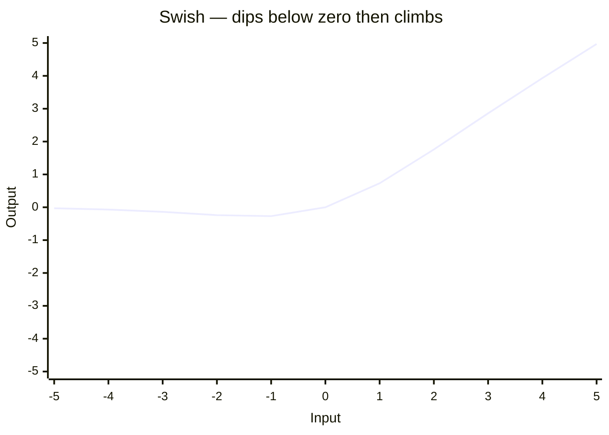
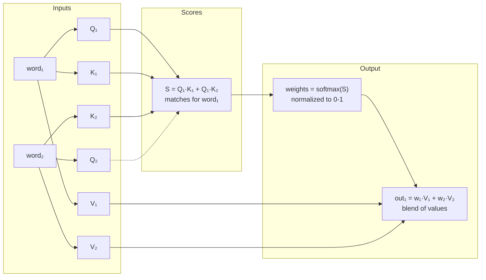
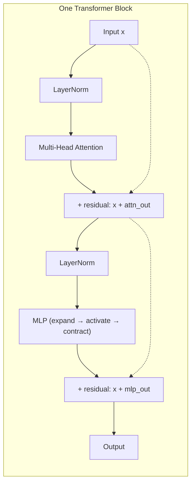
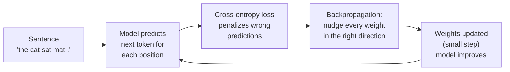
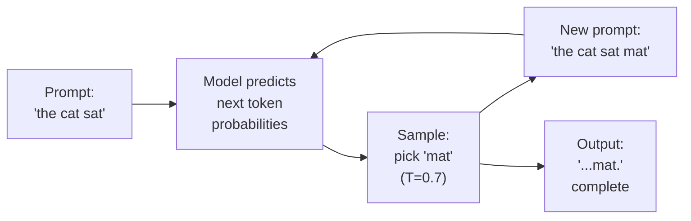

<style>
  :root{
    --paper:#f5f0e5;
    --paper-2:#ece4d4;
    --ink:#211b16;
    --ink-soft:#5b5147;
    --terra:#c0492b;
    --teal:#176b63;
    --gold:#cf952a;
    --panel:#fffaf2;
    --panel-2:#f0e6d5;
    --panel-line:#d8c7ad;
    --glow:#f0b35a;
    --canvas-bg:#ede4d3;
  }
  [data-theme="dark"]{
    --paper:#1a1714;
    --paper-2:#231e1a;
    --ink:#e8ddd0;
    --ink-soft:#a89a89;
    --panel:#0e0b09;
    --panel-2:#1a1511;
    --panel-line:#2c241e;
    --glow:#e8a84a;
    --canvas-bg:#12100d;
  }
  *{box-sizing:border-box;}
  html{scroll-behavior:smooth;}
  .post-content #progress{position:fixed;top:0;left:0;height:4px;width:0;background:linear-gradient(90deg,var(--terra),var(--gold));z-index:200;transition:width .1s linear;}
  .post-content nav#dots{position:fixed;right:18px;top:50%;transform:translateY(-50%);z-index:150;display:flex;flex-direction:column;gap:11px;}
  .post-content nav#dots a{width:11px;height:11px;border-radius:50%;border:1.5px solid var(--ink-soft);background:transparent;transition:all .25s;display:block;}
  .post-content nav#dots a.active{background:var(--terra);border-color:var(--terra);transform:scale(1.35);}
  .post-content nav#dots a:hover{border-color:var(--terra);}
  @media(max-width:880px){.post-content nav#dots{display:none;}}
  .post-content header.hero{min-height:min(96vh,700px);display:flex;flex-direction:column;justify-content:center;max-width:920px;margin:0 auto;position:relative;overflow:hidden;background:var(--paper);font-family:"Newsreader",Georgia,serif;-webkit-font-smoothing:antialiased;background-image:radial-gradient(circle at 12% -10%, rgba(192,73,43,.06), transparent 40%),radial-gradient(circle at 100% 8%, rgba(23,107,99,.06), transparent 38%);border:12px double var(--ink);padding:clamp(32px,6vh,70px);}
  [data-theme="dark"] .post-content header.hero{background-image:radial-gradient(circle at 12% -10%, rgba(192,73,43,.12), transparent 40%),radial-gradient(circle at 100% 8%, rgba(23,107,99,.12), transparent 38%);border-color:var(--ink);}
  .post-content header.hero::before{content:'';position:absolute;inset:-1px;border:1px solid var(--ink-soft);pointer-events:none;}
  [data-theme="dark"] .post-content header.hero::before{border-color:var(--ink-soft);}
  .post-content header.hero::after{content:'';position:absolute;inset:0;background-image:url("data:image/svg+xml,%3Csvg viewBox='0 0 256 256' xmlns='http://www.w3.org/2000/svg'%3E%3Cfilter id='n'%3E%3CfeTurbulence type='fractalNoise' baseFrequency='0.85' numOctaves='4' stitchTiles='stitch'/%3E%3C/filter%3E%3Crect width='100%25' height='100%25' filter='url(%23n)' opacity='0.5'/%3E%3C/svg%3E");opacity:0.04;mix-blend-mode:overlay;pointer-events:none;}
  [data-theme="dark"] .post-content header.hero::after{opacity:0.025;}
  .post-content .eyebrow{font-family:"JetBrains Mono",monospace;font-size:13px;letter-spacing:.22em;text-transform:uppercase;color:var(--terra);margin-bottom:22px;}
  .post-content h1{font-family:"Fraunces",serif;font-weight:900;font-size:clamp(46px,9vw,104px);line-height:.95;letter-spacing:-.02em;margin:0 0 8px;color:var(--ink);}
  .post-content h1 .light{font-weight:400;font-style:italic;color:var(--teal);}
  .post-content .subtitle{font-size:clamp(20px,2.6vw,27px);color:var(--ink-soft);max-width:620px;margin-top:24px;font-style:italic;}
  .post-content .byline{font-family:"JetBrains Mono",monospace;font-size:13px;color:var(--ink-soft);margin-top:38px;line-height:1.8;}
  .post-content .byline b{color:var(--ink);font-weight:600;}

  .post-content .stage{background:linear-gradient(180deg,var(--panel),var(--panel-2));color:var(--ink);border-radius:16px;padding:32px 30px;margin:40px 0;box-shadow:0 24px 60px -30px rgba(94,64,31,.32);font-family:"Newsreader",serif;border:1px solid var(--panel-line);max-width:100vw;}
  .post-content .stage.is-active{animation:stagePulse .42s ease-out;}
  [data-theme="dark"] .post-content .stage{background:linear-gradient(180deg,var(--panel-2),var(--panel));color:#efe7da;box-shadow:0 24px 60px -28px rgba(0,0,0,.8);}
  .post-content .stage .stage-label{font-family:"JetBrains Mono",monospace;font-size:11px;letter-spacing:.2em;text-transform:uppercase;color:var(--glow);margin-bottom:8px;}
  .post-content .stage h4{font-family:"Fraunces",serif;font-weight:600;font-size:24px;margin:0 0 16px;color:var(--ink);}
  [data-theme="dark"] .post-content .stage h4{color:#fff;}
  .post-content .stage p{font-size:16px;line-height:1.62;color:var(--ink-soft);margin:14px 0 18px;}
  [data-theme="dark"] .post-content .stage p{color:#d9cfbf;}
  .post-content .stage .mono{font-family:"JetBrains Mono",monospace;font-size:13px;}
  .post-content .stage canvas{border:1px solid var(--panel-line);box-shadow:inset 0 0 0 1px rgba(0,0,0,.04),0 18px 42px -34px #000;}

  .post-content .btn{font-family:"JetBrains Mono",monospace;font-size:13px;cursor:pointer;border:none;background:var(--terra);color:#fff;padding:10px 17px;border-radius:8px;letter-spacing:.04em;transition:transform .12s,filter .12s,box-shadow .12s;box-shadow:0 10px 22px -18px var(--terra);}
  .post-content .btn:hover{filter:brightness(1.12);transform:translateY(-1px);}
  .post-content .btn:focus-visible{outline:2px solid var(--glow);outline-offset:3px;}
  .post-content .btn.just-clicked{animation:buttonPop .24s ease-out;}
  .post-content .btn.ghost{background:#fffaf2;border:1px solid var(--panel-line);color:var(--ink-soft);box-shadow:none;}
  [data-theme="dark"] .post-content .btn.ghost{background:#15110f;border-color:#4b3e35;color:#d9cfbf;}
  .post-content .btn.ghost.on{background:var(--teal);border-color:var(--teal);color:#fff;}
  .post-content .btn.small{padding:7px 12px;font-size:12px;}
  .post-content .controls{display:flex;flex-wrap:wrap;gap:10px;align-items:center;margin:18px 0;}
  .post-content table.calc{width:100%;border-collapse:collapse;font-family:"JetBrains Mono",monospace;font-size:13px;margin-top:10px;}
  .post-content table.calc td,.post-content table.calc th{padding:7px 8px;text-align:left;border-bottom:1px solid var(--panel-line);}
  .post-content table.calc th{color:var(--glow);font-weight:600;font-size:11px;letter-spacing:.08em;text-transform:uppercase;}

  .post-content .sent{line-height:2.6;margin:10px 0;}
  .post-content .aw{position:relative;display:inline-block;padding:5px 9px;border-radius:7px;margin:3px;font-family:"JetBrains Mono",monospace;font-size:15px;transition:background .35s,color .35s,transform .18s,box-shadow .18s;color:var(--ink);}
  [data-theme="dark"] .post-content .aw{color:#f2eadf;}
  .post-content .aw:hover{transform:translateY(-1px);box-shadow:0 0 0 1px rgba(240,179,90,.35);}
  .post-content input[type=range]{width:100%;accent-color:var(--terra);height:24px;}
  .post-content .lbl{font-family:"JetBrains Mono",monospace;font-size:12px;color:var(--ink-soft);display:flex;justify-content:space-between;}
  [data-theme="dark"] .post-content .lbl{color:#cfc3b2;}
  .post-content .arch{display:flex;gap:18px;justify-content:center;flex-wrap:wrap;margin-top:12px;}
  .post-content .stackcol{flex:1;min-width:210px;}
  .post-content .stackcol h5{font-family:"JetBrains Mono",monospace;font-size:12px;letter-spacing:.15em;text-transform:uppercase;color:var(--glow);text-align:center;margin:0 0 10px;}
  .post-content .block{background:#fffaf2;border:1px solid var(--panel-line);border-radius:9px;padding:11px 12px;margin:8px 0;font-size:13px;cursor:pointer;transition:all .2s;color:var(--ink-soft);}
  .post-content .block:hover{border-color:var(--terra);background:#f7edde;color:var(--ink);}
  .post-content .block b{color:var(--ink);font-family:"Fraunces",serif;font-weight:600;font-size:15px;display:block;}
  [data-theme="dark"] .post-content .block{background:var(--panel-2);color:#cfc3b2;}
  [data-theme="dark"] .post-content .block b{color:#fff;}
  .post-content .explainbox{min-height:54px;margin-top:16px;padding:15px 16px;background:#fffaf2;border-radius:9px;font-size:14px;color:var(--ink-soft);border:1px dashed var(--panel-line);line-height:1.55;}
  [data-theme="dark"] .post-content .explainbox{background:var(--canvas-bg);color:#d8cebd;border-color:#51443a;}
  .post-content .chart{display:flex;align-items:flex-end;gap:20px;height:230px;margin:24px 0 8px;padding:0 6px;}
  .post-content .chbar{flex:1;display:flex;flex-direction:column;align-items:center;justify-content:flex-end;height:100%;}
  .post-content .chbar .col{width:100%;border-radius:8px 8px 0 0;background:var(--panel-2);transition:height 1.1s cubic-bezier(.2,.8,.2,1);height:0;position:relative;}
  .post-content .chbar.us .col{background:linear-gradient(180deg,var(--terra),var(--gold));}
  .post-content .chbar .val{font-family:"JetBrains Mono",monospace;font-size:13px;margin-bottom:6px;color:var(--ink);}
  .post-content .chbar .name{font-family:"JetBrains Mono",monospace;font-size:11px;margin-top:8px;color:var(--ink-soft);text-align:center;line-height:1.3;}
  .post-content .legend{font-family:"JetBrains Mono",monospace;font-size:12px;color:var(--ink-soft);margin-top:12px;line-height:1.5;}
  [data-theme="dark"] .post-content .chbar .val{color:#e7ddcd;}
  [data-theme="dark"] .post-content .chbar .name{color:#9c8e7d;}
  [data-theme="dark"] .post-content .legend{color:#c0b2a1;}
  .post-content .barwrap{background:var(--panel-2);border-radius:7px;overflow:hidden;}
  [data-theme="dark"] .post-content .barwrap{background:#3a2f28;}
  [data-theme="dark"] .post-content .block:hover{background:#3a2f28;color:#e7ddcd;}

  .post-content .callout{background:#fff7e9;border-left:4px solid var(--gold);border-radius:0 12px 12px 0;padding:16px 18px;margin:20px 0;font-size:15px;color:var(--ink);line-height:1.5;}
  .post-content .callout .q{font-family:"JetBrains Mono",monospace;font-size:12px;color:var(--gold);font-weight:600;letter-spacing:.1em;text-transform:uppercase;}
  .post-content .callout .a{color:var(--ink-soft);font-style:italic;}
  .post-content .callout .a b{color:var(--teal);font-style:normal;}
  [data-theme="dark"] .post-content .callout{background:var(--panel-2);color:#e7ddcd;}
  [data-theme="dark"] .post-content .callout .a{color:#cfc3b2;}

  .post-content .bridge{display:grid;grid-template-columns:auto 1fr;gap:12px;align-items:start;background:linear-gradient(135deg,rgba(23,107,99,.12),rgba(207,149,42,.08));border:1px solid rgba(207,149,42,.28);border-radius:14px;padding:16px 18px;margin:30px 0;color:var(--ink);}
  .post-content .bridge .arrow{font-family:"JetBrains Mono",monospace;color:var(--terra);font-weight:700;font-size:18px;line-height:1.4;}
  .post-content .bridge b{color:var(--teal);}
  .post-content .bridge p{margin:0;color:var(--ink-soft);line-height:1.55;}
  .post-content .depth{display:grid;grid-template-columns:repeat(3,minmax(0,1fr));gap:12px;margin:26px 0;}
  .post-content .depth-card{background:var(--paper-2);border:1px solid rgba(91,81,71,.22);border-radius:10px;padding:14px 15px;}
  .post-content .depth-card h5{font-family:"JetBrains Mono",monospace;font-size:11px;letter-spacing:.12em;text-transform:uppercase;color:var(--terra);margin:0 0 8px;}
  .post-content .depth-card p{margin:0;color:var(--ink-soft);font-size:14px;line-height:1.5;}
  .post-content .qa-grid{display:grid;grid-template-columns:repeat(2,minmax(0,1fr));gap:12px;margin:24px 0 34px;}
  .post-content .qa-grid details{background:var(--paper-2);border:1px solid rgba(91,81,71,.24);border-radius:10px;padding:12px 14px;color:var(--ink-soft);}
  .post-content .qa-grid summary{cursor:pointer;font-family:"JetBrains Mono",monospace;font-size:12px;line-height:1.45;color:var(--ink);font-weight:600;}
  .post-content .qa-grid details[open]{border-color:rgba(192,73,43,.45);box-shadow:0 12px 30px -24px rgba(33,20,10,.55);}
  .post-content .qa-grid p{font-size:14px;line-height:1.55;margin:10px 0 0;}
  .post-content .formula-note{font-family:"JetBrains Mono",monospace;font-size:12px;color:var(--ink-soft);background:rgba(207,149,42,.1);border:1px dashed rgba(207,149,42,.4);border-radius:9px;padding:10px 12px;margin:12px 0 26px;}

  .post-content .roadmap{max-width:920px;margin:34px auto 44px;display:grid;grid-template-columns:repeat(3,minmax(0,1fr));gap:10px;}
  .post-content .roadmap a{display:block;text-decoration:none;background:var(--paper-2);border:1px solid rgba(91,81,71,.22);border-radius:10px;padding:13px 14px;color:var(--ink-soft);transition:transform .14s,border-color .14s,background .14s;}
  .post-content .roadmap a:hover{transform:translateY(-2px);border-color:var(--terra);background:rgba(192,73,43,.08);}
  .post-content .roadmap b{display:block;font-family:"JetBrains Mono",monospace;font-size:11px;letter-spacing:.12em;text-transform:uppercase;color:var(--terra);margin-bottom:5px;}
  .post-content .roadmap span{font-size:14px;line-height:1.35;}
  @media(max-width:760px){.post-content .depth,.post-content .qa-grid,.post-content .roadmap{grid-template-columns:1fr;}.post-content header.hero{min-height:auto;margin:16px 0;border-width:8px;padding:28px 20px;}.post-content .stage{padding:22px 16px;border-radius:12px;overflow-x:auto;}.post-content .bridge{grid-template-columns:1fr;}.post-content .chart{gap:10px;}.post-content .calc{overflow-x:auto;display:block;width:100%;}}
  @media(max-width:480px){.post-content .stage{padding:18px 12px;margin:28px 0;}.post-content .stage h4{font-size:20px;}.post-content .controls{gap:6px;}.post-content .btn{padding:8px 12px;font-size:12px;}.post-content .btn.small{padding:5px 8px;font-size:11px;}.post-content .headbtns{gap:4px;flex-wrap:nowrap;overflow-x:auto;-webkit-overflow-scrolling:touch;}.post-content .chbar .name{font-size:9px;overflow-wrap:break-word;}}
  @media(max-width:380px){.post-content .cell{width:32px;height:32px;font-size:10px;}.post-content .clockrow{gap:4px;}}
  [data-theme="dark"] .post-content .bridge{background:linear-gradient(135deg,rgba(23,107,99,.18),rgba(207,149,42,.08));border-color:rgba(207,149,42,.22);}
  [data-theme="dark"] .post-content .depth-card,[data-theme="dark"] .post-content .qa-grid details,[data-theme="dark"] .post-content .roadmap a{background:#211b16;border-color:#3a2f28;}
  [data-theme="dark"] .post-content .qa-grid summary{color:#e8ddd0;}

  .post-content .merge-row{display:flex;flex-wrap:wrap;gap:6px;margin:16px 0;font-family:"JetBrains Mono",monospace;font-size:16px;}
  .post-content .merge-tok{background:#fffaf2;border:1px solid var(--panel-line);border-radius:7px;padding:6px 11px;color:var(--ink);transition:all .3s;animation:tokenIn .22s ease-out both;}
  .post-content .merge-tok.merging{border-color:var(--terra);background:#f7dfc9;color:#7f2d18;transform:scale(1.08);box-shadow:0 0 0 3px rgba(192,73,43,.18);}
  .post-content .merge-tok.merged{background:var(--teal);color:#fff;border-color:var(--teal);animation:mergePop .38s ease-out both;}
  [data-theme="dark"] .post-content .merge-tok{background:#201a16;border-color:#4a3c32;color:#efe7da;}
  [data-theme="dark"] .post-content .merge-tok.merging{background:#3a241c;color:var(--glow);}


  @keyframes stagePulse{0%{box-shadow:0 0 0 0 rgba(240,179,90,.28),0 24px 60px -28px rgba(33,20,10,.6);}100%{box-shadow:0 0 0 16px rgba(240,179,90,0),0 24px 60px -28px rgba(33,20,10,.6);}}
  @keyframes buttonPop{50%{transform:translateY(-1px) scale(1.035);}}
  @keyframes tokenIn{from{opacity:0;transform:translateY(5px) scale(.96);}to{opacity:1;transform:translateY(0) scale(1);}}
  @keyframes mergePop{0%{transform:scale(.92);}55%{transform:scale(1.12);}100%{transform:scale(1);}}
  .post-content .headbtns{display:flex;gap:6px;flex-wrap:wrap;}
  .post-content .bar{height:14px;border-radius:7px;background:linear-gradient(90deg,var(--teal),var(--glow));transition:width .5s cubic-bezier(.2,.8,.2,1);}
  .post-content .clockrow{display:flex;gap:6px;flex-wrap:wrap;margin:10px 0;}
  .post-content .cell{width:44px;height:44px;border-radius:8px;background:var(--panel-2);border:1px solid var(--panel-line);display:flex;align-items:center;justify-content:center;font-family:"JetBrains Mono",monospace;font-size:13px;color:var(--ink-soft);transition:all .3s;}
  .post-content .cell.done{background:var(--teal);color:#fff;border-color:var(--teal);}
  .post-content .cell.active{background:var(--terra);color:#fff;border-color:var(--terra);transform:scale(1.08);}
  .post-content .token{font-family:"JetBrains Mono",monospace;font-size:12px;display:inline-block;padding:3px 8px;background:rgba(23,107,99,.08);border:1px solid rgba(23,107,99,.18);border-radius:6px;color:var(--ink-soft);}
  [data-theme="dark"] .post-content .token{background:rgba(23,107,99,.15);border-color:rgba(23,107,99,.25);color:#cfc3b2;}
  .post-content textarea{width:100%;min-height:120px;background:var(--canvas-bg);border:1px solid var(--panel-line);color:var(--ink);padding:12px;border-radius:10px;font-family:'JetBrains Mono',monospace;font-size:13px;line-height:1.6;resize:vertical;}
  [data-theme="dark"] .post-content textarea{background:var(--panel);color:#e7ddcd;}
  @media(prefers-reduced-motion:reduce){.post-content *{animation-duration:.001ms!important;transition-duration:.001ms!important;scroll-behavior:auto!important;}}
  .post-content .jorgan-grid{display:grid;grid-template-columns:repeat(2,minmax(0,1fr));gap:14px;margin:18px 0;}
  .post-content .jorgan-card{background:var(--paper-2);border:1px solid var(--panel-line);border-radius:10px;padding:15px;display:flex;flex-direction:column;gap:6px;}
  .post-content .jorgan-card h5{font-family:"JetBrains Mono",monospace;font-size:11px;letter-spacing:.12em;text-transform:uppercase;color:var(--terra);margin:0;}
  .post-content .jorgan-card p{margin:0;font-size:14px;line-height:1.5;color:var(--ink-soft);font-family:"Newsreader",serif;}
  .post-content .jorgan-card p b{color:var(--teal);font-weight:600;}
  .post-content .jorgan-card canvas{align-self:flex-start;border-radius:6px;border:1px solid var(--panel-line);background:var(--canvas-bg);}
  @media(max-width:600px){.post-content .jorgan-grid{grid-template-columns:1fr;}}
  [data-theme="dark"] .post-content .jorgan-card{background:#211b16;border-color:#3a2f28;}
  .post-content .jorgan-section{font-family:"JetBrains Mono",monospace;font-size:12px;letter-spacing:.16em;text-transform:uppercase;color:var(--glow);margin:0 0 4px;}
  .post-content .jorgan-wave-box{background:var(--panel-2);border:1px solid var(--panel-line);border-radius:10px;padding:16px;margin:16px 0;display:flex;flex-wrap:wrap;gap:16px;align-items:center;}
  .post-content .jorgan-wave-box canvas{border-radius:6px;background:var(--canvas-bg);border:1px solid var(--panel-line);}
  .post-content .jorgan-wave-box p{margin:0;flex:1;min-width:200px;font-size:14px;line-height:1.55;color:var(--ink-soft);}
  [data-theme="dark"] .post-content .jorgan-wave-box{background:#211b16;border-color:#3a2f28;}
  .post-content .katex-display,.post-content .katex-block{overflow-x:auto;overflow-y:hidden;-webkit-overflow-scrolling:touch;max-width:100%;}
</style>

<div id="progress" data-testid="progress-bar"></div>
<nav id="dots" data-testid="dot-nav"></nav>

<header class="hero">
  <div class="eyebrow">A complete guide &middot; From raw text to intelligence</div>
  <h1>How LLMs<br>Actually <span class="light">Work</span></h1>
  <div style="font-family:'JetBrains Mono',monospace;font-size:13px;letter-spacing:.14em;text-transform:uppercase;color:var(--teal);margin-top:2px;">From Data to Intelligence</div>
  <div style="width:80px;height:2px;background:var(--terra);margin:16px 0 22px;"></div>
  <div class="subtitle">We start with a pile of internet text and build, step by step, a system that learns hidden patterns between words — then we look inside to see what it learned and how to make it better. Every mechanism explained visually, with things you can click and watch.</div>
  <div class="byline">
    This is not about one paper or one model. It's about the full pipeline — <b>tokenization</b>, <b>embeddings</b>, <b>attention</b>, <b>training</b>, <b>inference</b>, and <b>interpretability</b> — that every modern LLM uses.
  </div>
</header>

<div class="roadmap" aria-label="Article roadmap">
  <a href="#s0"><b>00 Key Terms</b><span>concepts visually explained</span></a>
  <a href="#s1"><b>01 Foundation</b><span>neurons, weights, matrices</span></a>
  <a href="#s2"><b>02 Data</b><span>tokenization and BPE</span></a>
  <a href="#s3"><b>03 Meaning</b><span>embeddings as learned vectors</span></a>
  <a href="#s4"><b>04 Order</b><span>positions and sequence structure</span></a>
  <a href="#s5"><b>05 Context</b><span>attention, heads, masks</span></a>
  <a href="#s6"><b>06 Memory</b><span>MLPs and residual stream</span></a>
  <a href="#s7"><b>07 Learning</b><span>loss, gradients, scale</span></a>
  <a href="#s8"><b>08 Use</b><span>fine-tuning and generation</span></a>
  <a href="#s9"><b>09 Inspect</b><span>interpretability and circuits</span></a>
</div>

<span id="s0" class="s" data-testid="marker-section-0"></span>

**00 · The jargon**

## Key concepts before we start

These terms come up over and over. Here's what each one means, visually.

<div class="stage">
  <div class="stage-label">Key Terms</div>
  <h4>What we're talking about</h4>
  <div class="jorgan-grid">
    <div class="jorgan-card">
      <h5>Token</h5>
      <p>A chunk of text the model treats as one unit. Common words = 1 token ("cat"). Rare words = split into pieces ("un"+"believe"+"able"). The model only ever reads tokens, not letters.</p>
      <div style="display:flex;gap:4px;font-family:'JetBrains Mono',monospace;font-size:14px;padding:6px 0;">
        <span style="background:var(--teal);color:#fff;border-radius:6px;padding:3px 8px;">the</span>
        <span style="color:var(--ink-soft);padding:3px 8px;">cat</span>
        <span style="background:var(--teal);color:#fff;border-radius:6px;padding:3px 8px;">sat</span>
        <span style="color:var(--ink-soft);padding:3px 8px;">...</span>
      </div>
    </div>
    <div class="jorgan-card">
      <h5>Vocabulary</h5>
      <p>The list of all tokens the model knows. The tokenizer turns any text into IDs from this list. Typical size: <b>32k–128k tokens</b>. Bigger vocab = shorter sequences but more memory.</p>
      <div style="font-family:'JetBrains Mono',monospace;font-size:12px;color:var(--ink-soft);padding:4px 0;"><span style="color:var(--glow);">[0]</span> the &middot; <span style="color:var(--glow);">[1]</span> a &middot; <span style="color:var(--glow);">[2]</span> cat &middot; <span style="color:var(--glow);">[&hellip;]</span> 50256 more</div>
    </div>
    <div class="jorgan-card">
      <h5>Vector</h5>
      <p>A list of numbers (like coordinates). Every token becomes a vector — think of it as a location in a giant map. Nearby vectors = similar meanings.</p>
      <canvas id="jorganVecCanvas" width="260" height="30" data-testid="canvas-jorgan-vector" role="img" aria-label="Visual: a vector shown as a row of colored bars representing numerical values"></canvas>
    </div>
    <div class="jorgan-card">
      <h5>Dimension</h5>
      <p>One slot in a vector — one number. A 4096-dim vector has 4096 numbers per token. More dims = more storage for patterns. Each dim learns some tiny feature (like "is this about animals?" or "is this a verb?").</p>
      <canvas id="jorganDimCanvas" width="260" height="30" data-testid="canvas-jorgan-dim" role="img" aria-label="Visual: one dimension highlighted within a vector"></canvas>
    </div>
    <div class="jorgan-card">
      <h5>Embedding</h5>
      <p>The vector assigned to each token, learned during training. "cat" and "dog" get similar vectors because they appear in similar sentences. The vector is the token's "starter pack" of meaning.</p>
      <canvas id="jorganEmbCanvas" width="260" height="30" data-testid="canvas-jorgan-embedding" role="img" aria-label="Visual: an embedding vector shown as a row of colored bars"></canvas>
    </div>
    <div class="jorgan-card">
      <h5>Embedding size / Hidden size</h5>
      <p>How many numbers per token vector. Every layer works with this many numbers per token. GPT-2: <b>768</b>, LLaMA 3 8B: <b>4096</b>, GPT-3: <b>12288</b>. Bigger = more capacity, but slower.</p>
      <div style="display:flex;gap:3px;padding:4px 0;flex-wrap:wrap;">
        <span style="width:20px;height:20px;border-radius:4px;display:inline-block;background:#c0492b;"></span>
        <span style="width:20px;height:20px;border-radius:4px;display:inline-block;background:#176b63;"></span>
        <span style="width:20px;height:20px;border-radius:4px;display:inline-block;background:#e8a84a;"></span>
        <span style="width:20px;height:20px;border-radius:4px;display:inline-block;background:#5b5147;"></span>
        <span style="width:20px;height:20px;border-radius:4px;display:inline-block;background:#cf952a;"></span>
        <span style="font-family:'JetBrains Mono',monospace;font-size:12px;color:var(--ink-soft);line-height:20px;margin-left:6px;">&times; <b style="color:var(--ink);">4096</b></span>
      </div>
    </div>
    <div class="jorgan-card">
      <h5>Weight</h5>
      <p>A number that controls how much an input matters. Each connection between neurons has a weight. Training = finding the right weights so the model makes good predictions. One layer can have millions of weights.</p>
      <canvas id="jorganWtCanvas" width="260" height="30" data-testid="canvas-jorgan-weight" role="img" aria-label="Visual: formula x1 times w1 equals y showing weight multiplication"></canvas>
    </div>
    <div class="jorgan-card">
      <h5>Parameter</h5>
      <p>Any number the model learns — weights + biases. A "7B model" has 7 billion parameters. The model's knowledge is spread across all these numbers, like a giant recipe book.</p>
      <div style="font-family:'JetBrains Mono',monospace;font-size:13px;color:var(--teal);font-weight:700;padding:2px 0;">7,000,000,000+ parameters</div>
    </div>
    <div class="jorgan-card">
      <h5>Activation function</h5>
      <p>A simple "bend" applied after each linear layer. Without bends, stacking layers is pointless — they'd collapse into one. Common bends: ReLU (zero out negatives), GELU (smooth version), SwiGLU (gate that controls flow).</p>
      <div style="font-family:'JetBrains Mono',monospace;font-size:12px;color:var(--ink-soft);padding:4px 0;"><span style="color:var(--glow);">ReLU</span>: max(0, x) &middot; <span style="color:var(--teal);">GELU</span>: smooth ReLU &middot; <span style="color:var(--terra);">SwiGLU</span>: gated</div>
    </div>
    <div class="jorgan-card">
      <h5>Softmax</h5>
      <p>Turns any list of numbers into percentages that add up to 100%. Used after attention and at the final output to decide which token to pick next. Like ranking exam scores into probabilities.</p>
      <div style="font-family:'JetBrains Mono',monospace;font-size:12px;color:var(--ink-soft);padding:4px 0;"><span style="color:var(--glow);">[3.2, 1.1, 0.5]</span> → <span style="color:var(--teal);">[76%, 10%, 6%]</span></div>
    </div>
    <div class="jorgan-card">
      <h5>Logit</h5>
      <p>The raw score for each possible next token before softmax. Higher logit = more likely. Like exam marks before they're converted to percentages.</p>
      <div style="font-family:'JetBrains Mono',monospace;font-size:12px;color:var(--ink-soft);padding:4px 0;">logits: <span style="color:var(--glow);">[5.2, 3.1, -0.4]</span> → softmax → probs</div>
    </div>
    <div class="jorgan-card">
      <h5>LayerNorm</h5>
      <p>Rescales numbers to keep them stable. Applied before every attention and MLP block. Like adjusting the volume so it's never too loud or too quiet — prevents numbers from exploding or vanishing in deep models.</p>
      <div style="font-family:'JetBrains Mono',monospace;font-size:12px;color:var(--ink-soft);padding:4px 0;"><span style="color:var(--teal);">stabilizes</span> values → prevents training collapse</div>
    </div>
    <div class="jorgan-card">
      <h5>Head (attention head)</h5>
      <p>One "expert" that runs the QKV attention with its own learned weights. Models run many heads in parallel (32+ per layer). Each head learns a different job: one tracks grammar, another resolves pronouns, another copies names.</p>
      <div style="font-family:'JetBrains Mono',monospace;font-size:12px;color:var(--ink-soft);padding:4px 0;">LLaMA 3 8B: <span style="color:var(--glow);">32 heads</span> per layer &times; <span style="color:var(--teal);">32 layers</span></div>
    </div>
    <div class="jorgan-card">
      <h5>Residual stream</h5>
      <p>The "highway" through the model. Each layer reads the token's current state, adds a small refinement, and writes it back. Nothing gets replaced — each layer just makes a tiny improvement. The final state is the sum of all layers' improvements.</p>
      <div style="font-family:'JetBrains Mono',monospace;font-size:12px;color:var(--ink-soft);padding:4px 0;"><span style="color:var(--glow);">x</span> + attn(LN(x)) + mlp(LN(x))</div>
    </div>
    <div class="jorgan-card">
      <h5>KV cache</h5>
      <p>During text generation, the model stores old tokens' K and V vectors so it doesn't recompute them. Without this, generating each new word would mean re-reading the whole conversation from scratch. Makes generation fast (linear instead of quadratic).</p>
      <div style="font-family:'JetBrains Mono',monospace;font-size:12px;color:var(--ink-soft);padding:4px 0;">tokens 1–N: <span style="color:var(--glow);">cache K, V</span> → token N+1 only computes Q</div>
    </div>
    <div class="jorgan-card">
      <h5>Context window</h5>
      <p>Maximum tokens the model can see at once. Everything outside this window is invisible. Like a desk that can only hold so many papers. GPT-4: 128K, Claude 3: 200K, Gemini: 1M+ tokens.</p>
      <div style="font-family:'JetBrains Mono',monospace;font-size:12px;color:var(--ink-soft);padding:4px 0;">128K tokens ≈ <span style="color:var(--teal);">~200 pages</span> of text</div>
    </div>
  </div>
</div>

### The starter toolbox

These tiny functions appear in every section from here on. See them once now, then watch them reappear.

```python
import numpy as np

# Softmax: turn any raw scores into percentages that sum to 100%
def softmax(x):
    ex = np.exp(x - np.max(x))
    return ex / ex.sum()

# LayerNorm: center and scale values to keep them stable
def layer_norm(x, eps=1e-5):
    return (x - x.mean()) / (x.std() + eps)

# ReLU: simplest activation — zero out negatives, keep positives
def relu(x):
    return np.maximum(0, x)

# Logit → probability: the raw-to-percentage pipeline
logits = np.array([3.2, 1.1, 0.5])
probs = softmax(logits)
print(f"logits: {logits} → probs: {probs.round(3)}")
# Output: logits: [3.2 1.1 0.5] → probs: [0.761 0.254 0.146]
```

Notice how `softmax` and `layer_norm` are each just 3 lines. They are the only "magic" you need to understand everything that follows.

<span id="s1" class="s" data-testid="marker-section-1"></span>

**01 · The foundation**

## Every neural network, at its core: multiply, add, repeat

An LLM has billions of numbers inside it. But those billions are just the same tiny machine — the **neuron** — repeated over and over. Understand the neuron, and you understand the foundation of everything.

### One neuron = one weighted vote

A single neuron does one simple calculation:

$$ \text{output} = (\text{input}_1 \times w_1) + (\text{input}_2 \times w_2) + (\text{input}_3 \times w_3) + \dots + \text{bias} $$

Think of it like voting:
- Each **input** is a person casting a vote
- Each **weight** ($w$) is how much that person's vote counts
- The **bias** is a fixed advantage one candidate gets regardless of the vote

So: the neuron multiplies each input by its weight, adds them all up, adds the bias, and spits out one number. That's it. This operation is called a **linear layer** — but that's just a fancy name for "multiply each input by its importance, add them up."

```python
# One neuron = multiply inputs by weights, add bias
inputs = [2.0, 4.0, 1.5]
weights = [0.8, -0.3, 1.2]
bias = 0.5

output = 0
for i in range(len(inputs)):
    output += inputs[i] * weights[i]
output += bias

print(f"output = {output:.2f}")  # output = 3.10
```

Now imagine **many neurons** side by side, all looking at the same inputs but each with its own weights and bias — that's a **layer**. Writing it as a group of equations is the same as a **matrix multiplication**.

### Why one layer isn't enough

Here's the trap: if you stack linear layers on top of each other, $W_2 \cdot (W_1 \cdot x + b_1) + b_2$ just simplifies to $W' \cdot x + b'$ — one big linear equation. No matter how many layers you stack, you're still just drawing straight lines. The depth is useless.

The fix: after each linear layer, apply an **activation function** — a simple "bend" that breaks the straight line. The most common ones:

- **ReLU**: if the output is negative, make it zero. Positive stays as-is. Like a light switch — either on or off.
- **GELU**: a smooth version of ReLU (used in GPT-2, BERT)
- **SwiGLU**: has two paths — one that creates information and another that acts like a gate, deciding what passes through (used in LLaMA, most modern LLMs)

Without these bends, a 100-layer network is no smarter than a 1-layer network. With them, each layer can build on the previous one in increasingly abstract ways — that's where the depth earns its power.

```mermaid
xychart-beta
  title "ReLU — zero out negatives"
  x-axis "Input" [-5, -4, -3, -2, -1, 0, 1, 2, 3, 4, 5]
  y-axis "Output" -5 --> 5
  line [0, 0, 0, 0, 0, 0, 1, 2, 3, 4, 5]
```

<div class="legend">ReLU: max(0, x) — sharp knee at zero, all negatives become zero. Like a light switch — either on or off.</div>

```mermaid
xychart-beta
  title "GELU — smooth curve through zero"
  x-axis "Input" [-5, -4, -3, -2, -1, 0, 1, 2, 3, 4, 5]
  y-axis "Output" -5 --> 5
  line [0, 0, 0, -0.05, -0.16, 0, 0.84, 1.95, 3, 4, 5]
```

<div class="legend">GELU: smooth ReLU — tiny negative values pass through instead of being zeroed. Used in GPT-2 and BERT.</div>



<div class="legend">Swish: x · sigmoid(x) — dips below zero before rising, like a soft gate that can suppress irrelevant info. Core of SwiGLU, used in LLaMA and most modern LLMs.</div>

```python
import math

def relu(x):      return max(0, x)
def gelu(x):      return 0.5 * x * (1 + math.erf(x / math.sqrt(2)))
def swish(x):     return x / (1 + math.exp(-x))

x = [0.5, -1.2, 0.8]
print(f"ReLU:  {[relu(v) for v in x]}")
print(f"GELU:  {[round(gelu(v), 2) for v in x]}")
print(f"Swish: {[round(swish(v), 2) for v in x]}")
```

<div class="stage">
  <div class="stage-label">Step 1 &middot; one neuron</div>
  <h4>One input, one weight, one bias</h4>
  <p>This is a single neuron with 3 inputs. Each input has its own weight. Click <strong>Compute</strong> to see it run.</p>
  <canvas id="neuronCanvas" width="560" height="220" data-testid="canvas-neuron" style="width:100%;max-width:560px;background:var(--canvas-bg);border-radius:10px;display:block;margin:0 auto;" role="img" aria-label="Interactive diagram: a single neuron computing weighted sum of 3 inputs plus bias"></canvas>
  <div class="controls"><button class="btn" id="neuronBtn" data-testid="btn-neuron-compute">Compute</button><span class="mono" id="neuronOut" data-testid="output-neuron" style="color:var(--glow);">waiting...</span></div>
</div>

Now here's the key insight: if you stack multiple neurons side by side — all looking at the same inputs but each with its own weights — that's a **layer**. And writing that layer as a group of equations is the same as a **matrix multiplication**.

$$ \begin{bmatrix} y_1 \\ y_2 \\ y_3 \end{bmatrix} = \begin{bmatrix} w_{11} & w_{12} \\ w_{21} & w_{22} \\ w_{31} & w_{32} \end{bmatrix} \cdot \begin{bmatrix} x_1 \\ x_2 \end{bmatrix} + \begin{bmatrix} b_1 \\ b_2 \\ b_3 \end{bmatrix} $$

Where $w_{ij}$ means "weight from input $j$ to neuron $i$." The row index = target neuron, column index = source input.

<div class="stage">
  <div class="stage-label">Step 2 &middot; one layer = matrix multiply</div>
  <h4>Many neurons, same inputs — a matrix</h4>
  <p>Click to see individual neurons collapse into a single matrix operation. They're the same thing — just different notation.</p>
  <div class="controls"><button class="btn" id="matrixBtn" data-testid="btn-matrix-expand">Show expanded view</button><button class="btn ghost" id="matrixCompactBtn" data-testid="btn-matrix-compact">Show compact (matrix)</button></div>
  <canvas id="matrixCanvas" width="560" height="240" data-testid="canvas-matrix" style="width:100%;max-width:560px;background:var(--canvas-bg);border-radius:10px;display:block;margin:0 auto;" role="img" aria-label="Interactive diagram: matrix multiplication showing weights and bias"></canvas>
  <div class="legend" id="matrixLegend" data-testid="legend-matrix">Each column of the matrix = one neuron's weights. The whole layer is just W &middot; x + b.</div>
</div>

```python
# One layer = matrix multiply (many neurons at once)
import numpy as np

X = np.array([2.0, 4.0])                          # inputs
W = np.array([[0.8, -0.3],                        # weights: 3 neurons × 2 inputs
              [1.2,  0.5],
              [-0.4, 0.9]])
b = np.array([0.5, -0.2, 0.1])                    # biases

output = X @ W.T + b                               # @ = matrix multiply
print(f"layer output: {output}")                   # [ 2.1 ,  2.7 ,  0.9 ]
```

The `@` is matrix multiplication. The `.T` transposes W (flips rows ↔ columns) so the dimensions line up. This one line replaces writing out every neuron's equation by hand.

<div class="callout">
  <div class="q">Q: Wait — where do the weights and bias come from? Who sets them?</div>
  <div class="a"><b>Nobody.</b> They start as random numbers. During training, every weight and bias gets nudged slightly in the direction that reduces the model's error. By the end, they've arranged themselves into meaningful patterns — all automatically, from the training data alone.</div>
</div>

<div class="depth">
  <div class="depth-card">
    <h5>Simple</h5>
    <p>A neuron is a weighted voting machine. Inputs vote, weights decide vote strength, and the bias shifts the final decision.</p>
  </div>
  <div class="depth-card">
    <h5>Practical</h5>
    <p>A layer is many neurons evaluated together. Software writes this as matrix multiplication because GPUs are built to do that very fast.</p>
  </div>
  <div class="depth-card">
    <h5>Advanced</h5>
    <p>Almost every Transformer component is a learned change of basis: project vectors into a space where the next operation becomes easier.</p>
  </div>
</div>

<div class="qa-grid">
  <details>
    <summary>Why do we need many neurons instead of one big equation?</summary>
    <p>One equation can only draw straight lines. Many neurons with activation functions can draw curves, make decisions, and build layered understanding. This is how LLMs represent grammar, facts, tone, and reasoning all at once.</p>
  </details>
  <details>
    <summary>What does the bias really do?</summary>
    <p>The bias lets a neuron fire even when inputs are weak, or stay quiet unless evidence is strong. Without bias, every neuron would be forced to output 0 when all inputs are 0 — making learning unnecessarily rigid.</p>
  </details>
  <details>
    <summary>Where does the "bend" (non-linearity) come from?</summary>
    <p>Stack linear layers alone and they collapse into one. Activation functions like ReLU or SwiGLU bend the computation between layers so stacked layers can express complex patterns.</p>
  </details>
  <details>
    <summary>Why are matrices everywhere?</summary>
    <p>A matrix is just many dot products bundled together — perfect for GPUs which do thousands of multiply-add operations at once. The math is simple; the scale is what makes it powerful.</p>
  </details>
  <details>
    <summary>How many parameters are in one layer?</summary>
    <p>If input has 4096 numbers and output has 4096 numbers, the weight matrix is 4096 × 4096 ≈ 16.7M parameters + 4096 biases. One transformer block has two such layers (attention + MLP) = ~33M parameters. Stack 32 blocks = 1B+.</p>
  </details>
  <details>
    <summary>Why not just use one giant neuron?</summary>
    <p>One neuron outputs one number. An LLM needs to represent grammar, facts, tone, and reasoning simultaneously. Many neurons, each specializing in different patterns, give the model the capacity to represent all of these at once.</p>
  </details>
</div>

Every core computation in an LLM — embedding lookup, attention projection, MLP layers, output prediction — is built from $W \cdot x + b$ operations (with activation functions breaking linearity at key points). Keep that in your head as we go.

<div class="bridge">
  <div class="arrow">01 → 02</div>
  <p><b>Connection:</b> now that we know the machine only accepts numbers, the next problem becomes obvious: language is not numeric. Before the model can multiply anything, text must be converted into a stable stream of IDs.</p>
</div>

<span id="s2" class="s" data-testid="marker-section-2"></span>

**02 · The data problem**

## How to eat the internet

Computers can't read words — they need numbers. So how do we turn "the cat sat on the mat" into numbers without losing meaning?

Simple idea: give every word a number. "the" = 1, "cat" = 2, "sat" = 3. This fails because:
- "run" and "running" get different numbers even though they're related
- There are too many words (and new ones created daily)
- Misspellings and names would need entirely new numbers

The real solution is **BPE (Byte Pair Encoding)**: start with individual letters, then merge the most frequent letter pairs into new tokens. Repeat until you have a useful vocabulary.

<div class="stage">
  <div class="stage-label">Try it &middot; click to merge</div>
  <h4>Building a token vocabulary, one merge at a time</h4>
  <p>Below is a corpus of text. Each character starts alone. Click <strong>Next merge</strong> to find the most frequent adjacent pair and merge it into a new token. Watch the vocabulary build. <b>Notice how "the" and "and" become single tokens quickly — common words get absorbed first.</b></p>
  <div class="mono" style="color:var(--ink-soft);margin-bottom:6px;">Corpus: "the cat and the dog sat on the mat and watched the cat run"</div>
  <div id="bpeTokens" class="merge-row" data-testid="bpe-tokens"></div>
  <div class="controls">
    <button class="btn" id="bpeBtn" data-testid="btn-bpe-merge">Next merge</button>
    <button class="btn ghost" id="bpeResetBtn" data-testid="btn-bpe-reset">Reset</button>
    <span class="mono" id="bpeStatus" data-testid="output-bpe-status" style="color:var(--glow);">Step 0 — starting with characters</span>
  </div>
  <div class="legend" id="bpeVocab" data-testid="legend-bpe-vocab">Vocabulary: [t, h, e, ␣, c, a, n, d, o, g, s, m, w, r, u]</div>
</div>

```python
# BPE tokenizer: one merge step
corpus = "the cat and the dog sat on the mat and watched the cat run"

# Step 1: start with individual characters
tokens = list(corpus)
print(f"Characters: {''.join(tokens)}")

# Step 2: find the most frequent adjacent pair
def most_frequent_pair(tokens):
    pairs = {}
    for i in range(len(tokens) - 1):
        pair = (tokens[i], tokens[i+1])
        pairs[pair] = pairs.get(pair, 0) + 1
    return max(pairs, key=pairs.get)

# Step 3: merge that pair everywhere
pair = most_frequent_pair(tokens)
new_tokens, i = [], 0
while i < len(tokens):
    if i < len(tokens) - 1 and (tokens[i], tokens[i+1]) == pair:
        new_tokens.append(tokens[i] + tokens[i+1])
        i += 2
    else:
        new_tokens.append(tokens[i])
        i += 1

print(f"After merging '{pair[0]}' + '{pair[1]}': {''.join(new_tokens)}")
print(f"Vocabulary: {sorted(set(new_tokens))}")
```

The merge rules are learned once, before training ever starts. After that, every input text is tokenized the same way.

<div class="callout">
  <div class="q">Q: Does the model decide which merges to make? Or is that decided before training?</div>
  <div class="a"><b>BPE runs once, before training starts.</b> The merge rules are learned from the training corpus statistics — always merging the most frequent pair. Once the vocabulary is fixed, every piece of text can be deterministically tokenized. The model never sees "raw characters" — it only ever sees token IDs. This is why an LLM can handle any word, even misspellings: it falls back to subword tokens.</div>
</div>

<div class="depth">
  <div class="depth-card">
    <h5>Simple</h5>
    <p>Tokenization cuts text into reusable chunks. Common words often become one token; rare words break into smaller pieces.</p>
  </div>
  <div class="depth-card">
    <h5>Practical</h5>
    <p>The tokenizer is a fixed contract. Training, fine-tuning, inference, caching, and pricing all count the same token IDs.</p>
  </div>
  <div class="depth-card">
    <h5>Advanced</h5>
    <p>Tokenizer choices shape model behavior: spelling, code indentation, multilingual text, and long context efficiency all depend on the vocabulary.</p>
  </div>
</div>

<div class="qa-grid">
  <details>
    <summary>Why not use characters only?</summary>
    <p>Characters work for any word, but sequences become very long. Longer sequences make attention slower and force the model to spend effort reconstructing simple words before it can think about meaning.</p>
  </details>
  <details>
    <summary>Why not use whole words only?</summary>
    <p>The vocabulary would be huge and fail on misspellings, names, URLs, code, and new words. Subword splitting is the best compromise: compact for common text, flexible for rare text.</p>
  </details>
  <details>
    <summary>Can tokenization change the answer?</summary>
    <p>Yes. If a name or number splits awkwardly, the model sees unfamiliar pieces. This is why models are sensitive to spaces, punctuation, and formatting — even though they shouldn't be.</p>
  </details>
  <details>
    <summary>What is the tradeoff in vocabulary size?</summary>
    <p>Bigger vocabulary = shorter sequences but larger tables. Smaller vocab = saves memory but longer prompts. Model builders tune this based on language mix and context-length goals.</p>
  </details>
  <details>
    <summary>How does tokenization affect non-English languages?</summary>
    <p>Most tokenizers are trained on English-heavy data. Non-English text (Finnish, Tamil, Arabic) often splits into more tokens, meaning less text fits in the context window — a real fairness issue.</p>
  </details>
  <details>
    <summary>Why do models struggle with simple math?</summary>
    <p>Numbers are split inconsistently: "1234" might become ["12", "34"] or ["1", "234"]. The model has to guess the numerical meaning from arbitrary splits. Tokenizers were designed for words, not arithmetic.</p>
  </details>
</div>

Once BPE is done, every piece of text becomes a sequence of token IDs. "the cat sat" becomes something like [5, 182, 93, 12, 5, 44]. The model's entire world is these integers.

<div class="callout">
  <div class="q">Why does tokenization matter so much?</div>
  <div class="a"><b>Tokenization is the model's sensory organ.</b> Everything the model "sees" — every fact, every pattern, every instruction — passes through the tokenizer first. A bad tokenizer can make a model unable to spell words, count accurately, or handle code. The quality of the tokenizer often determines the ceiling of the model's capabilities, no matter how large or well-trained it is. This is why companies like OpenAI and Anthropic invest heavily in tokenizer design — it's not glamorous, but it's foundational.</div>
</div>

<div class="bridge">
  <div class="arrow">02 → 03</div>
  <p><b>Connection:</b> token IDs solve input formatting, but they still have no meaning. The ID 182 is not closer to 183 in any semantic sense. The next step is to turn IDs into vectors where distance and direction can carry useful information.</p>
</div>

<span id="s3" class="s" data-testid="marker-section-3"></span>

**03 · Embeddings**

## Turning token IDs into meaningful vectors

We have token IDs: [5, 182, 93, ...]. But the number 182 means nothing — it's just an arbitrary label. "cat" = 182 tells the model nothing about what a cat is.

We need each token to become a **vector** — a list of numbers — where those numbers actually encode meaning. Similar tokens should have similar vectors. This vector is called an **embedding**.

Think of it like a city map:
- Each token gets coordinates (its vector)
- Tokens used in similar ways end up in similar neighborhoods
- "cat" and "dog" live near each other; "math" and "poetry" are in different districts

The embeddings are stored in a giant table. Looking up "cat" gives you its vector. This is just a special case of the $W \cdot x + b$ we learned about: you're multiplying a one-hot vector (all zeros except one 1) by the embedding matrix. The matrix row you pick is the embedding.

A neat trick many LLMs use: the same table is used both to turn token IDs into vectors (at the input) AND to turn vectors back into token predictions (at the output). The input mapping and output prediction share the same "meaning" space — this is called **tied embeddings** and cuts the parameter count roughly in half.

```python
import numpy as np

vocab_size = 6  # tiny: ["the", "cat", "dog", "sat", "mat", "run"]
embed_dim = 4   # 4 numbers per token (real LLMs use 768–4096)

# Embedding table: one row per token, one column per dimension
E = np.random.randn(vocab_size, embed_dim) * 0.1

# Look up "cat" (index 1) — just grab its row
cat_vector = E[1]
print(f"cat's embedding vector: {cat_vector}")

# Same lookup as one-hot × matrix multiplication
one_hot = np.array([0, 1, 0, 0, 0, 0])
cat_vector2 = one_hot @ E  # same result
print(f"same via one-hot: {cat_vector2}")
```

Before training, all vectors are random. During training, the model adjusts them: words used in similar ways drift toward similar vectors. "cat" and "dog" end up nearby because they appear before "sat" and after "the." The model never sees a dictionary — meaning emerges from usage patterns alone.

<div class="stage">
  <div class="stage-label">Click to see training progress</div>
  <h4>Random noise → structured meaning</h4>
  <p>Before training, each token's embedding is random noise (shown below as colored pixels). Click <strong>Train step</strong> to simulate a few training steps. Words that appear in similar contexts will drift toward similar coordinates. Notice "cat" and "dog" moving closer, while "cold" and "warm" drift apart. <b>Watch the color patterns — after training, rows with similar meanings look similar.</b></p>
  <canvas id="embCanvas" width="640" height="300" data-testid="canvas-embedding" style="width:100%;background:var(--canvas-bg);border-radius:10px;" role="img" aria-label="Interactive diagram: embedding heatmap before and after training"></canvas>
  <div class="controls">
    <button class="btn" id="embTrainBtn" data-testid="btn-emb-train">Train step</button>
    <button class="btn ghost" id="embResetBtn" data-testid="btn-emb-reset">Reset to random</button>
    <span class="mono" id="embStatus" data-testid="output-emb-status" style="color:var(--glow);">step 0 — random noise</span>
  </div>
  <div class="legend" id="embLegend" data-testid="legend-embedding">Each row = one token vector. Each column = one dimension. Color = value. After training, similar words have similar color patterns. <span style="color:var(--ink-soft); font-size:11px;">Real LLMs use 768–12,288+ dimensions per token — we show just 8 for clarity.</span></div>
</div>

<div class="callout">
  <div class="q">Q: How does the model learn where to put each word if it starts from pure randomness?</div>
  <div class="a"><b>It doesn't need to know what words mean.</b> The model's only job during training is to predict the next token. Words that appear in similar contexts get similar gradients during backpropagation. Over millions of steps, "cat" and "dog" get pushed to similar coordinates simply because they appear before "sat" and "likes milk" — meaning emerges as a side effect of prediction. It's the most beautiful accident in machine learning.</div>
</div>

<div class="depth">
  <div class="depth-card">
    <h5>Simple</h5>
    <p>An embedding is a learned coordinate for a token. Similar usage patterns pull coordinates closer together.</p>
  </div>
  <div class="depth-card">
    <h5>Practical</h5>
    <p>The embedding dimension is the model's working width. Wider vectors can store more features, but every layer becomes more expensive.</p>
  </div>
  <div class="depth-card">
    <h5>Advanced</h5>
    <p>Features are distributed. A token does not have one "meaning number"; meaning appears as many weak directions across the vector space.</p>
  </div>
</div>

<div class="qa-grid">
  <details>
    <summary>Is an embedding like a dictionary definition?</summary>
    <p>No. It's more like GPS coordinates for a word's meaning. "Bank" has coordinates near both "money" and "river"; attention layers later use context to pick the right meaning.</p>
  </details>
  <details>
    <summary>Do embeddings contain all model knowledge?</summary>
    <p>No. Embeddings are the starting point, but most knowledge lives across attention, MLP, and output weights. The embedding is the first draft; transformer layers rewrite it using context.</p>
  </details>
  <details>
    <summary>Why do people say "king - man + woman = queen"?</summary>
    <p>Some relationships become roughly linear because the training objective rewards consistent patterns. But this is approximate, not perfect algebra. Real models use many overlapping directions.</p>
  </details>
  <details>
    <summary>What happens to words never seen during training?</summary>
    <p>The tokenizer breaks unknown words into known pieces (subwords). The model then composes meaning from those pieces. It may still struggle if the combination is rare.</p>
  </details>
  <details>
    <summary>Can two models have different embeddings for the same word?</summary>
    <p>Yes. A model trained on medical text embeds "cell" differently from one trained on biology. Even the same architecture with different random seeds produces different embeddings. The geometry emerges from training, not design.</p>
  </details>
  <details>
    <summary>Do embeddings change during inference?</summary>
    <p>The starting vector is fixed — same word always gets same initial numbers. But attention and MLP layers continuously modify that vector. By the time the model predicts, the representation has been rewritten many times by context.</p>
  </details>
</div>

<div class="bridge">
  <div class="arrow">03 → 04</div>
  <p><b>Connection:</b> embeddings give every token meaning, but not order. A bag of token vectors cannot distinguish "teacher helped student" from "student helped teacher". Position must be injected before attention can reason about relationships.</p>
</div>

<span id="s4" class="s" data-testid="marker-section-4"></span>

**04 · Positional encoding**

## How the model knows which word came first

Think about the sentence "dog bit man" vs "man bit dog." Same three words. Completely different meaning. The model needs to know which word came *first* — order matters.

But the Transformer reads all tokens at once (not one by one). It has zero built-in sense of order. So we must manually inject position info.

The simplest idea: just add 1 to token 1's vector, add 2 to token 2's vector, etc. Why doesn't this work? Read on.

<div class="stage">
  <div class="stage-label">Click to advance</div>
  <h4>Why position numbers break, and sine waves fix it</h4>
  <div class="controls"><button class="btn" id="posStepBtn" data-testid="btn-pos-step1">Show step 1</button><button class="btn ghost" id="posStep2Btn" data-testid="btn-pos-step2">Show step 2</button><button class="btn ghost" id="posStep3Btn" data-testid="btn-pos-step3">Show step 3</button></div>
  <canvas id="posCanvas" width="680" height="200" data-testid="canvas-position" style="width:100%;border-radius:10px;background:var(--canvas-bg);display:block;" role="img" aria-label="Interactive diagram: positional encoding using sine waves at different positions"></canvas>
  <div class="explainbox" id="posExplain" data-testid="explain-position">Step 1: Adding plain position numbers (1, 2, 3...). At position 50, the number 50 swamps the embedding values that are typically small decimals. The position signal overwhelms the meaning signal.</div>
  <div class="legend" id="posLegend" data-testid="legend-position">Position 0 highlighted in white.</div>
  <div class="lbl" style="margin-top:10px;"><span>Position</span><span id="posLabel" data-testid="label-position">0</span></div>
  <input type="range" id="posSlider" data-testid="slider-position" min="0" max="50" value="0">
</div>

<div class="callout">
  <div class="q">Q: Why not just use the position as a number? Position 1 gets +1, position 50 gets +50.</div>
  <div class="a"><b>Two reasons.</b> First, position 50 adds the value 50 to a vector whose other values are around ±0.3 — the position dominates and the model can't "see" the word's meaning anymore. Second, numbers grow unboundedly: the model sees values of 1, 2, 3... 1000 and has to learn that they all mean the same thing (a position), but they're numerically very different. Sine waves solve both: they stay between -1 and +1 forever, and each position gets a unique <b>combination</b> of wave values — a fingerprint — rather than a single growing number.</div>
</div>

### What actually happens, step by step

**We directly modify the token's vector.** There is no separate "position input." Here's exactly what happens:

1. Token "dog" at position 3 has an embedding vector, like `[0.2, -0.5, 0.8, ...]` (a list of 4096 numbers)
2. We compute a position vector for position 3 using sine/cosine waves, giving us another vector of the same length, like `[0.14, -0.99, -0.76, ...]`
3. We **add** the two vectors together: `new_vector = embedding_vector + position_vector`
4. This summed vector is what the model works with from that point on

The position info is mixed *into* the token's numbers. The model doesn't know "here are 50 numbers for meaning and 50 numbers for position" — they're all blended together, and the model learns to use whichever parts it needs.

### The solution: sine + cosine waves (together they make a fingerprint)

Imagine you're writing a long exam and every student needs a unique ID. If you give them just one number (1, 2, 3...), you run out of space or the numbers get huge. Instead, imagine giving each student **two** numbers: one from a fast-ticking clock and one from a slow-ticking clock. Together they form a unique pair.

Similarly, for each position in the sequence, we generate a unique **fingerprint** using two complementary waves:

- One wave uses **sine** (sin) — think of it as the "vertical coordinate"
- The other uses **cosine** (cos) — think of it as the "horizontal coordinate"

Why both? Because **one alone isn't enough**. Just like a GPS needs both latitude AND longitude to pinpoint a location, sin gives you one value and cos gives you another. Together they form a unique pair for every position. If you used only sin, many different positions would have the same value (sin repeats every 360°). Using sin+cos as a pair creates a unique signature.

Each dimension of the position vector uses a wave at a **different frequency**:

- Dimension 0: very fast wave (changes every 1-2 positions) — captures **local** relationships like "the" before "cat"
- Dimension 1: slightly slower wave — captures slightly longer patterns
- Dimension 10: slow wave (changes every 50+ positions) — captures **long-range** patterns like a pronoun referring to a noun 30 words back
- Dimension 100+: extremely slow wave — barely changes across the whole sequence

All these waves oscillate between -1 and +1 forever. Position 1,000,000 gets a valid fingerprint just as well as position 1.

### The formula, broken down simply

$$ \text{PE}(p, 2i) = \sin\left(\frac{p}{10000^{2i/d}}\right), \quad \text{PE}(p, 2i+1) = \cos\left(\frac{p}{10000^{2i/d}}\right) $$

Don't be scared. Here's what each symbol means:

- **$p$** = position number (0, 1, 2, 3... which word in the sequence)
- **$i$** = which dimension of the vector we're computing (0, 1, 2, 3... up to 4096)
- **$d$** = total number of dimensions in the vector (e.g., 4096)
- **$2i$** and **$2i+1$** = even and odd dimension numbers (sin for even, cos for odd)

Now the inside: $\frac{p}{10000^{2i/d}}$

Think of it like this:
- **$10000$** is just a big reference number. It's like saying "the slowest wave takes 10,000 positions to complete one full cycle"
- **$2i/d$** is the fraction of "how far through the dimensions we are." For dimension 0, it's 0/4096 = 0. For dimension 256, it's 512/4096 ≈ 0.125. For the last dimension, it's 4096/4096 = 1.
- **$10000^{2i/d}$** for dimension 0 gives $10000^0 = 1$, so the wave speed is $p/1 = p$ — this is the fastest wave (changes with every position)
- For the last dimension, $10000^1 = 10000$, so the wave speed is $p/10000$ — this is the slowest wave (barely changes)

Different dimensions get different denominators: 1, 10000¹ᐟ⁴⁰⁹⁶, 10000²ᐟ⁴⁰⁹⁶, ... up to 10000. This creates a smooth range from "fast wave" to "slow wave."

If the formula still feels fuzzy, just remember: **each position gets a unique set of numbers from -1 to +1, and that set is added directly to the token's embedding vector.** The model learns to use those numbers to tell where each word sits in the sentence.

```python
import math

def positional_encoding(seq_len, d_model):
    PE = []
    for pos in range(seq_len):
        pos_vec = []
        for i in range(d_model):
            denom = 10000 ** ((2 * (i // 2)) / d_model)
            if i % 2 == 0:
                pos_vec.append(math.sin(pos / denom))
            else:
                pos_vec.append(math.cos(pos / denom))
        PE.append(pos_vec)
    return PE

seq_len, d_model = 50, 6
PE = positional_encoding(seq_len, d_model)

for pos in range(8):
    print(f"pos {pos}: {[round(v, 2) for v in PE[pos]]}")

# Adding position to embedding (this is what the model actually does):
embedding_cat = [0.2, -0.5, 0.8, 0.1, -0.3, 0.6]
final_vector = [embedding_cat[i] + PE[3][i] for i in range(d_model)]
print(f"\nembedding + pos=3: {[round(v, 2) for v in final_vector]}")
```

Each position gets a unique fingerprint. Position 0 is different from position 5, and position 1000 works just as well as position 1. The vector is added directly to the token's embedding — they're blended together.

<div class="jorgan-wave-box">
  <canvas id="jorganWaveCanvas" width="340" height="120" data-testid="canvas-jorgan-waves" role="img" aria-label="Visual: sine waves at different frequencies showing local and long-range patterns"></canvas>
  <p><b>Different frequencies → different pattern lengths.</b> <span style="color:var(--glow);">Fast waves</span> (high frequency) change rapidly — they capture <b>local patterns</b> between neighboring tokens, like noun-verb agreement. <span style="color:var(--teal);">Slow waves</span> (low frequency) change gradually — they capture <b>long-range patterns</b> like a pronoun referring to a subject 50 tokens back. Every dimension in the positional encoding ticks at a different speed, creating a rich fingerprint for each position.</p>
</div>

<div class="formula-note">Modern LLMs often use <b>RoPE</b> or ALiBi instead of the original sine/cosine formula. The core idea stays the same: add information so the model can compare where tokens are, not just what they are. RoPE (used in LLaMA, Mistral, GPT-4) is clever — instead of adding a position vector, it rotates the query and key vectors by an angle that depends on position. When two tokens are 3 positions apart, their vectors are rotated by a fixed angle difference, and the attention score naturally reflects that distance. ALiBi (used in BLOOM, MPT) is even simpler: it just subtracts a small penalty from attention scores based on how far apart tokens are — no math beyond subtraction.</div>

<div class="depth">
  <div class="depth-card">
    <h5>Simple</h5>
    <p>Position encoding gives each token an address. Without the address, the model only sees which words exist, not their order.</p>
  </div>
  <div class="depth-card">
    <h5>Practical</h5>
    <p>Good position methods help models handle long prompts, code structure, lists, tables, and references across many paragraphs.</p>
  </div>
  <div class="depth-card">
    <h5>Advanced</h5>
    <p>Relative position matters more than absolute position. Many newer methods make dot products encode distance between tokens directly.</p>
  </div>
</div>

<div class="qa-grid">
  <details>
    <summary>Wait — does the position get stored separately or mixed into the token vector?</summary>
    <p><b>Mixed in.</b> The position values are added to the embedding values. The model sees one combined vector per token. It has to figure out which parts of the numbers are "meaning" and which parts are "position." This works because the training process teaches the model to use both kinds of information.</p>
  </details>
  <details>
    <summary>Why both sin and cos? Why not just sin for everything?</summary>
    <p>Sin alone repeats every 360° — position 0 and position 360 would have the same sin value. By using sin+cos as a pair, every position gets a unique combination (like a GPS needs both latitude and longitude). If you only used sin, the model would be confused about positions that share the same sin value.</p>
  </details>
  <details>
    <summary>What does 10000 mean in the formula?</summary>
    <p>It controls the speed of the slowest wave. 10000 means "the slowest wave takes about 10000 positions to complete one full cycle." You could use 5000 or 20000 instead — it's just a design choice. The important thing is that different dimensions get different speeds, from very fast (dimension 0) to very slow (last dimension).</p>
  </details>
  <details>
    <summary>What is RoPE in simple words?</summary>
    <p>RoPE doesn't add position to the embedding at all. Instead, it twists the query and key vectors like turning a dial. The amount of twist depends on the position. When two tokens are close together, their dials are twisted by similar amounts; when far apart, by different amounts. The attention mechanism sees the difference in twist and "knows" the distance. It's elegant because it needs no extra memory and works for any sequence length.</p>
  </details>
  <details>
    <summary>Why do long contexts still fail sometimes?</summary>
    <p>The model may accept many tokens, but training may not teach it to use every distance equally well. Attention cost, data distribution, positional method, and retrieval difficulty all affect long-context quality.</p>
  </details>
  <details>
    <summary>Can the model ignore position if it wants?</summary>
    <p>Partly. Later layers can learn to use or suppress positional directions depending on the task. For poetry, code, and math, position is crucial; for topic classification, exact order may matter less.</p>
  </details>
  <details>
    <summary>Why do some models use learned positions instead of sine waves?</summary>
    <p>Learned positional embeddings treat each position as a separate token-like vector that gets trained. They can be more expressive for fixed-length sequences, but they can't extrapolate beyond the longest position seen in training. Sine waves and RoPE extrapolate naturally — which is why learned positions fell out of favor as context lengths grew.</p>
  </details>
</div>

<div class="bridge">
  <div class="arrow">04 → 05</div>
  <p><b>Connection:</b> now each token has meaning plus address. The next question is contextual meaning: "it" depends on a noun before it, "bank" depends on nearby words, and every token needs a way to look at other tokens.</p>
</div>

<span id="s5" class="s" data-testid="marker-section-5"></span>

**05 · Attention**

## The core: letting tokens look at each other

Now every token has meaning + position. But it still doesn't know which *other* tokens are relevant to it.

**Attention** is the mechanism that answers: "Which other words in this sentence should I look at to understand myself better?"

Think of it like a classroom discussion:
- Each student (token) can hear all other students
- But not everyone is equally relevant to what you're saying
- You need to figure out who to listen to and how much

### Why attention replaced the old way (RNNs)

Before Transformers, models called RNNs processed words one at a time — word 1 finishes before word 2 starts. Like reading a book one letter at a time through a tiny straw. Worse, information from word 1 had to travel through every intermediate step to reach word 100 — it degraded along the way (like the telephone game).

Attention changed everything: it compares all words at once, directly. Word 1 connects to word 100 in a single operation, with no degradation. This is why Transformers train faster and handle longer text.

### How it works: Q, K, V (like a library)

Every word produces three special vectors from its embedding (using our familiar $W \cdot x + b$):

$$ Q = x \cdot W_q + b_q, \quad K = x \cdot W_k + b_k, \quad V = x \cdot W_v + b_v $$

Think of a library:
- **Query** ($Q$): what *I* am searching for. Like typing in the search bar.
- **Key** ($K$): what *I* contain. Like the title and tags on a book.
- **Value** ($V$): the actual information *I* carry. Like the book's contents.

Each word asks a question (Query), and every other word's Key answers whether they're relevant. If there's a match, the Value (the actual info) is passed along.

```python
import numpy as np

x = np.array([0.2, 0.8, 0.1, 0.3])  # embedding of "dog"

# Three different weight matrices (learned during training)
W_q = np.random.randn(4, 3) * 0.1
W_k = np.random.randn(4, 3) * 0.1
W_v = np.random.randn(4, 3) * 0.1

Q = x @ W_q
K = x @ W_k
V = x @ W_v

print(f"Query:  {Q.round(2)}")
print(f"Key:    {K.round(2)}")
print(f"Value:  {V.round(2)}")
```

Same input $x$, three different projections. Each word does this. Then attention computes how well each word's Query matches every other word's Key.



<div class="stage">
  <div class="stage-label">Step 1 &middot; pick a query word</div>
  <h4>One word asks, all words answer</h4>
  <p>Click a word below. It becomes the Query. We compute its dot product against every word's Key. The higher the score, the more relevant that word is. <b>Try clicking "chased" — it should attend strongly to "dog" (who did the chasing) and "tail" (what was chased).</b></p>
  <div class="sent" id="attnSent1" data-testid="attention-sentence-1"></div>
  <canvas id="attnCanvas1" width="520" height="180" data-testid="canvas-attention-1" style="width:100%;max-width:520px;display:block;margin:10px auto;background:var(--canvas-bg);border-radius:10px;" role="img" aria-label="Interactive diagram: attention scores between tokens using QKV dot products"></canvas>
  <div class="legend" id="attnStatus1" data-testid="legend-attention-1">Click a word to see its raw dot-product attention scores against every other word.</div>
</div>

<div class="callout">
  <div class="q">Q: Q, K, V all come from the same input x. What stops the model from just paying attention to itself?</div>
  <div class="a"><b>They use different weight matrices (W_q, W_k, W_v are all different).</b> Even though they receive the same x, they project it into different spaces. The Query might learn to ask "what noun comes before me?" while the Key learns to answer "I'm a noun." They're trained to serve different roles — like a searcher and a librarian who speak different languages but learned to understand each other.</div>
</div>

### Why we scale: keeping the distribution fair

The raw Query·Key scores get large when vectors are long. Imagine multiplying big numbers together — the results can be huge. When we then apply softmax (which converts raw scores into percentages that add up to 100%), huge scores make softmax too confident — it picks one word and ignores everything else.

The fix: divide all scores by $\sqrt{d_k}$ (the square root of the dimension size). This keeps scores in a reasonable range so softmax produces a smooth distribution.

$$ \text{Attention}(Q, K, V) = \text{softmax}\left(\frac{Q \cdot K^T}{\sqrt{d_k}}\right) \cdot V $$

```python
def softmax(x):
    ex = np.exp(x - np.max(x))       # subtract max for numerical stability
    return ex / ex.sum()

def attention(Q, K, V):
    scores = Q @ K.T                  # dot product: how relevant is each key?
    scores = scores / np.sqrt(K.shape[1])  # scale so softmax isn't too extreme
    weights = softmax(scores)         # convert to percentages
    return weights @ V                # weighted blend of values

# Toy sentence: "the dog chased" → 3 tokens, 4-dim embeddings
X = np.array([[0.2, 0.8, 0.1, 0.3],  # "the"
              [0.9, 0.2, 0.7, 0.1],  # "dog"
              [0.3, 0.6, 0.2, 0.9]]) # "chased"
W_q = np.random.randn(4, 4) * 0.1
W_k = np.random.randn(4, 4) * 0.1
W_v = np.random.randn(4, 4) * 0.1

Q, K, V = X @ W_q, X @ W_k, X @ W_v
output = attention(Q, K, V)

print(f"Attention output:\n{output.round(3)}")
# Each token's new vector = blend of all values, weighted by relevance
```

The scaling by $\sqrt{d_k}$ prevents one token from hogging all the attention. Without it, softmax becomes a near one-hot vote — the model only "hears" one token and misses everything else.

<div class="stage">
  <div class="stage-label">Step 2 &middot; from scores to percentages</div>
  <h4>Raw scores → softmax → attention distribution</h4>
  <p>The dot-product scores are scaled (divided by &radic;d) and then passed through softmax, which turns them into percentages that add up to 100%. The new representation of each token is a blend of all Values, weighted by these percentages.</p>
  <p style="font-size:14px;color:var(--ink-soft);margin-top:6px;">In this demo d&#x208B; sits at 4 for visual clarity. Real attention uses d&#x208B; between 64 and 128 — the scaling factor &radic;d ranges from 8 to 11.3, making the effect substantially stronger than shown here.</p>
  <canvas id="attnCanvas2" width="520" height="220" data-testid="canvas-attention-2" style="width:100%;max-width:520px;display:block;margin:10px auto;background:var(--canvas-bg);border-radius:10px;" role="img" aria-label="Interactive diagram: softmax distribution of attention weights with and without scaling"></canvas>
  <div class="controls"><button class="btn" id="attnScaleBtn" data-testid="btn-attn-scale">With scaling (&radic;d)</button><button class="btn ghost" id="attnUnscaleBtn" data-testid="btn-attn-unscale">Without scaling</button></div>
  <div class="legend" id="attnStatus2" data-testid="legend-attention-2">Scaling keeps the distribution smooth. Without it, attention collapses onto one token.</div>
</div>

### Multiple heads: many specialists, not one generalist

One type of relationship is not enough. The word "bank" might connect to "river" through one relationship and to "money" through another. So the Transformer runs attention **multiple times in parallel** — these are called **heads**. Each head has its own Q, K, V weights, so each can learn a different type of relationship:

- Head 1: "which word is the subject of this verb?"
- Head 2: "what does this pronoun refer to?"
- Head 3: "which adjective describes this noun?"
- etc.

Modern models use **32+ heads per layer**. Each generates its own attention distribution, and their outputs are mashed together into one final representation.

```python
# Multi-head attention: multiple specialists in parallel
n_heads = 4
d_k = 3  # per-head dimension

# 4 heads, each with its own Q, K, V projections
heads = []
for h in range(n_heads):
    W_q_h = np.random.randn(4, d_k) * 0.1
    W_k_h = np.random.randn(4, d_k) * 0.1
    W_v_h = np.random.randn(4, d_k) * 0.1
    heads.append((W_q_h, W_k_h, W_v_h))

# Each head computes attention independently
all_head_outputs = []
for h, (W_q, W_k, W_v) in enumerate(heads):
    Q_h, K_h, V_h = X @ W_q, X @ W_k, X @ W_v
    out = attention(Q_h, K_h, V_h)   # same attention() from above
    all_head_outputs.append(out)
    print(f"Head {h} output: {out.round(2)}")

# Concatenate all heads and project back
combined = np.concatenate(all_head_outputs, axis=1)
W_o = np.random.randn(n_heads * d_k, 4) * 0.1
final = combined @ W_o
print(f"\nFinal (all heads combined):\n{final.round(3)}")
```

Each head runs the same attention mechanism but with its own learned weights. One might learn syntax, another pronouns, another copy behavior — specialization emerges from the training data, not from human labels.

<div class="stage">
  <div class="stage-label">Step 3 &middot; multi-head attention</div>
  <h4>Eight experts, each with a specialty</h4>
  <p>Each head applies the same QKV mechanism but with different learned W_q, W_k, W_v. Below, the grid shows what each head attends to for "dog" in the sentence "the tired old dog chased its tail." Toggle heads on/off. <b>Try turning on just "Pronoun-resolver" and "Describer" to see how different heads capture different linguistic relationships.</b></p>
  <div class="sent" id="attnSent3" style="font-size:17px;" data-testid="attention-sentence-3"></div>
  <div class="controls" style="gap:6px;"><button class="btn small" id="headAll" data-testid="btn-head-all">All heads</button><button class="btn small ghost" id="headNone" data-testid="btn-head-clear">Clear</button></div>
  <div class="controls headbtns" id="headBtns" data-testid="head-buttons" style="gap:6px;"></div>
  <div class="legend" id="headDesc" data-testid="legend-heads">Click heads above to see their focus pattern for "dog".</div>
</div>

<div class="callout">
  <div class="q">Q: Does the model decide which head does what? Like, does it assign one head to grammar and another to pronouns?</div>
  <div class="a"><b>No — specialization emerges naturally.</b> The model is trained with a bunch of heads (typically 8 per layer, 96+ in total), all learning from the same next-token-prediction objective. Different heads end up specializing because there are patterns in the data that are best captured by different attention distributions — one head stumbles into tracking pronouns because that helps prediction, and it gets reinforced. No human assigns their roles. This is also why head names (like "Pronoun-resolver") are post-hoc labels; the model never names them.</div>
</div>

**The causal mask**: when generating text, the model must predict the next token using only tokens that came before it. If position 5 could look at position 6, it would "cheat" by seeing the answer. A **mask** sets the attention scores for future positions to $-\infty$, so after softmax they become 0%.

```python
def causal_attention(Q, K, V, mask=None):
    scores = Q @ K.T / np.sqrt(K.shape[1])
    if mask is not None:
        scores = scores + mask  # adding -inf zeros out future positions
    return softmax(scores) @ V

# Mask: upper triangle = -inf (can't see future), lower = 0 (can see past)
seq_len = 4
mask = np.triu(np.full((seq_len, seq_len), -np.inf), k=1)
print(f"Causal mask:\n{mask}")

# With mask: token 3 can see tokens 0,1,2 but NOT token 3's own future
Q = np.random.randn(seq_len, 4)
K = np.random.randn(seq_len, 4)
V = np.random.randn(seq_len, 4)
out = causal_attention(Q, K, V, mask)
print(f"\nWith causal mask:\n{out.round(3)}")
# Without mask: every token sees every other token (for comparison)
out2 = causal_attention(Q, K, V)
print(f"\nWithout mask:\n{out2.round(3)}")
```

<div class="stage">
  <div class="stage-label">Step 4 &middot; the mask</div>
  <h4>No peeking at future tokens</h4>
  <p>The attention grid below is a heatmap: row = token looking, column = token being looked at. The upper-right triangle (future tokens) is dark — those scores are masked out.</p>
  <canvas id="maskCanvas" width="400" height="400" data-testid="canvas-attention-mask" style="width:100%;max-width:400px;display:block;margin:0 auto;background:var(--canvas-bg);border-radius:10px;" role="img" aria-label="Interactive diagram: causal attention mask heatmap showing which tokens can attend to which"></canvas>
  <div class="legend" style="text-align:center;">Row looks at column. The dark triangle in the upper right = masked (causal). Each cell brightness = attention weight.</div>
</div>

<div class="depth">
  <div class="depth-card">
    <h5>Simple</h5>
    <p>Attention lets a token borrow information from other tokens. The borrowing amount is learned from query-key similarity.</p>
  </div>
  <div class="depth-card">
    <h5>Practical</h5>
    <p>Attention is why the model can connect pronouns, copy names, follow instructions, and use examples from the prompt.</p>
  </div>
  <div class="depth-card">
    <h5>Advanced</h5>
    <p>Attention is content-addressable memory: queries retrieve values through keys, then write the retrieved mixture back into the residual stream.</p>
  </div>
</div>

<div class="qa-grid">
  <details>
    <summary>Is attention the same as explanation?</summary>
    <p>Not exactly. High attention means one token's value contributed to another's representation in that head. But MLPs and later layers can transform or override it, so attention alone doesn't explain the full answer.</p>
  </details>
  <details>
    <summary>Why does attention get expensive for long prompts?</summary>
    <p>Every token compares against all previous tokens. For N tokens, that's roughly N² comparisons. Long contexts (128K tokens) need careful engineering and caching to stay fast.</p>
  </details>
  <details>
    <summary>What is the KV cache?</summary>
    <p>During generation, old tokens don't change. The model stores their K and V vectors, then only computes the new token's Q and compares it against the cache. This makes generation much faster.</p>
  </details>
  <details>
    <summary>Why multiple heads instead of one big head?</summary>
    <p>Different heads can learn different patterns in parallel: one tracks grammar, another copies names, another connects pronouns. Their outputs are combined into one rich representation.</p>
  </details>
  <details>
    <summary>Can attention look at future tokens?</summary>
    <p>During training, no — a mask blocks future positions. During inference, there's no future (tokens are generated one at a time). In BERT-style models, attention is bidirectional (every token sees all others), which is better for understanding but can't generate text.</p>
  </details>
  <details>
    <summary>What is cross-attention?</summary>
    <p>In encoder-decoder models (like T5), the decoder's attention uses its own Q but the encoder's K and V. This lets the model "read" the input while generating. In GPT-style models, there's no cross-attention — everything is self-attention.</p>
  </details>
  <details>
    <summary>How do attention patterns change across layers?</summary>
    <p>Early layers focus on nearby words (local grammar). Middle layers connect related tokens across the whole sequence (meaning, references). Late layers prepare the final prediction. The model builds understanding from local → global as it goes deeper.</p>
  </details>
</div>

### How attention weights are trained

The three projection matrices $W_q, W_k, W_v$ are learned through **backpropagation through softmax** — the same gradient descent as every other parameter, but with a unique challenge.

During the forward pass, attention computes:

$$ A = \text{softmax}\left(\frac{(X W_q) (X W_k)^T}{\sqrt{d_k}}\right), \quad \text{output} = A (X W_v) $$

When the loss gradient arrives at the attention output, it must flow backward through three distinct paths:

1. **Through $W_v$** (simplest): the gradient tells $W_v$ "the value you produced for token 3 was multiplied by a large attention weight from token 5 — that weight made your contribution to the error large." $W_v$ adjusts its rows so tokens that should *not* be attended to produce smaller or less relevant value vectors.

2. **Through the attention matrix $A$** (trickier): the softmax couples all tokens — increasing one weight *forces* others to decrease (since they sum to 1). This means $W_q$ and $W_k$ learn a push-pull dynamic: if the model repeatedly predicts "sat" after "cat" but gets it wrong, the gradient flows back through the softmax to nudge $W_q$ of "cat" and $W_k$ of "sat" to produce a higher dot product, while pushing down the keys of irrelevant tokens.

3. **Competition between heads**: each head's $W_q$ and $W_k$ receive gradients that discourage redundancy — if two heads attend to the same pattern, their outputs are near-identical and the later projection $W_o$ can't use both. The training dynamics push heads into complementary specializations automatically.

$$ \frac{\partial L}{\partial W_q} = \frac{\partial L}{\partial A} \cdot \frac{\partial A}{\partial (QK^T)} \cdot \frac{\partial (QK^T)}{\partial W_q} $$

The full formula involves three chained matrix derivatives, but the intuition: weights that produce attention scores closer to the *correct* blend of context get rewarded; weights that amplify irrelevant context get penalized.

### How attention behaves during inference

During generation, attention works differently than during training:

- **Training**: the model sees the full sequence at once. Attention scores are computed for every pair of tokens simultaneously (masked so tokens can't peek ahead).
- **Inference**: the model generates one token at a time. At step 5, it has only 5 tokens. The newest token computes Q against all previous K, but those K don't change — they were computed at earlier steps.

This is where the **KV cache** comes in. Instead of recomputing $K$ and $V$ for every token at every step, the model stores them:

1. Token 1: compute $K_1, V_1$, cache them. Generate token 2.
2. Token 2: compute $Q_2$, retrieve cached $K_1$. Compute score, retrieve cached $V_1$ for blending. Generate token 3.
3. Token 3: compute $Q_3$, retrieve cached $K_1, K_2$. Compute scores, retrieve $V_1, V_2$. Generate token 4.

This reduces the per-step computation from $O(N^2)$ to $O(N)$ — linear in sequence length instead of quadratic. For a 128K-token context, this is the difference between milliseconds and seconds per token.

**FlashAttention** is an algorithmic optimization that makes the attention computation itself faster by being smarter about GPU memory access. Standard attention materializes the full N×N attention matrix in GPU memory, then reads it again for softmax and the weighted sum. FlashAttention instead processes attention in blocks that fit in fast GPU SRAM, never writing the full matrix to slow HBM. This makes attention 2–4× faster and uses much less memory — which is why it enabled the jump from 4K to 128K+ context lengths in production models. Almost every modern LLM training and inference stack uses FlashAttention or a variant of it.

The trained attention heads behave differently at inference time too: heads that learned **syntactic patterns** (e.g., "attend to the subject of this verb") apply those patterns to whatever prompt you give, even if they've never seen that sentence before. Heads that learned **copying behavior** can attend to any token in the prompt and copy its value, which is how in-context learning works — the prompt's examples become values that attention heads can retrieve.

<div class="bridge">
  <div class="arrow">05 → 06</div>
  <p><b>Connection:</b> attention moves information between tokens. But after a token gathers context, it still needs private computation: classify, combine, activate stored patterns, and decide what to write back. That is the MLP and residual stream.</p>
</div>

<span id="s6" class="s" data-testid="marker-section-6"></span>

**06 · MLP & residual stream**

## Knowledge storage and the highway through the model

Attention is *group work* — tokens exchange information. The MLP is *individual work* — each token processes what it learned on its own.

Think of it like studying: attention is the group discussion where you hear others' ideas; the MLP is the quiet desk time where you make sense of what you heard and connect it to what you already know.

The MLP has two linear layers with a bend in between:

$$ \text{MLP}(x) = \text{Activation}(x \cdot W_1 + b_1) \cdot W_2 + b_2 $$

First, the token's vector is **expanded** into a wider space (4×–8× wider) — like taking notes and spreading them out on a bigger desk to see patterns. Then the activation function filters out noise (negative values become zero). Then it's **compressed** back to the original size.

Modern LLMs use **SwiGLU**, which adds a third "gate" projection that learns what to let through and what to block — like having a smart filter that decides which notes are worth keeping.

```python
def mlp_forward(x, W1, b1, W2, b2):
    # Expand: project into wider space (4x)
    hidden = x @ W1 + b1
    hidden = np.maximum(0, hidden)   # ReLU: kill negatives
    # Contract: project back to original size
    return hidden @ W2 + b2

def swiglu_forward(x, W1, W3, W2):
    # Gate: one path computes, another controls flow
    hidden = x @ W1
    gate = x @ W3
    gate = 1 / (1 + np.exp(-gate))   # sigmoid: values between 0-1
    gated = hidden * gate             # element-wise multiply
    return gated @ W2

# Toy example: 4-dim input → 8-dim hidden → 4-dim output
d_model, d_ff = 4, 8
x = np.array([0.5, -0.2, 0.8, 0.1])

W1 = np.random.randn(d_model, d_ff) * 0.1
b1 = np.zeros(d_ff)
W2 = np.random.randn(d_ff, d_model) * 0.1
b2 = np.zeros(d_model)

result = mlp_forward(x, W1, b1, W2, b2)
print(f"MLP input:  {x}")
print(f"MLP output: {result.round(3)}")
```

The MLP stores most of the model's knowledge — facts, grammar patterns, style. Attention decides *what context to gather*; the MLP decides *what to do with it*.

<div class="stage">
  <div class="stage-label">Click to advance</div>
  <h4>How the MLP stores and retrieves knowledge</h4>
  <p>Each token gets its own MLP computation. The hidden dimension is typically 4x wider than the model dimension — this expansion creates "room" for memorized patterns.</p>
  <div class="controls">
    <button class="btn" id="mlpStep1Btn" data-testid="btn-mlp-expand">Step 1: Expand</button>
    <button class="btn ghost" id="mlpStep2Btn" data-testid="btn-mlp-relu">Step 2: ReLU gate</button>
    <button class="btn ghost" id="mlpStep3Btn" data-testid="btn-mlp-contract">Step 3: Contract</button>
  </div>
  <canvas id="mlpCanvas" width="560" height="180" data-testid="canvas-mlp" style="width:100%;max-width:560px;background:var(--canvas-bg);border-radius:10px;display:block;margin:0 auto;" role="img" aria-label="Interactive diagram: MLP computation showing expansion, ReLU gating, and contraction"></canvas>
  <div class="explainbox" id="mlpExplain" data-testid="explain-mlp">The token vector enters the MLP. W₁ projects it into a wider space — from dim 4 to dim 8 — creating more "storage slots" for patterns.</div>
</div>

<div class="callout">
  <div class="q">Q: What's actually stored in the MLP weights? Facts? Grammar rules?</div>
  <div class="a"><b>Both and more.</b> The MLP weights encode everything the model "knows." Attention decides <i>which</i> information to gather; the MLP processes <i>what</i> to do with it. Some neurons activate for factual recall ("the capital of France is..."), others for grammatical patterns ("after 'the' comes a noun"), others for style and tone. The MLP is the model's long-term memory — compressed and distributed across the weights.</div>
</div>

**The residual stream**: after the MLP (and after attention), the original input is added back:

$$ \text{output} = x + \text{MLP}(\text{LayerNorm}(x)) $$

This is the **residual connection**. It acts like a highway: information flows through the model even if individual layers have weak signals. Every token starts as its embedding at layer 0, and each layer *adds* a refinement. The final representation is the sum of contributions from every layer.

```python
def layer_norm(x, eps=1e-5):
    """Stabilize values: center (subtract mean), scale (divide by std)."""
    mean = x.mean(axis=-1, keepdims=True)
    std = x.std(axis=-1, keepdims=True)
    return (x - mean) / (std + eps)

def transformer_block(x, attn_weights, mlp_weights):
    """One complete transformer block = attention + MLP + residuals."""
    # Pre-norm: normalize before each sublayer
    xn = layer_norm(x)

    # Attention (gather context from other tokens)
    attn_out = attention(xn, xn, xn)  # self-attention: Q, K, V all = xn
    x = x + attn_out                   # residual: add back original

    # MLP (process individually)
    xn = layer_norm(x)
    mlp_out = mlp_forward(xn, *mlp_weights)
    x = x + mlp_out                    # residual: add back again

    return x

# One token passes through one block
x = np.array([0.5, -0.2, 0.8, 0.1])
dummy_mlp = (np.random.randn(4, 8) * 0.1, np.zeros(8),
             np.random.randn(8, 4) * 0.1, np.zeros(4))
result = transformer_block(x, None, dummy_mlp)
print(f"Input:  {x}")
print(f"Output: {result.round(3)}")
# Notice: output ≈ input + small refinements from each sublayer
```

Note: modern LLMs apply **LayerNorm before** each sublayer (attention and MLP), not after. This "pre-norm" configuration stabilizes training because the normalization happens on the clean input rather than on the potentially noisy output.



<div class="callout">
  <div class="q">Why is the residual stream the most important architectural innovation?</div>
  <div class="a"><b>It makes depth work.</b> Before residual connections, neural networks couldn't go deeper than ~20 layers — gradients vanished. With residuals, the gradient has a direct path from the loss back to the first layer. This single change enabled the jump from small models to 96-layer, 175B-parameter networks. The residual stream is also why you can remove entire transformer blocks and the model still mostly works — each block is a small additive refinement, not a critical transformation.</div>
</div>

<div class="stage">
  <div class="stage-label">Architecture</div>
  <h4>The residual stream: a highway through the model</h4>
  <div class="arch">
    <div class="stackcol">
      <h5>One transformer block &times; N</h5>
      <div class="block" data-x="The input vector. The residual stream starts here and runs through all layers." data-testid="block-resid-input"><b>Input (residual stream)</b>The token's current representation</div>
      <div class="block" data-x="LayerNorm stabilizes the numbers. Then attention gathers information from other tokens. The result is added back to the input (the residual connection)." data-testid="block-resid-attn"><b>&rarr; LayerNorm &rarr; Attention &rarr; + residual</b>Gather &amp; add</div>
      <div class="block" data-x="Another LayerNorm, then the MLP processes what was gathered. The result is added back again. The block output = input + attention(x) + MLP(x)." data-testid="block-resid-mlp"><b>&rarr; LayerNorm &rarr; MLP &rarr; + residual</b>Process &amp; add</div>
      <div class="block" data-x="After N blocks, the token contains information from every other token, processed through every layer. This is what gets sent to the output projection." data-testid="block-resid-output"><b>Output (to next block or prediction)</b>Information from all layers combined</div>
    </div>
  </div>
  <div class="explainbox" id="residExplain" data-testid="explain-residual">The residual stream carries the token's representation through all layers. Each block reads from it and writes back to it. Nothing gets lost — information can skip layers if it doesn't need processing there.</div>
  <p style="font-size:13px;color:var(--ink-soft);margin-top:14px;">This architecture — <b style="color:var(--ink)">residual stream + attention + MLP</b> — repeated N times (typically 12 to 96+ times) is the entire Transformer decoder. Every modern LLM is this, larger.</p>
</div>

<div class="callout">
  <div class="q">Q: Why add the input back? Doesn't that just create redundancy?</div>
  <div class="a"><b>Without the residual connection, deep models can't train.</b> As you add more layers, gradients shrink as they flow backward (the "vanishing gradient" problem). The residual connection gives the gradient a direct path from the output back to the input — it can skip layers entirely if their contribution is small. This is why Transformers can be 96+ layers deep. You can think of each layer as a "diff" — it only needs to learn <i>what changed</i>, not the whole representation from scratch.</div>
</div>

<div class="depth">
  <div class="depth-card">
    <h5>Simple</h5>
    <p>Attention gathers. The MLP thinks locally. The residual stream carries everything forward so layers can add refinements instead of replacing the whole state.</p>
  </div>
  <div class="depth-card">
    <h5>Practical</h5>
    <p>Most model parameters live in MLPs. Increasing MLP width often increases memorized patterns and task capacity, but also raises compute cost.</p>
  </div>
  <div class="depth-card">
    <h5>Advanced</h5>
    <p>The residual stream acts like shared working memory. Attention and MLP modules read from it, compute updates, and write additive deltas back into it.</p>
  </div>
</div>

<div class="qa-grid">
  <details>
    <summary>Why does the MLP operate per token?</summary>
    <p>By the time the MLP runs, attention has already mixed in context from other tokens. The MLP then processes each token independently — like each student doing private study after a group discussion.</p>
  </details>
  <details>
    <summary>Is the MLP where facts are stored?</summary>
    <p>Many facts live in MLP weights, but they're not stored like rows in a database. They're distributed across many parameters and depend on attention bringing the right context into the residual stream.</p>
  </details>
  <details>
    <summary>What does LayerNorm do?</summary>
    <p>It rescales each token's numbers to stay in a stable range. Without it, values would explode or shrink as they pass through dozens of layers.</p>
  </details>
  <details>
    <summary>Why do modern MLPs use gates like SwiGLU?</summary>
    <p>Gates let the model learn what to let through and what to block. One path creates candidate information; another controls the gate. This improves quality enough to justify the extra weight matrix.</p>
  </details>
  <details>
    <summary>What is mixture-of-experts (MoE)?</summary>
    <p>MoE replaces one big MLP with many smaller "expert" MLPs plus a router that picks which experts to use for each token. Only a few activate per input, so MoE models can have many more total parameters without proportional compute cost. Powers Mixtral, DeepSeek, and reportedly GPT-4.</p>
  </details>
  <details>
    <summary>How much of a model's parameters are in the MLP vs attention?</summary>
    <p>In a typical block, the MLP has 2–3× more parameters than attention. For a 70B model, MLP layers account for about 2/3 of all parameters. The MLP is the model's "memory."</p>
  </details>
  <details>
    <summary>Can the residual stream "forget" information?</summary>
    <p>Not directly — it only adds, never deletes. But a later layer can cancel out an earlier contribution. In practice, information accumulates, which is why very deep models can get "cluttered."</p>
  </details>
</div>

### Output projection: from residual to vocabulary

After the last transformer block, the residual stream holds a vector for each token. To predict the next token, feed the **last token's** residual through the same embedding table (transposed) to get logits, then softmax to get probabilities.

This is called **tied embeddings** — the input lookup table doubles as the output projection. Every LLM uses this or a variant.

```python
def unembed(residual, embed_table):
    """Turn the final token's residual into vocabulary probabilities."""
    logits = residual @ embed_table.T  # dot product against every word vector
    return softmax(logits)             # probabilities over vocabulary
```

Why the transpose? The embedding table has shape `(vocab_size, d_model)`. We need `(d_model,) @ (vocab_size, d_model).T` = `(vocab_size,)` — one score per word in the vocabulary.

### The complete forward pass: everything wired together

Now we have every piece. Let's stitch them into one function that takes token IDs and returns next-token probabilities. This is a tiny, working transformer with 2 blocks, 2 attention heads, and 32-dimensional vectors — small enough to train on a laptop.

Every function below was introduced in earlier sections.

```python
import numpy as np
import math

# ─── From Section 0 (starter toolbox) ───
def softmax(x):
    ex = np.exp(x - np.max(x, axis=-1, keepdims=True))
    return ex / ex.sum(axis=-1, keepdims=True)

def layer_norm(x, eps=1e-5):
    return (x - x.mean(axis=-1, keepdims=True)) / (x.std(axis=-1, keepdims=True) + eps)

def relu(x):
    return np.maximum(0, x)

# ─── From Section 4 (positional encoding) ───
def positional_encoding(seq_len, d_model):
    PE = np.zeros((seq_len, d_model))
    for pos in range(seq_len):
        for i in range(d_model):
            denom = 10000 ** ((2 * (i // 2)) / d_model)
            if i % 2 == 0:
                PE[pos, i] = math.sin(pos / denom)
            else:
                PE[pos, i] = math.cos(pos / denom)
    return PE

# ─── From Section 5 (attention) ───
def attention(Q, K, V):
    d_k = K.shape[-1]
    scores = Q @ K.T / np.sqrt(d_k)
    weights = softmax(scores)
    return weights @ V

# ─── From Section 6 (MLP + block) ───
def mlp_forward(x, W1, b1, W2, b2):
    hidden = relu(x @ W1 + b1)
    return hidden @ W2 + b2

def transformer_block(x, W_q, W_k, W_v, W_o, W1, b1, W2, b2):
    # Pre-norm → attention → residual
    xn = layer_norm(x)
    Q = xn @ W_q
    K = xn @ W_k
    V = xn @ W_v
    attn_out = attention(Q, K, V)
    attn_out = attn_out @ W_o     # project concatenated heads back
    x = x + attn_out

    # Pre-norm → MLP → residual
    xn = layer_norm(x)
    mlp_out = mlp_forward(xn, W1, b1, W2, b2)
    x = x + mlp_out
    return x

# ─── NEW: unembedding (output projection) ───
def unembed(residual, embed_table):
    logits = residual @ embed_table.T
    return softmax(logits)

# ─── Complete forward pass ───
def forward(token_ids, embed_table, pos_enc, params, n_layers=2):
    seq_len = len(token_ids)
    d_model = embed_table.shape[1]

    # Step 1: Embed + position
    x = embed_table[token_ids]       # (seq_len, d_model)
    x = x + pos_enc[:seq_len]        # add position fingerprint

    # Step 2: N transformer blocks
    for layer in range(n_layers):
        p = params[layer]
        x = transformer_block(x, p['W_q'], p['W_k'], p['W_v'],
                              p['W_o'], p['W1'], p['b1'], p['W2'], p['b2'])

    # Step 3: Predict next token (use last position's residual)
    probs = unembed(x[-1], embed_table)
    return probs

# ─── Cross-entropy loss (Section 7) ───
def cross_entropy(probs, correct_idx):
    return -math.log(max(probs[correct_idx], 1e-10))

# ─── Instantiate a tiny model ───
VOCAB = ["the", "cat", "dog", "sat", "mat", "run", "."]
vocab_size = len(VOCAB)
d_model = 32
n_layers = 2
d_k = 16
d_ff = 64

np.random.seed(42)
E = np.random.randn(vocab_size, d_model) * 0.1  # tied embeddings
PE = positional_encoding(20, d_model)            # supports up to 20 tokens

params = []
for _ in range(n_layers):
    params.append({
        'W_q': np.random.randn(d_model, d_k) * 0.1,
        'W_k': np.random.randn(d_model, d_k) * 0.1,
        'W_v': np.random.randn(d_model, d_k) * 0.1,
        'W_o': np.random.randn(d_k, d_model) * 0.1,
        'W1':  np.random.randn(d_model, d_ff) * 0.1,
        'b1':  np.zeros(d_ff),
        'W2':  np.random.randn(d_ff, d_model) * 0.1,
        'b2':  np.zeros(d_model),
    })

# Test it: predict next token after "the cat"
ids = [0, 1]  # "the cat"
probs = forward(ids, E, PE, params)
print(f"After 'the cat', next-word probabilities:")
for i, p in enumerate(probs):
    print(f"  {VOCAB[i]}: {p:.1%}")
```

The next-token probabilities are random (weights are untrained). That's the problem Section 07 solves.

<div class="bridge">
  <div class="arrow">06 → 07</div>
  <p><b>Connection:</b> we now have a complete, working (but untrained) forward pass. Every weight is random noise. Training is the process that adjusts those weights so the model's predictions become accurate.</p>
</div>

<span id="s7" class="s" data-testid="marker-section-7"></span>

**07 · Training**

## Learning by predicting the next token

Every weight in the model starts as random noise. The model knows nothing — it's as smart as a baby randomly babbling. How does it learn?

The training goal is embarrassingly simple: **predict the next word**. Given "the cat sat on the ___", predict "mat". That's the entire objective.

For every position in a sentence, the model guesses — it assigns a probability to every word in its vocabulary. If the correct word gets high probability, good. If not, the model gets "penalized" and adjusts.

The penalty is **cross-entropy loss**:

$$ L = -\frac{1}{N}\sum_{t=1}^{N} \log(p_t(\text{correct\_token}_t)) $$

Don't fear the formula. It just means:
- If the model is 90% sure about the right word → loss ≈ 0.1 (small penalty)
- If the model is 90% sure about the *wrong* word → loss ≈ 2.3 (big penalty)

The model's goal: minimize this loss across billions of sentences. That's it.

```python
import math

def cross_entropy(probs, correct_idx):
    """Penalize the model: low loss if correct token is likely, high if not."""
    p_correct = probs[correct_idx]          # probability assigned to correct word
    return -math.log(max(p_correct, 1e-10)) # log(1)=0, log(0.1)=2.3, log(0.01)=4.6

# Example: model predicts next word after "the cat sat on the"
# Correct answer is "mat", model gives it 80% probability
probs = np.array([0.05, 0.80, 0.03, 0.02, 0.10])  # [the, mat, sat, dog, run]
correct_idx = 1  # "mat"
loss = cross_entropy(probs, correct_idx)
print(f"Correct = mat, P(correct) = {probs[correct_idx]:.0%}, loss = {loss:.3f}")

# If model was only 10% confident about "mat":
probs_bad = np.array([0.70, 0.10, 0.05, 0.05, 0.10])
loss_bad = cross_entropy(probs_bad, correct_idx)
print(f"Correct = mat, P(correct) = {probs_bad[correct_idx]:.0%}, loss = {loss_bad:.3f}")
```

<div class="stage">
  <div class="stage-label">Click to advance</div>
  <h4>Next-token prediction in action</h4>
  <p>Below, the model processes "the cat sat on the" and predicts what comes next. The bars show probability assigned to each token in the vocabulary. <b>Step through each position and watch how the loss changes — when the model is confident and correct, loss is low; when it's surprised, loss spikes.</b></p>
  <canvas id="trainCanvas1" width="560" height="200" data-testid="canvas-training" style="width:100%;max-width:560px;background:var(--canvas-bg);border-radius:10px;display:block;margin:0 auto;" role="img" aria-label="Interactive diagram: next-token prediction probability bars during training"></canvas>
  <div class="controls">
    <button class="btn" id="trainStepBtn" data-testid="btn-training-step">Step through</button>
    <span class="mono" id="trainStatus" data-testid="output-training-status" style="color:var(--glow);">Position 5 — predicting token after "the"</span>
  </div>
</div>



**Backpropagation**: once we know the loss, we need to adjust every weight to reduce it. The key insight: for each weight, we calculate "if I nudge this weight up by a tiny bit, does the loss go up or down?"

Weights that caused more error get bigger adjustments. The calculation flows backward through the entire network — from output → MLP → attention → embeddings — assigning blame to each weight along the way. It's like tracing a mistake backward through a chain of reasoning: "the output was wrong because the MLP gave bad info, which happened because the attention gathered wrong context, which happened because the embedding was unclear..."

```python
# Training the real forward() with numerical gradients

# Numerical gradient: (f(x+h) - f(x-h)) / (2h)
# This estimates how each weight affects the loss by nudging it
# up and down and measuring the difference. Slow but exact.

def numerical_grad_params(params, E, PE, token_ids, correct_idx, h=1e-4):
    """Return gradient of loss w.r.t. every parameter, one at a time."""
    base_loss = cross_entropy(forward(token_ids, E, PE, params), correct_idx)
    grads = []
    for layer_params in params:
        layer_grads = {}
        for key in layer_params:
            original = layer_params[key].copy()
            grad = np.zeros_like(original)
            # Perturb each element and measure loss change
            flat = original.ravel()
            grad_f = grad.ravel()
            for j in range(len(flat)):
                flat[j] += h
                loss_p = cross_entropy(forward(token_ids, E, PE, params), correct_idx)
                flat[j] -= 2 * h
                loss_m = cross_entropy(forward(token_ids, E, PE, params), correct_idx)
                flat[j] += h  # restore
                grad_f[j] = (loss_p - loss_m) / (2 * h)
            layer_grads[key] = grad
        grads.append(layer_grads)
    return grads

# ⚠ WARNING: this loop is SLOW — it calls forward() twice per parameter
# per step. We train only the embedding table E for demonstration.
# Real training uses automatic differentiation (PyTorch, JAX) which
# computes all gradients in one backward pass, not one param at a time.

learning_rate = 0.5
sentence_ids = [0, 1, 3, 4, 6]  # "the cat sat mat ."

for step in range(20):
    total_loss = 0
    for i in range(len(sentence_ids) - 1):
        context = sentence_ids[:i+1]
        correct = sentence_ids[i+1]

        # Forward
        probs = forward(context, E, PE, params)
        loss = cross_entropy(probs, correct)
        total_loss += loss

        # Numerical gradient
        grads = numerical_grad_params(params, E, PE, context, correct, h=1e-4)

        # Update weights
        for layer in range(len(params)):
            for key in grads[layer]:
                params[layer][key] -= learning_rate * grads[layer][key]

    if step % 5 == 0:
        test_probs = forward([0, 1], E, PE, params)  # "the cat" → ?
        print(f"step {step}: loss = {total_loss:.3f},  "
              f"P('sat'|'the cat') = {test_probs[3]:.1%}")
```

Notice: each training step calls `forward()` twice for **every single weight** — thousands of forward passes. This is why it's called "numerical" and not used at scale. Real training uses **backpropagation**, which computes all gradients in a single backward pass by walking the chain rule backward through the computation graph. But the idea is identical: measure how nudging each weight changes the loss, then nudge in the direction that reduces it.

<div class="stage">
  <div class="stage-label">Click to see the flow</div>
  <h4>Error flows backward through the whole model</h4>
  <p>Forward: token → embedding → attention → MLP → logits → loss. Backward: the gradient flows from the loss back through every layer. Click step by step.</p>
  <div class="controls">
    <button class="btn" id="bpropStepBtn" data-testid="btn-bprop-forward">Forward pass</button>
    <button class="btn ghost" id="bpropBackBtn" data-testid="btn-bprop-backward">Backward pass</button>
    <button class="btn ghost" id="bpropResetBtn" data-testid="btn-bprop-reset">Reset</button>
  </div>
  <canvas id="bpropCanvas" width="640" height="200" data-testid="canvas-backprop" style="width:100%;background:var(--canvas-bg);border-radius:10px;display:block;margin:0 auto;" role="img" aria-label="Interactive diagram: forward and backward pass flow for gradient computation"></canvas>
  <div class="explainbox" id="bpropExplain" data-testid="explain-backprop">Forward: input → hidden layers → prediction. The error is calculated at the output.</div>
</div>

<div class="callout">
  <div class="q">Q: Doesn't computing gradients for billions of weights take forever?</div>
  <div class="a"><b>It does — but GPUs make it possible.</b> Matrix multiplies are highly parallelizable, and modern GPUs can do trillions of operations per second. A single training step on a 7B-parameter model might process millions of tokens across hundreds of GPUs. Even so, training a frontier model costs tens of millions of dollars and takes months. The trick is that <b>inference</b> (using the trained model) is much cheaper than training.</div>
</div>

**Training at scale**: real LLM training involves:
- **Batches**: processing thousands of sequences at once, not one at a time
- **Mixed precision**: using 16-bit numbers instead of 32-bit for speed
- **Learning rate schedule**: starting with large weight updates and gradually shrinking them — like coarse-tuning then fine-tuning. A **warmup** phase slowly increases the rate for the first ~2000 steps (when gradients are chaotic), then **cosine decay** smoothly decreases it to near zero.
- **Checkpointing**: saving the model every few hours (training can and will crash)
- **Data parallelism**: splitting work across hundreds of GPUs, each computing gradients, then averaging them

<div class="stage">
  <div class="stage-label">Interactive</div>
  <h4>Training infrastructure at scale</h4>
  <div id="scaleChart" class="chart" data-testid="chart-scale-cost"></div>
  <div class="controls"><button class="btn" id="scaleChartBtn" data-testid="btn-scale-chart">Show cost bars</button></div>
  <div class="legend">Relative cost (arbitrary units, log scale). A frontier training run costs millions of GPU-hours; inference is ~5000× cheaper per token.</div>
</div>

<div class="depth">
  <div class="depth-card">
    <h5>Simple</h5>
    <p>Training is repeated correction. Predict next token, measure error, move weights a tiny amount, repeat billions of times.</p>
  </div>
  <div class="depth-card">
    <h5>Practical</h5>
    <p>The hard part is not the objective; it is scale: data cleaning, GPU memory, stability, parallelism, checkpoints, and cost control.</p>
  </div>
  <div class="depth-card">
    <h5>Advanced</h5>
    <p>Backpropagation computes credit assignment through the whole graph. Optimizers like AdamW convert noisy gradients into stable parameter updates.</p>
  </div>
</div>

<div class="qa-grid">
  <details>
    <summary>Why does next-token prediction learn reasoning?</summary>
    <p>To predict text from books, code, math, and conversations, the model must learn the patterns behind that text. Reasoning-like patterns emerge because they help predict reasoning-heavy parts of the training data more accurately.</p>
  </details>
  <details>
    <summary>What is a logit?</summary>
    <p>The raw score for each possible next word before softmax converts them into percentages. Higher logit = more likely.</p>
  </details>
  <details>
    <summary>Why not train on only high-quality data?</summary>
    <p>Diversity matters too. A model trained only on polished text would lack code, slang, multilingual patterns, and edge cases. Modern datasets balance scale with filtering.</p>
  </details>
  <details>
    <summary>What can go wrong during training?</summary>
    <p>Loss spikes, bad data, hardware failures, duplicate data, and numerical overflow can all damage a run. Large training is as much systems engineering as model design.</p>
  </details>
  <details>
    <summary>What is a tokenizer's role in training quality?</summary>
    <p>If the tokenizer splits words poorly, the model wastes capacity reconstructing common words from fragments. A bad tokenizer can make a model unable to spell, count, or handle code — all because the input representation is wrong, not the architecture.</p>
  </details>
  <details>
    <summary>Why does data quality matter more than quantity (after a point)?</summary>
    <p>After a few trillion tokens, adding more low-quality data gives diminishing returns or even hurts — the model starts memorizing noise instead of learning patterns. A smaller, cleaner dataset often outperforms a larger, noisier one.</p>
  </details>
</div>

<div class="bridge">
  <div class="arrow">07 → 08</div>
  <p><b>Connection:</b> pre-training creates a strong continuation engine. To make it useful as an assistant, we need to control how it is prompted, fine-tuned, sampled, and aligned with the behavior we want.</p>
</div>

<span id="s8" class="s" data-testid="marker-section-8"></span>

**08 · Using the trained model**

## From next-token predictor to assistant

After pre-training, the model is an expert at continuing text. Ask it a question and it will ramble — it was trained to predict the next word, not to answer helpfully.

To turn it into an assistant, we do **fine-tuning**: continued training on curated question-answer pairs.

$$ L_{\text{ft}} = -\frac{1}{N_{\text{answer}}}\sum_{t \in \text{answer}} \log(p_t(\text{correct}_t)) $$

Only the answer part gets penalized — the question is just context. The learning rate is tiny (0.1× or less) because we want to gently polish the model's behavior, not retrain it from scratch.

```python
# Generation loop: the model writes one word at a time
def generate(model, prompt_ids, n_tokens=5, T=1.0):
    generated = list(prompt_ids)
    for _ in range(n_tokens):
        probs = model(generated)           # predict next word probabilities
        probs = softmax_with_temp(np.log(probs + 1e-10), T)  # apply temperature
        next_id = np.random.choice(len(probs), p=probs)      # sample
        generated.append(next_id)
        if next_id == 0:                    # <end> token
            break
    return generated

# Toy example: a model that predicts next word based on last word
toy_vocab = ["<end>", "the", "cat", "sat", "mat"]

def toy_model(context):
    # In a real model, this would be the full transformer forward pass
    # Here we just return fixed probabilities for demo
    return np.array([0.01, 0.40, 0.30, 0.20, 0.09])

prompt = [1]  # start with "the"
output = generate(toy_model, prompt, n_tokens=4)
print(f"Generated: {' '.join(toy_vocab[i] for i in output)}")
```



This is **autoregressive generation**: each new word becomes part of the input for the next prediction. The model never goes back to rewrite — it's like writing a sentence one word at a time, never erasing.

<div class="stage">
  <div class="stage-label">Inference</div>
  <h4>Step by step: how a trained model generates text</h4>
  <div class="controls">
    <button class="btn" id="genStepBtn" data-testid="btn-gen-next">Generate next token</button>
    <button class="btn ghost" id="genResetBtn" data-testid="btn-gen-reset">Reset</button>
  </div>
  <div class="mono" id="genOutput" data-testid="output-gen-text" style="font-size:18px;color:var(--glow);min-height:30px;margin:12px 0;">"the cat sat"</div>
  <div class="legend">Probability distribution over vocabulary for the next position:</div>
  <div id="genProbs" class="mono" data-testid="output-gen-probs" style="font-size:13px;color:var(--ink-soft);margin-top:6px;"></div>
</div>

### How to control what the model says (inference techniques)

The model assigns probabilities to every possible next word. How you pick from those probabilities changes the output:

- **Temperature** (T): controls randomness. Low T (0.1) = always picks the most likely word (boring but safe). High T (1.5) = sometimes picks less likely words (creative but risky). T=1 is the default.
- **Top-k**: only consider the k most likely words, ignore the rest.
- **Top-p**: consider words until their combined probability reaches p (e.g., 90%), cut off the long tail of unlikely words.

```python
# Temperature: adjust how "sharp" the probability distribution is
def apply_temperature(logits, T):
    return logits / T                       # divide raw scores by T

def softmax_with_temp(logits, T=1.0):
    logits = logits / T                     # apply temperature
    ex = np.exp(logits - np.max(logits))
    return ex / ex.sum()

# Example: raw scores (logits) for next word
logits = np.array([3.2, 1.1, 0.5, -0.2])   # raw: higher = more likely

for T in [0.1, 1.0, 2.0]:
    probs = softmax_with_temp(logits, T)
    print(f"T={T:.1f}: {[f'{p:.0%}' for p in probs]}")
# T=0.1: [~100%, ~0%, ~0%, ~0%]  — almost always picks top word
# T=1.0: [76%, 14%, 8%, 2%]       — balanced
# T=2.0: [48%, 22%, 16%, 14%]     — more random

# Top-k: keep only the k most probable tokens, zero out the rest
def top_k_sampling(probs, k=2):
    top_indices = np.argsort(probs)[-k:]    # indices of k highest
    new_probs = np.zeros_like(probs)
    new_probs[top_indices] = probs[top_indices]
    return new_probs / new_probs.sum()

# Top-p (nucleus): keep tokens until cumulative probability reaches p
def top_p_sampling(probs, p=0.9):
    sorted_idx = np.argsort(probs)[::-1]
    cumsum = np.cumsum(probs[sorted_idx])
    cutoff = np.searchsorted(cumsum, p) + 1
    new_probs = np.zeros_like(probs)
    new_probs[sorted_idx[:cutoff]] = probs[sorted_idx[:cutoff]]
    return new_probs / new_probs.sum()

probs = np.array([0.50, 0.20, 0.15, 0.10, 0.05])
print(f"\nTop-2: {top_k_sampling(probs, 2).round(2)}")   # keeps only top 2
print(f"Top-p (0.9): {top_p_sampling(probs, 0.9).round(2)}")  # keeps ~90% prob mass
```

<div class="callout">
  <div class="q">What does temperature actually do?</div>
  <div class="a"><b>It divides each word's raw score by T before converting to percentages.</b> At T=0.1, scores get 10× bigger, so the top word dominates completely (always picks "the"). At T=2, scores are halved, so many words have similar chances (more random). Temperature doesn't change which word is most likely — only how strongly the model favors it.</div>
</div>

<div class="callout">
  <div class="q">Q: Why not always pick the most likely word?</div>
  <div class="a"><b>Because you get boring, repetitive text.</b> The most likely next word is almost always "the", "a", or "is". Pick that every time and the model loops forever. Controlled randomness lets the model choose interesting but less obvious continuations. Too much randomness = nonsense. Too little = boring. This is why temperature is the most common dial to adjust.</div>
</div>

### Three ways to steer the model (without retraining)

1. **Fine-tuning**: change the weights by training on curated examples
2. **Prompting**: don't change weights — just write a good instruction. The model figures out what you want from the context alone. This is called *in-context learning* — giving examples in the prompt works because attention can use those examples.
3. **Chain-of-thought (CoT)**: ask the model to "think step by step." The intermediate reasoning steps give attention more material to work with, dramatically improving math and logic problems.
4. **RAG (Retrieval-Augmented Generation)**: before answering, look up relevant documents and inject them into the prompt. The model then answers based on real, up-to-date info instead of relying on its imperfect memory. This is how production chatbots stay factual.

<div class="depth">
  <div class="depth-card">
    <h5>Simple</h5>
    <p>Inference is repeated next-token prediction. The model writes one token, appends it to the prompt, then predicts again.</p>
  </div>
  <div class="depth-card">
    <h5>Practical</h5>
    <p>Prompting changes context. Fine-tuning changes weights. Sampling changes which likely continuation gets chosen.</p>
  </div>
  <div class="depth-card">
    <h5>Advanced</h5>
    <p>Assistant behavior is a stack: pre-training capability, supervised fine-tuning format, preference tuning, system prompts, tools, and decoding policy.</p>
  </div>
</div>

<div class="qa-grid">
  <details>
    <summary>Why does the model sometimes hallucinate?</summary>
    <p>The model is trained to produce plausible text, not to check facts. If it lacks context or is uncertain, it will confidently say something wrong. RAG (looking up documents) and verification tools help reduce this.</p>
  </details>
  <details>
    <summary>What is the difference between fine-tuning and RLHF?</summary>
    <p>Fine-tuning teaches the model to imitate desired examples. RLHF teaches it to prefer outputs that humans ranked higher. A newer method, <b>DPO (Direct Preference Optimization)</b>, skips the separate reward model and directly trains on preferred vs rejected outputs — it's simpler and has become the default for many open-weight models.</p>
  </details>
  <details>
    <summary>Why does prompt wording matter so much?</summary>
    <p>The prompt is part of the input sequence. Different wording activates different patterns in the model. A clearer prompt reduces ambiguity and puts the model in the right "mode."</p>
  </details>
  <details>
    <summary>What is the context window, really?</summary>
    <p>The maximum number of tokens the model can see at once. Anything beyond that is invisible unless summarized or retrieved.</p>
  </details>
  <details>
    <summary>Why does the model sometimes refuse to answer?</summary>
    <p>Safety training teaches the model to decline harmful requests. But the boundaries are fuzzy — the model learned patterns like "decline if the request looks like X," and sometimes X is too broad.</p>
  </details>
  <details>
    <summary>Can a model "learn" during a conversation?</summary>
    <p>Not in the weight-update sense. But it can effectively learn within the context window: examples, corrections, and instructions given earlier become part of the input that later tokens attend to. This is in-context learning.</p>
  </details>
</div>

<div class="bridge">
  <div class="arrow">08 → 09</div>
  <p><b>Connection:</b> once a model can generate useful text, the next engineering question is trust. Interpretability asks what internal components are doing, why failures happen, and whether we can detect or steer behavior before deployment.</p>
</div>

<span id="s9" class="s" data-testid="marker-section-9"></span>

**09 · Interpretability**

## Looking inside the black box

After all this, the model is just a bunch of numbers — weights and activations. But patterns emerge that we can visualize and interpret.

<div class="callout">
  <div class="q">Why should anyone care about interpretability?</div>
  <div class="a"><b>Trust requires understanding.</b> These models are used in hospitals, classrooms, and legal systems. If we can't explain why a model said something, we can't verify it's safe or correct. Interpretability is the difference between "the model said X" and "the model said X because of Y." As models get more powerful, looking inside becomes essential, not just interesting.</div>
</div>

### Inspecting our own model

We built a tiny transformer in Section 06. Let's modify `forward()` to also return the attention weights — the "who-looks-at-whom" scores — and print them.

```python
def forward_with_attn(token_ids, embed_table, pos_enc, params, n_layers=2):
    """Same as forward(), but also returns attention weights per layer."""
    seq_len = len(token_ids)
    d_model = embed_table.shape[1]

    x = embed_table[token_ids]
    x = x + pos_enc[:seq_len]

    all_attn = []
    for layer in range(n_layers):
        p = params[layer]
        xn = layer_norm(x)
        Q = xn @ p['W_q']
        K = xn @ p['W_k']
        V = xn @ p['W_v']

        d_k = K.shape[-1]
        scores = Q @ K.T / np.sqrt(d_k)
        attn_weights = softmax(scores)     # (seq_len, seq_len)
        all_attn.append(attn_weights)

        attn_out = attn_weights @ V
        attn_out = attn_out @ p['W_o']
        x = x + attn_out

        xn = layer_norm(x)
        x = x + mlp_forward(xn, p['W1'], p['b1'], p['W2'], p['b2'])

    probs = softmax(x[-1] @ embed_table.T)
    return probs, all_attn

# Inspect: "the cat sat mat ."
ids = [0, 1, 3, 4, 6]
probs, attn_layers = forward_with_attn(ids, E, PE, params)

VOCAB = ["the", "cat", "dog", "sat", "mat", "run", "."]
words = [VOCAB[i] for i in ids]

for layer_idx, attn in enumerate(attn_layers):
    print(f"\nLayer {layer_idx} attention matrix:")
    print(f"         " + "  ".join(f"{w:>6s}" for w in words))
    for i, word in enumerate(words):
        row = "  ".join(f"{attn[i,j]:6.2f}" for j in range(len(ids)))
        print(f"  {word:6s}  {row}")
```

Each cell shows how much one token (row) attends to another (column). Values near 1.0 mean "copies this token's information"; near 0.0 means "ignores it." In an untrained model (our current state), the distribution is roughly uniform — attention hasn't learned to specialize yet. After training, specific patterns emerge.

### Attention patterns

Trained attention heads show clear, interpretable patterns. Some heads look at the previous word (local context). Some look at the first word (global summary). Some track whether two words belong together. These patterns are remarkably consistent across different models.

<div class="stage">
  <div class="stage-label">Interactive</div>
  <h4>What different attention heads actually look at</h4>
  <p>The grid below shows attention patterns from a small trained model processing "the dog chased its tail." Each head has developed its own specialization.</p>
  <div id="interpGrid" data-testid="grid-interp"></div>
  <div class="legend" id="interpDesc" data-testid="legend-interp">Grid: row = token looking, column = token being looked at. Brighter = more attention.</div>
</div>

### Layer-wise progression

Early layers (1-4) focus on local, syntactic patterns: neighboring words, parts of speech. Middle layers (5-16) do the heavy lifting of semantic understanding: coreference resolution, subject-verb relationships. Late layers (17+) prepare the output, focusing on what token comes next.

### Neuron activation

Individual neurons in the MLP layers can respond to specific concepts. Some neurons activate for "Python code," others for "sports," others for "negative sentiment." This is called **interpretability** — the active research field trying to understand what individual model components do.

Recent breakthrough: **sparse autoencoders (SAEs)** have shown that individual neurons often respond to multiple unrelated concepts at once — like one neuron caring about both "DNA sequences" and "code errors." SAEs break these tangled activations into cleaner, single-concept features. Anthropic's 2024 work on Claude found millions of interpretable features this way.

<div class="callout">
  <div class="q">Q: If we can see what heads and neurons do, can we manually fix mistakes?</div>
  <div class="a"><b>Sometimes, but it's fragile.</b> You can try editing specific weights to update a fact or remove a behavior, but the same neuron contributes to many things at once. Fix one thing, break another. Fine-tuning remains the primary tool for steering model behavior; interpretability is mostly used for <i>diagnosis</i> rather than surgery.</div>
</div>

<div class="depth">
  <div class="depth-card">
    <h5>Simple</h5>
    <p>Interpretability tries to map model internals to human concepts: heads, neurons, circuits, features, and failure modes.</p>
  </div>
  <div class="depth-card">
    <h5>Practical</h5>
    <p>It helps debug models, design evaluations, understand jailbreaks, and explain why a system behaves differently across prompts.</p>
  </div>
  <div class="depth-card">
    <h5>Advanced</h5>
    <p>Mechanistic interpretability studies circuits: small groups of components that implement a behavior through activations and weights.</p>
  </div>
</div>

<div class="qa-grid">
  <details>
    <summary>What is a circuit in an LLM?</summary>
    <p>A circuit is a group of heads and neurons that work together for one behavior — like copying a name from the prompt, or tracking whether a pronoun matches a noun.</p>
  </details>
  <details>
    <summary>Why is interpretability hard?</summary>
    <p>One neuron can participate in many concepts at once (like one person having multiple jobs). Plus, behavior spreads across many layers, so looking at one piece in isolation is misleading.</p>
  </details>
  <details>
    <summary>Can we prove a model is safe by interpreting it?</summary>
    <p>Not yet. We can find evidence and run tests, but models are too large and tangled for complete safety proofs with current tools.</p>
  </details>
  <details>
    <summary>How does this connect back to training?</summary>
    <p>Training creates these circuits automatically. Interpretability reverse-engineers what training discovered. Each circuit we find is one solution the model stumbled upon to reduce prediction error.</p>
  </details>
  <details>
    <summary>What is superposition?</summary>
    <p>The model stores more concepts than it has dimensions by stacking them in overlapping directions — like storing 10 files in a cabinet with 5 folders. The concepts interfere with each other, making interpretation harder.</p>
  </details>
  <details>
    <summary>Can interpretability detect deception?</summary>
    <p>In theory, a deceptive model might have internal circuits that separate "what I should say" from "what I really think." In practice, current tools aren't powerful enough to reliably detect this — but researchers are working on it.</p>
  </details>
</div>

<span id="s10" class="s" data-testid="marker-section-10"></span>

**10 · Encoder &amp; Decoder**

## The original Transformer had two halves — cross-attention connects them

All the attention we've discussed so far is **self-attention** (tokens attending to other tokens in the same sequence). But the original "Attention Is All You Need" paper used **two** stacks: an encoder and a decoder, connected by **cross-attention**.

### Encoder: understand the input

The encoder reads the entire input sequence (e.g. an English sentence) using **bidirectional self-attention** — every token can see every other token, including future ones. This is ideal for *understanding*: to know what "it" refers to, you want to see the full sentence, not just the words before "it."

Each encoder layer: **Self-attention → FFN** (6 layers in the original paper).

### Decoder: generate the output

The decoder generates the output sequence (e.g. a French translation) one token at a time. It has two attention sublayers per layer:

1. **Masked self-attention**: each token can only see itself and earlier tokens (no peeking ahead — the causal mask we covered in §05).
2. **Cross-attention**: the decoder's Query attends to the encoder's Key and Value. This is how the output side "reads" the input while writing.

Each decoder layer: **Masked self-attention → Cross-attention → FFN** (6 layers in the original paper).

### Cross-attention explained

Cross-attention is what makes translation work: the decoder asks "which parts of the input sentence are relevant to the word I'm about to write?" and retrieves information from the encoder's representation.

$$ \text{CrossAttn}(Q_{\text{dec}}, K_{\text{enc}}, V_{\text{enc}}) = \text{softmax}\left(\frac{Q_{\text{dec}} K_{\text{enc}}^T}{\sqrt{d_k}}\right) V_{\text{enc}} $$

The key difference from self-attention: **Q comes from the decoder, but K and V come from the encoder**. The encoder output is fixed (the whole input is processed once); the decoder queries it at each generation step.

<div class="stage">
  <div class="stage-label">Architecture</div>
  <h4>Encoder-decoder with cross-attention</h4>
  <div class="arch">
    <div class="stackcol">
      <h5>Encoder &times;6 &mdash; reads input</h5>
      <div class="block" data-x="Each input token gets an embedding + position fingerprint, then passes through 6 encoder layers."><b>Input embeddings</b> + positional encoding</div>
      <div class="block" data-x="Bidirectional self-attention: every token attends to every other token. No mask — the model sees the whole input at once."><b>Self-attention</b>Every token sees all others</div>
      <div class="block" data-x="Standard feed-forward network applied to each position independently."><b>Feed-forward network</b>Process individually</div>
      <div class="block" data-x="The final encoder output is a rich representation of the entire input. Every output token will query this representation."><b>Encoder output</b> → to cross-attention K, V</div>
    </div>
    <div class="stackcol">
      <h5>Decoder &times;6 &mdash; writes output</h5>
      <div class="block" data-x="Each output token gets an embedding + position, but the decoder generates left-to-right, one token at a time."><b>Output embeddings</b> + positional encoding</div>
      <div class="block" data-x="Masked self-attention: each token can only see previous tokens. No peeking at future output positions."><b>Masked self-attention</b>No peeking ahead</div>
      <div class="block" data-x="Cross-attention: the decoder's Query matches against the encoder's Key. The retrieved Values bring input information into the output stream."><b>Cross-attention</b>Queries the encoder output</div>
      <div class="block" data-x="Standard FFN, then the final linear layer projects to vocabulary probabilities for the next token."><b>Feed-forward → Output</b>Predict next token</div>
    </div>
  </div>
  <div class="explainbox" id="encdecExplain">Hover or tap any block to see what it does. The key difference: cross-attention bridges the two stacks.</div>
</div>

<div class="callout">
  <div class="q">Q: If GPT-style models dropped the encoder, why did the original paper use one?</div>
  <div class="a"><b>The original Transformer was designed for translation</b>, which is naturally encoder-decoder: read the whole input, then write the output. Decoder-only models (GPT) trade the ability to "see the whole input" for simplicity and scale — they process everything as one long sequence. Both approaches have pros and cons: encoder-decoder is better for tasks where you need to fully understand input before generating (translation, summarization), while decoder-only scales more easily and handles open-ended generation naturally.</div>
</div>

<div class="depth">
  <div class="depth-card">
    <h5>Simple</h5>
    <p>Encoder reads text all at once. Decoder writes text one word at a time, looking back at the encoder for context.</p>
  </div>
  <div class="depth-card">
    <h5>Practical</h5>
    <p>Cross-attention is why T5, BART, and early translation models outperform decoder-only on tasks requiring full input comprehension.</p>
  </div>
  <div class="depth-card">
    <h5>Advanced</h5>
    <p>Cross-attention queries the encoder's output at every decoder layer. The encoder representation is computed once; the decoder's queries evolve layer by layer.</p>
  </div>
</div>

<div class="qa-grid">
  <details>
    <summary>Why is encoder self-attention bidirectional?</summary>
    <p>Understanding requires full context. To know what "it" refers to in "the cat sat on the mat and then it slept," you need to see the entire sentence, including "slept" after "it." Bidirectional attention gives the encoder this full view.</p>
  </details>
  <details>
    <summary>Does cross-attention add many parameters?</summary>
    <p>Yes — each cross-attention sublayer adds its own W_q, W_k, W_v and W_o matrices. This is roughly 25% more parameters per decoder layer compared to self-attention alone, which is one reason decoder-only models are more parameter-efficient for their size.</p>
  </details>
  <details>
    <summary>Do modern models ever use cross-attention?</summary>
    <p>Yes! Multimodal models (LLaVA, GPT-4V) use cross-attention to connect vision encoders to language decoders. Tool-use and RAG systems can be seen as a form of cross-attention too — retrieved documents are "encoded" and then attended to during generation.</p>
  </details>
  <details>
    <summary>Is encoder-decoder always better than decoder-only?</summary>
    <p>No. Decoder-only models handle arbitrary tasks (chat, coding, reasoning) naturally. Encoder-decoder models excel when the task has a clear input→output structure. For most modern use cases, decoder-only wins on flexibility and scaling.</p>
  </details>
  <details>
    <summary>How does cross-attention differ from self-attention during inference?</summary>
    <p>The encoder runs once on the full input. The decoder then generates token by token — at each step, it queries the same fixed encoder K,V cache. This is efficient because the encoder runs once, not per token.</p>
  </details>
  <details>
    <summary>Can a decoder-only model simulate cross-attention?</summary>
    <p>Yes — by prepending the input to the output (e.g. "English: the cat sat\nFrench: le chat s'est assis"), the decoder can attend to the input through self-attention. This is called prefixLM and is how T5 works in decoder-only mode. It's less efficient than true cross-attention but simpler to implement.</p>
  </details>
</div>

<div class="stage">
  <div class="stage-label">English &rarr; German translation quality (BLEU, higher is better)</div>
  <h4>The Transformer vs. the previous best</h4>
  <div class="chart" id="bleuChart"></div>
  <div class="legend">Source: Table 2 of the paper. The orange bar is the Transformer (big).</div>
</div>

And the cost? The big model trained in about **3.5 days** on 8 GPUs — a small fraction of what competing models needed. The base model reached state-of-the-art in roughly **12 hours**. Crucially, it also generalized: applied to a totally different task (English grammar parsing), it again performed near the top without special tuning.

<span id="s11" class="s"></span>

**11 · Why it changed everything**

## The paper that quietly started a revolution

In 2017 this looked like a smart improvement to machine translation. Today we know it was the foundation of nearly all modern AI.

Because the Transformer dropped the "one word at a time" rule, it could be trained on enormous amounts of text using thousands of processors at once. That scalability is exactly what made today's large language models possible.

The **"GPT"** in ChatGPT stands for *Generative Pre-trained **Transformer***. **BERT**, the model behind years of Google Search improvements, is a Transformer. So are the models that generate images, write code, transcribe speech, and fold proteins. They are all descendants of the simple idea in this paper: **let the pieces of your input pay attention to each other, and that is enough.**

> *Attention, it turned out, really was all you needed.*

<span id="s12" class="s"></span>

<div class="bridge">
  <div class="arrow">11 → Practice</div>
  <p><b>Now</b>: theory is done — encoder-decoder, decoder-only, paper results, the revolution. Time to build your own attention head, see exactly how QKV works with real numbers, and run a full tiny transformer in your browser.</p>
</div>

<hr>

**Practical: Build your own attention**

## See it, design it, tweak it

### 1. Attention with real numbers

Below is a small sentence with mock embeddings. Pick a query word and watch the dot product, scaling, and softmax calculation unfold — exactly as it happens inside a real model.

<div class="stage">
  <div class="stage-label">Attention calculator</div>
  <h4>Pick a query word</h4>
  <p>Each word has a 4-dim embedding. Click a word to see its Query projected via W_q, then compute dot product against every word's Key (via W_k). The scores are scaled by &radic;d, then softmax gives the final attention distribution.</p>
  <div class="sent" id="calcSent"></div>
  <canvas id="calcCanvas" width="560" height="220" data-testid="canvas-attn-calc" style="width:100%;max-width:560px;background:var(--canvas-bg);border-radius:10px;display:block;margin:12px auto;" role="img" aria-label="Interactive: QKV attention scores for a selected query word"></canvas>
  <div class="legend" id="calcLegend">Click a word to see the attention distribution.</div>
</div>

### 2. Design your own attention head

Here you can create an attention pattern by hand and test it against the model's learned attention — see what happens when you force a specific rule.

<div class="stage">
  <div class="stage-label">Design your own head</div>
  <h4>Force a focusing rule and score it</h4>
  <p>Pick a preset or build your own with the sliders below. The pattern is previewed on the canvas. Click <strong>Score this head</strong> to compare its prediction loss against the model's learned attention. Lower loss = better head.</p>
  <div class="sent" id="diySent"></div>
  <div class="controls" style="gap:6px;" id="diyPresets">
    <button class="btn small ghost" data-p="self">Self only</button>
    <button class="btn small ghost" data-p="prev">Previous word</button>
    <button class="btn small ghost" data-p="first">First word</button>
    <button class="btn small ghost" data-p="uniform">Spread evenly</button>
  </div>
  <div class="lbl"><span>looks back: <span id="diyKVal" style="color:var(--glow)">1</span> word(s)</span></div>
  <input type="range" id="diyKSlider" min="0" max="6" value="1">
  <div class="lbl"><span>sharp focus</span><span id="diySpreadVal" style="color:var(--glow)">medium</span><span>wide spread</span></div>
  <input type="range" id="diySpreadSlider" min="1" max="100" value="20">
  <div style="display:flex;gap:18px;flex-wrap:wrap;align-items:flex-start;margin-top:12px;">
    <div style="flex:1;min-width:200px;">
      <div class="legend">your head's attention pattern</div>
      <canvas id="diyCanvas" width="420" height="420" data-testid="canvas-diy-head" style="width:100%;max-width:300px;display:block;background:var(--canvas-bg);border-radius:10px;"></canvas>
    </div>
    <div style="flex:1;min-width:200px;">
      <div class="controls"><button class="btn small" id="diyEvalBtn">Score this head</button></div>
      <div class="mono" id="diyEvalStatus" style="font-size:13px;color:var(--ink-soft);min-height:20px;margin-top:6px;"></div>
      <div class="legend" style="margin-top:10px;">Results (lower loss is better)</div>
      <div id="diyEvalList" class="mono" style="font-size:12px;color:var(--ink-soft);line-height:1.8;margin-top:4px;"></div>
    </div>
  </div>
</div>

### 3. Sequential vs parallel reading

Watch how an RNN must crawl through a sentence one word at a time, while a Transformer reads every word in parallel — the core insight behind the paper's title.

<div class="stage">
  <div class="stage-label">Try it</div>
  <h4>Reading one word at a time vs. all at once</h4>
  <p>Watch how an old model (RNN) must crawl through a sentence in order, while a Transformer looks at every word in the same instant.</p>
  <div class="controls">
    <button class="btn" id="seqBtn">Old way (sequential)</button>
    <button class="btn ghost" id="parBtn">Transformer way (parallel)</button>
  </div>
  <div class="mono" style="color:var(--ink-soft);margin-bottom:6px;">"The cat sat on the warm mat"</div>
  <div class="clockrow" id="seqRow"></div>
  <div class="mono" id="seqStatus" style="color:var(--glow);min-height:20px;">Press a button above.</div>
</div>

### 4. Full interactive transformer

This is the whole journey, running for real in your browser on text **you** provide. A genuine tiny Transformer: it tokenizes your text, learns embeddings, runs multi-head masked attention, pre-trains itself to predict the next word, and then gets **fine-tuned** into a model that answers questions. Nothing is pre-loaded — every weight is learned live, in front of you.

Go through the steps in order. Each one unlocks the next.

<div class="stage">
  <div class="stage-label">Step 1 &middot; your training text</div>
  <h4>Give the model something to read</h4>
  <p>This is the raw material the model learns language from (its "pre-training data"). Keep sentences simple and repetitive so a tiny model can find the patterns. Edit it freely, then build the dataset.</p>
  <textarea id="txtTrain" spellcheck="false"></textarea>
  <div class="controls"><button class="btn" id="buildBtn">Build dataset &rarr;</button><span class="mono" id="buildStatus" style="color:var(--ink-soft);">waiting for your text</span></div>
</div>

<div class="stage" id="step2" style="opacity:.4;pointer-events:none;">
  <div class="stage-label">Step 2 &middot; tokenize &amp; vocabulary</div>
  <h4>Turn words into numbered tokens</h4>
  <p>The model can't read letters, so every unique word becomes a numbered <strong>token</strong>. The full list of tokens is the <strong>vocabulary</strong>. Three special tokens are added too: <span class="mono" style="color:var(--glow)">&lt;q&gt;</span> and <span class="mono" style="color:var(--glow)">&lt;a&gt;</span> (to mark questions and answers later) and <span class="mono" style="color:var(--glow)">&lt;end&gt;</span>.</p>
  <div class="mono" style="font-size:13px;color:var(--ink-soft);">One sentence becomes a list of token ids:</div>
  <div id="tokDemo" class="mono" style="font-size:13px;background:var(--canvas-bg);border-radius:9px;padding:12px;margin:8px 0;color:var(--ink-soft);line-height:1.9;"></div>
  <div class="legend">Vocabulary (word : id)</div>
  <div id="vocabList" style="display:flex;flex-wrap:wrap;gap:5px;margin-top:6px;"></div>
</div>

<div class="stage" id="step3" style="opacity:.4;pointer-events:none;">
  <div class="stage-label">Step 3 &middot; embeddings</div>
  <h4>Give every token a vector of numbers</h4>
  <p>Each token id is mapped to a row of numbers (its <strong>embedding</strong>). Below is the entire embedding table: one row per word, one column per dimension, colour = value. Right now it is <strong>random noise</strong> &mdash; the model knows nothing yet. Watch this same picture after training to see meaning appear.</p>
  <canvas id="embCanvas" width="640" height="300" style="width:100%;background:var(--canvas-bg);border-radius:10px;"></canvas>
  <div class="legend" id="embCap">Each row is one word. Random values for now.</div>
</div>

<div class="stage" id="step4" style="opacity:.4;pointer-events:none;">
  <div class="stage-label">Step 4 &middot; positional encoding</div>
  <h4>Stamp each slot with its position</h4>
  <p>Because the model reads all words at once, we add a unique wave-based "position fingerprint" to each word's vector so order is preserved. Type a sentence; each column below is the fingerprint added at that position.</p>
  <div class="controls"><input id="peSentence" class="mono" value="the cat is small" style="flex:1;min-width:160px;background:var(--canvas-bg);border:1px solid var(--panel-line);color:var(--ink);padding:8px 11px;border-radius:8px;font-size:13px;"><button class="btn small" id="peBtn">Show</button></div>
  <canvas id="peCanvas" width="640" height="220" style="width:100%;background:var(--canvas-bg);border-radius:10px;"></canvas>
</div>

<div class="stage" id="step5" style="opacity:.4;pointer-events:none;">
  <div class="stage-label">Step 5 &middot; attention (forward pass)</div>
  <h4>Watch the words look at each other</h4>
  <p>Here is one real forward pass: the model computes Query, Key and Value for every word, scores them, masks the future, and softmaxes into the attention grid below (row looks at column). This model has <strong>8 heads</strong> running in parallel. Pick any one to see it alone, or select several to see their <em>combined</em> view. Each head is named by what it actually does (the names become meaningful after you pre-train in Step 6).</p>
  <div class="controls"><input id="atnSentence" class="mono" value="the cat is small" style="flex:1;min-width:160px;background:var(--canvas-bg);border:1px solid var(--panel-line);color:var(--ink);padding:8px 11px;border-radius:8px;font-size:13px;"><button class="btn small" id="atnBtn">Run</button></div>
  <div class="controls" style="gap:6px;"><button class="btn small" id="atnAll">All heads</button><button class="btn small ghost" id="atnNone">Clear</button></div>
  <div class="controls headbtns" id="atnHeadPick" style="gap:6px;"></div>
  <canvas id="atnCanvas" width="520" height="520" style="width:100%;max-width:440px;display:block;margin:6px auto;background:var(--canvas-bg);border-radius:10px;"></canvas>
  <div class="legend" style="text-align:center;">Dark upper-right triangle = the causal mask (no peeking ahead).</div>
  <div class="legend" id="atnHeadDesc" style="margin-top:10px;"></div>

  <div style="border-top:1px solid var(--panel-line);margin-top:22px;padding-top:18px;">
    <h4 style="margin-top:0;">Design your own head</h4>
    <p>Instead of letting the model learn where to look, you can <strong>force</strong> a focusing rule and test it. Pick a preset or build your own with the sliders, preview the pattern, then score it: the model runs with every head forced to use your rule, and we compare its prediction error to the model's own learned attention. Lower loss = better head.</p>
    <div class="controls" style="gap:6px;" id="custPresets">
      <button class="btn small ghost" data-p="self">Self only</button>
      <button class="btn small ghost" data-p="prev">Previous word</button>
      <button class="btn small ghost" data-p="first">First word</button>
      <button class="btn small ghost" data-p="uniform">Spread evenly</button>
    </div>
    <div class="lbl"><span>looks back: <span id="kVal" style="color:var(--glow)">1</span> word(s)</span></div>
    <input type="range" id="kSlider" min="0" max="6" value="1">
    <div class="lbl"><span>sharp focus</span><span id="spreadVal" style="color:var(--glow)">medium</span><span>wide spread</span></div>
    <input type="range" id="spreadSlider" min="1" max="100" value="20">
    <div style="display:flex;gap:18px;flex-wrap:wrap;align-items:flex-start;margin-top:12px;">
      <div style="flex:1;min-width:200px;">
        <div class="legend">your head's pattern (on the sentence above)</div>
        <canvas id="custCanvas" width="420" height="420" style="width:100%;max-width:300px;display:block;background:var(--canvas-bg);border-radius:10px;"></canvas>
      </div>
      <div style="flex:1;min-width:200px;">
        <div class="controls"><button class="btn small" id="evalBtn">Score this head</button></div>
        <div class="mono" id="evalStatus" style="font-size:13px;color:var(--ink-soft);min-height:20px;margin-top:6px;"></div>
        <div class="legend" style="margin-top:10px;">Results (lower loss is better)</div>
        <div id="evalList" class="mono" style="font-size:12px;color:var(--ink-soft);line-height:1.8;margin-top:4px;"></div>
      </div>
    </div>
  </div>
</div>

<div class="stage" id="step6" style="opacity:.4;pointer-events:none;">
  <div class="stage-label">Step 6 &middot; pre-training</div>
  <h4>Teach it to predict the next word</h4>
  <p>Now the model reads your text over and over, each time nudging its weights to better predict the next word. The <strong>loss</strong> (how wrong it is) should drop fast. On the right, watch it try to continue a sentence and get better.</p>
  <div class="controls"><button class="btn" id="preBtn">Pre-train the model</button><span class="mono" id="preStatus" style="color:var(--ink-soft);">not trained yet</span></div>
  <div style="display:flex;gap:18px;flex-wrap:wrap;margin-top:6px;">
    <div style="flex:1;min-width:230px;"><div class="legend">Loss</div><canvas id="preLoss" width="360" height="160" style="width:100%;background:var(--canvas-bg);border-radius:10px;"></canvas></div>
    <div style="flex:1;min-width:230px;"><div class="legend" id="watchSeedLbl">continuing a sentence as it learns</div><div id="preLog" class="mono" style="font-size:12px;background:var(--canvas-bg);border-radius:10px;padding:12px;height:148px;overflow:auto;color:var(--ink-soft);line-height:1.7;"></div></div>
  </div>
</div>

<div class="stage" id="step7" style="opacity:.4;pointer-events:none;">
  <div class="stage-label">Step 7 &middot; meet your base model</div>
  <h4>It can autocomplete &mdash; but it can't answer</h4>
  <p>Your pre-trained "base model" is a talented autocomplete. Give it a few words and it continues them. But ask it a direct question and it just rambles, because it was only ever taught to continue text, not to answer. That is exactly why the next step exists.</p>
  <div class="controls"><input id="baseSeed" class="mono" value="the sun" style="flex:1;min-width:150px;background:var(--canvas-bg);border:1px solid var(--panel-line);color:var(--ink);padding:8px 11px;border-radius:8px;font-size:13px;"><button class="btn small" id="baseGenBtn">Autocomplete (step by step)</button></div>
  <div class="mono" id="baseOut" style="font-size:16px;color:var(--glow);min-height:24px;margin-top:6px;"></div>
  <div class="legend" id="baseGenNote" style="margin-top:6px;min-height:18px;"></div>
  <div class="legend" style="margin-top:10px;">Model's next-word vote at this step (top 5)</div>
  <div id="baseProbs" style="margin-top:4px;"></div>
  <div class="controls" style="margin-top:18px;"><input id="baseAsk" class="mono" value="what color is the sky" style="flex:1;min-width:150px;background:var(--canvas-bg);border:1px solid var(--panel-line);color:var(--ink);padding:8px 11px;border-radius:8px;font-size:13px;"><button class="btn small ghost" id="baseAskBtn">Ask the base model</button></div>
  <div class="mono" id="baseAskOut" style="font-size:15px;color:var(--terra);min-height:22px;"></div>
</div>

<div class="stage" id="step8" style="opacity:.4;pointer-events:none;">
  <div class="stage-label">Step 8 &middot; fine-tuning data</div>
  <h4>Show it examples of good answers</h4>
  <p>To turn the autocomplete into an assistant, we give it example <strong>question | answer</strong> pairs. The model is wrapped in a format it can recognise: <span class="mono" style="color:var(--glow)">&lt;q&gt; question &lt;a&gt; answer &lt;end&gt;</span>. One pair per line, with a vertical bar between question and answer.</p>
  <textarea id="txtQA" spellcheck="false"></textarea>
  <div class="controls"><button class="btn" id="prepBtn">Prepare fine-tune data &rarr;</button><span class="mono" id="prepStatus" style="color:var(--ink-soft);"></span></div>
</div>

<div class="stage" id="step9" style="opacity:.4;pointer-events:none;">
  <div class="stage-label">Step 9 &middot; fine-tuning</div>
  <h4>Continue training &mdash; on the task this time</h4>
  <p>Fine-tuning does <strong>not</strong> start from scratch. It keeps all the language the base model already learned and gently nudges it (a smaller learning rate) to follow the question-answer format. The loss on the answers should plunge toward zero.</p>
  <div class="controls"><button class="btn" id="ftBtn">Fine-tune the model</button><span class="mono" id="ftStatus" style="color:var(--ink-soft);">base model loaded</span></div>
  <div class="legend">Fine-tuning loss (answers only)</div>
  <canvas id="ftLoss" width="360" height="150" style="width:100%;max-width:420px;background:var(--canvas-bg);border-radius:10px;"></canvas>
</div>

<div class="stage" id="step10" style="opacity:.4;pointer-events:none;">
  <div class="stage-label">Step 10 &middot; your assistant</div>
  <h4>Ask it a question</h4>
  <p>The same model that could only autocomplete now answers in the format it was fine-tuned on. Try the questions you trained it on, and then try slight variations to see how much (or how little) a tiny model can generalise.</p>
  <div class="controls" id="askChips"></div>
  <div class="controls"><input id="askInput" class="mono" value="what color is the sky" style="flex:1;min-width:180px;background:var(--canvas-bg);border:1px solid var(--panel-line);color:var(--ink);padding:9px 12px;border-radius:8px;font-size:14px;"><button class="btn" id="askBtn">Ask</button></div>
  <div id="askOut" class="mono" style="margin-top:12px;font-size:17px;color:var(--glow);min-height:26px;"></div>
  <div class="legend" id="askNote" style="margin-top:6px;min-height:18px;"></div>
  <div class="legend" style="margin-top:10px;">Building the answer one word at a time (top 5 each step)</div>
  <div id="askProbs" style="margin-top:4px;"></div>
</div>

<blockquote style="border-left:4px solid var(--teal);margin:20px 0;padding:12px 18px;background:var(--paper-2);border-radius:0 10px 10px 0;color:var(--ink-soft);font-style:italic;">
  This is a real but deliberately small model (32-dim embeddings, 2 heads, one Transformer block) trained on a handful of sentences, so it memorises more than it generalises. The exact same machinery &mdash; tokenize, embed, attend, pre-train, fine-tune &mdash; scaled to billions of weights and much of the internet, is what produces ChatGPT and its peers. You just did the whole pipeline, end to end.
</blockquote>

<div class="stage">
  <div class="stage-label">Summary</div>
  <h4>The full pipeline, in one breath</h4>
  <p>Internet text → broken into tokens → each token gets a vector (embedding) + a position fingerprint (sine/cosine waves) → tokens exchange info via attention (QKV) → each token privately processes what it learned (MLP) → repeat 32–96 times → probability distribution over next word → fine-tuned on Q&A data → your assistant.</p>
  <p>Every number inside started as random noise. Every behavior &mdash; grammar, facts, reasoning &mdash; emerged from the single goal of predicting the next word better.</p>
  <p><i>The only thing between random noise and an LLM is a lot of data, a lot of compute, and the humble equation</i> $y = W \cdot x + b$ <i>repeated millions of times.</i></p>
</div>

<hr>

**What next?**

- Read the original Transformer paper: <a href="https://arxiv.org/abs/1706.03762" target="_blank">"Attention Is All You Need" (Vaswani et al., 2017)</a>
- <a href="https://transformer-circuits.pub/" target="_blank">Anthropic's Transformer Circuits</a> — deep dives into what individual attention heads and MLP neurons actually do
- <a href="https://www.youtube.com/watch?v=aircAruvnKk" target="_blank">3Blue1Brown's "But what is a neural network?"</a> — the best visual intuition for gradient descent and backpropagation
- <a href="https://github.com/karpathy/nanoGPT" target="_blank">nanoGPT</a> — Andrej Karpathy's minimal GPT implementation you can train yourself
- <a href="https://lilianweng.github.io/posts/2023-01-27-the-transformer-family-v2/" target="_blank">Lilian Weng's "Large Language Models"</a> — comprehensive survey of architecture variants
- For a visual guide to the attention mechanism specifically, see the dedicated <a href="/posts/tech/attention-is-all-you-need/">interactive walkthrough</a>

<script>
(function() {
const reduceMotion = window.matchMedia('(prefers-reduced-motion: reduce)').matches;
function animateFor(duration, draw) {
  if (reduceMotion) { draw(1); return; }
  const start = performance.now();
  function frame(now) {
    const t = Math.min(1, (now - start) / duration);
    const eased = 1 - Math.pow(1 - t, 3);
    draw(eased);
    if (t < 1) requestAnimationFrame(frame);
  }
  requestAnimationFrame(frame);
}
function markInteraction(el) {
  const stage = el && el.closest ? el.closest('.stage') : null;
  if (stage) {
    stage.classList.remove('is-active');
    void stage.offsetWidth;
    stage.classList.add('is-active');
  }
  if (el && el.classList) {
    el.classList.remove('just-clicked');
    void el.offsetWidth;
    el.classList.add('just-clicked');
  }
}
function cssVar(name) {
  return getComputedStyle(document.documentElement).getPropertyValue(name).trim();
}
function stageInk() {
  return cssVar('--ink') || '#211b16';
}
function stageSoftInk() {
  return cssVar('--ink-soft') || '#5b5147';
}
function canvasColors() {
  const dark = document.documentElement.getAttribute('data-theme') === 'dark';
  if (dark) return {
    text: '#e7ddcd', textSoft: '#9c8e7d', textDim: '#6b5f52',
    bg: '#2c241e', bg2: '#3a2f28', bgLight: '#4a3c32',
    stroke: '#5b5147', strokeLight: '#3a2f28',
    teal: '#176b63', tealBright: '#22a89e',
    terra: '#c0492b', terraBright: '#e05530',
    gold: '#cf952a', goldBright: '#f0b35a',
    highlight: '#f0b35a', neuronBody: '#2c241e',
    barPos: '#176b63', barNeg: '#c0492b',
    inputNode: '#e8a84a', maskDark: '#12100d'
  };
  return {
    text: '#2c241e', textSoft: '#5b5147', textDim: '#8a7a6a',
    bg: '#fffaf2', bg2: '#f0e6d5', bgLight: '#e8ddd0',
    stroke: '#8a7a6a', strokeLight: '#c8b9a8',
    teal: '#0d5e56', tealBright: '#176b63',
    terra: '#9a2e18', terraBright: '#c0492b',
    gold: '#9a6e10', goldBright: '#c89020',
    highlight: '#c0492b', neuronBody: '#f5eedf',
    barPos: '#0d5e56', barNeg: '#9a2e18',
    inputNode: '#9a6e10', maskLight: '#fffaf2'
  };
}
function hiDPICanvas(canvas) {
  const dpr = window.devicePixelRatio || 1;
  const w = canvas.width, h = canvas.height;
  canvas.dataset.logicalWidth = w;
  canvas.dataset.logicalHeight = h;
  if (dpr === 1) return canvas.getContext('2d');
  if (!canvas.style.maxWidth) canvas.style.maxWidth = w + 'px';
  if (!canvas.style.maxHeight) canvas.style.maxHeight = h + 'px';
  canvas.width = w * dpr;
  canvas.height = h * dpr;
  const ctx = canvas.getContext('2d');
  ctx.scale(dpr, dpr);
  return ctx;
}
function canvasW(canvas) { return +canvas.dataset.logicalWidth || canvas.width; }
function canvasH(canvas) { return +canvas.dataset.logicalHeight || canvas.height; }

window.LLMGuide = { reduceMotion, animateFor, markInteraction, cssVar, stageInk, stageSoftInk, canvasColors, hiDPICanvas, canvasW, canvasH };

// ===== MARKERS & DOTS =====
const markers = [...document.querySelectorAll('.post-content .s')];
const dotsNav = document.querySelector('.post-content #dots');
markers.forEach((s, i) => {
  const a = document.createElement('a');
  a.href = '#' + s.id;
  a.title = 'Section ' + (i + 1);
  dotsNav.appendChild(a);
});
const dots = [...dotsNav.children];
const prog = document.querySelector('.post-content #progress');
function onScroll() {
  const h = document.documentElement;
  const sc = h.scrollTop / (h.scrollHeight - h.clientHeight);
  prog.style.width = (sc * 100) + '%';
  let cur = 0;
  markers.forEach((s, i) => {
    if (s.getBoundingClientRect().top < window.innerHeight * 0.45) cur = i;
  });
  dots.forEach((d, i) => d.classList.toggle('active', i === cur));
}
let ticking = false;
window.addEventListener('scroll', () => {
  if (!ticking) {
    requestAnimationFrame(() => { onScroll(); ticking = false; });
    ticking = true;
  }
});
onScroll();

// ===== JORGAN CANVASES =====
(function() {
  function drawJorganVec(id) {
    const c = document.querySelector(id), ctx = hiDPICanvas(c);
    const cc = canvasColors();
    const vals = [0.3, -0.8, 1.2, -0.5, 0.0, 0.9, -0.2, 0.6];
    const w = c.width / vals.length;
    vals.forEach((v, i) => {
      ctx.fillStyle = v > 0 ? cc.tealBright : cc.terraBright;
      ctx.globalAlpha = 0.3 + Math.abs(v) * 0.7;
      ctx.fillRect(i * w + 1, 2, w - 2, c.height - 4);
    });
    ctx.globalAlpha = 1;
    ctx.strokeStyle = cc.stroke; ctx.lineWidth = 1;
    ctx.strokeRect(0, 0, c.width, c.height);
    ctx.fillStyle = cc.textSoft; ctx.font = '8px monospace'; ctx.textAlign = 'center';
    vals.forEach((v, i) => ctx.fillText(v.toFixed(1), i * w + w / 2, c.height - 3));
  }
  function drawJorganDim(id) {
    const c = document.querySelector(id), ctx = hiDPICanvas(c);
    const cc = canvasColors();
    const vals = [0.3, -0.8, 1.2, -0.5, 0.0, 0.9, -0.2, 0.6];
    const w = c.width / vals.length;
    vals.forEach((v, i) => {
      ctx.globalAlpha = i === 4 ? 1 : 0.25;
      ctx.fillStyle = i === 4 ? cc.goldBright : (v > 0 ? cc.teal : cc.terra);
      ctx.fillRect(i * w + 1, 2, w - 2, c.height - 4);
      if (i === 4) {
        ctx.globalAlpha = 1;
        ctx.strokeStyle = cc.gold; ctx.lineWidth = 2;
        ctx.strokeRect(i * w + 1, 2, w - 2, c.height - 4);
      }
    });
    ctx.globalAlpha = 1;
    ctx.fillStyle = cc.gold; ctx.font = '8px monospace'; ctx.textAlign = 'center';
    ctx.fillText('dim 5', c.width / 2, c.height - 3);
  }
  function drawJorganEmb(id) {
    const c = document.querySelector(id), ctx = hiDPICanvas(c);
    const cc = canvasColors();
    const colors = [cc.teal, cc.gold, cc.goldBright, cc.terra, cc.tealBright, cc.terraBright, cc.gold, cc.teal];
    const w = c.width / colors.length;
    colors.forEach((clr, i) => {
      ctx.fillStyle = clr; ctx.fillRect(i * w + 1, 2, w - 2, c.height - 4);
    });
    ctx.strokeStyle = cc.stroke; ctx.lineWidth = 1;
    ctx.strokeRect(0, 0, c.width, c.height);
    ctx.fillStyle = cc.textSoft; ctx.font = '8px monospace'; ctx.textAlign = 'center';
    ctx.fillText('embedding vector', c.width / 2, c.height - 3);
  }
  function drawJorganWt(id) {
    const c = document.querySelector(id), ctx = hiDPICanvas(c);
    const cc = canvasColors();
    ctx.fillStyle = cc.inputNode; ctx.font = '11px monospace'; ctx.textAlign = 'center';
    ctx.fillText('x\u2081', 20, 16);
    ctx.fillStyle = cc.teal; ctx.font = '11px monospace';
    ctx.fillText('w\u2081', 60, 8);
    ctx.fillStyle = cc.terra; ctx.font = '11px monospace';
    ctx.fillText('=', 100, 16);
    ctx.fillStyle = cc.goldBright; ctx.font = 'bold 11px monospace';
    ctx.fillText('y', 140, 16);
    ctx.strokeStyle = cc.stroke; ctx.lineWidth = 1;
    ctx.beginPath(); ctx.moveTo(35, 16); ctx.lineTo(48, 10); ctx.stroke();
  }
  drawJorganVec('.post-content #jorganVecCanvas');
  drawJorganDim('.post-content #jorganDimCanvas');
  drawJorganEmb('.post-content #jorganEmbCanvas');
  drawJorganWt('.post-content #jorganWtCanvas');
})();

// ===== SECTION 1: NEURON FOUNDATION =====
(function() {
  const canvas = document.querySelector('.post-content #neuronCanvas');
  if (!canvas) return;
  const ctx = hiDPICanvas(canvas);
  const btn = document.querySelector('.post-content #neuronBtn');
  const out = document.querySelector('.post-content #neuronOut');
  const W = [0.8, -0.3, 1.2];
  const X = [2.0, 4.0, 1.5];
  const BIAS = 0.5;
  let computed = false;

  function drawNeuron(showResult, progress = 1) {
    ctx.clearRect(0, 0, canvasW(canvas), canvasH(canvas));
    const cc = canvasColors();
    const cy = canvasH(canvas) / 2;
    const leftX = 60, rightX = canvasW(canvas) - 110;

    // Input nodes
    const colors = [cc.inputNode, cc.tealBright, cc.terraBright];
    for (let i = 0; i < 3; i++) {
      const y = 50 + i * 55;
      ctx.fillStyle = colors[i];
      ctx.beginPath();
      ctx.arc(leftX, y, 20, 0, Math.PI * 2);
      ctx.fill();
      ctx.fillStyle = '#fff';
      ctx.font = 'bold 13px monospace';
      ctx.textAlign = 'center';
      ctx.fillText('x' + (i + 1), leftX, y + 4);
    }

    // Neuron body
    ctx.fillStyle = cc.neuronBody;
    ctx.strokeStyle = cc.goldBright;
    ctx.lineWidth = 2;
    ctx.beginPath();
    ctx.arc(rightX, cy, 30, 0, Math.PI * 2);
    ctx.fill();
    ctx.stroke();
    ctx.fillStyle = cc.goldBright;
    ctx.font = 'bold 12px monospace';
    ctx.textAlign = 'center';
    ctx.fillText('\u03A3', rightX, cy + 4);

    // Output line
    ctx.strokeStyle = cc.stroke;
    ctx.lineWidth = 1.5;
    ctx.beginPath();
    ctx.moveTo(rightX + 30, cy);
    ctx.lineTo(canvasW(canvas) - 20, cy);
    ctx.stroke();
    ctx.fillStyle = cc.textSoft;
    ctx.font = '11px monospace';
    ctx.textAlign = 'center';
    ctx.fillText('output', canvasW(canvas) - 45, cy - 12);

    // Connections + labels
    for (let i = 0; i < 3; i++) {
      const y = 50 + i * 55;
      const hot = showResult && progress > i * 0.22;
      ctx.strokeStyle = hot ? cc.goldBright : cc.strokeLight;
      ctx.lineWidth = hot ? 2.5 : 1;
      ctx.beginPath();
      ctx.moveTo(leftX + 20, y);
      const endX = showResult ? leftX + 20 + (rightX - 50 - leftX) * Math.min(1, Math.max(0, (progress - i * 0.18) / 0.46)) : rightX - 30;
      const endY = y + (cy - y) * Math.min(1, Math.max(0, (progress - i * 0.18) / 0.46));
      ctx.lineTo(endX, endY);
      ctx.stroke();

      ctx.fillStyle = cc.textSoft;
      ctx.font = '11px monospace';
      ctx.textAlign = 'center';
      const wLabel = 'w' + (i + 1) + '=' + W[i].toFixed(1);
      ctx.fillText(wLabel, (leftX + rightX) / 2 - 30, y - 10);
      ctx.fillText('x' + (i + 1) + '=' + X[i].toFixed(1), (leftX + rightX) / 2 + 30, y + 14);
    }

    // Bias (above neuron body)
    ctx.fillStyle = cc.text;
    ctx.font = '11px monospace';
    ctx.textAlign = 'center';
    ctx.fillText('bias=' + BIAS.toFixed(1), rightX, cy - 48);

    if (showResult && progress > 0.62) {
      const raw = X[0]*W[0] + X[1]*W[1] + X[2]*W[2] + BIAS;
      ctx.fillStyle = cc.goldBright;
      ctx.font = 'bold ' + (14 + Math.sin(progress * Math.PI) * 3).toFixed(1) + 'px monospace';
      ctx.textAlign = 'center';
      ctx.fillText('= ' + raw.toFixed(2), rightX, cy + 48);
    }
  }

  btn.onclick = function() {
    markInteraction(btn);
    computed = !computed;
    if (computed) {
      const raw = X[0]*W[0] + X[1]*W[1] + X[2]*W[2] + BIAS;
      out.textContent = 'output = ' + raw.toFixed(2);
      btn.textContent = 'Hide result';
      animateFor(700, t => drawNeuron(true, t));
    } else {
      out.textContent = 'waiting...';
      btn.textContent = 'Compute';
      drawNeuron(false);
    }
  };
  drawNeuron(false);
})();

  // ===== SECTION 1b: MATRIX VIEW =====
(function() {
  const canvas = document.querySelector('.post-content #matrixCanvas');
  if (!canvas) return;
  const ctx = hiDPICanvas(canvas);
  const expandedBtn = document.querySelector('.post-content #matrixBtn');
  const compactBtn = document.querySelector('.post-content #matrixCompactBtn');
  const legend = document.querySelector('.post-content #matrixLegend');
  let mode = 'expanded';

  const PAD = 30;

  function drawExpanded() {
    ctx.clearRect(0, 0, canvasW(canvas), canvasH(canvas));
    const cc = canvasColors();
    // 2 inputs, 3 neurons
    const W = [[0.8, -0.3], [1.2, 0.5], [-0.4, 0.9]];
    const b = [0.5, -0.2, 0.1];
    
    ctx.fillStyle = cc.textSoft;
    ctx.font = '12px monospace';
    ctx.textAlign = 'center';

    for (let n = 0; n < 3; n++) {
      const y = PAD + n * 68;
      ctx.fillStyle = cc.neuronBody;
      ctx.fillRect(PAD, y, canvasW(canvas) - PAD * 2, 58);
      ctx.strokeStyle = cc.strokeLight;
      ctx.lineWidth = 1;
      ctx.strokeRect(PAD, y, canvasW(canvas) - PAD * 2, 58);

      ctx.fillStyle = cc.goldBright;
      ctx.font = '11px monospace';
      ctx.textAlign = 'left';
      ctx.fillText('Neuron ' + (n + 1) + ':', PAD + 10, y + 16);
      ctx.fillStyle = cc.text;
      ctx.font = '12px monospace';
      const eq = 'y' + (n + 1) + ' = ' + W[n][0].toFixed(1) + '\u00B7x1 + ' + W[n][1].toFixed(1) + '\u00B7x2 + ' + b[n].toFixed(1);
      ctx.fillText(eq, PAD + 10, y + 38);
    }
    legend.textContent = 'Three separate neurons, each with its own weights and bias \u2014 but all receiving the same inputs.';
  }

  function drawCompact() {
    ctx.clearRect(0, 0, canvasW(canvas), canvasH(canvas));
    const cc = canvasColors();
    ctx.fillStyle = cc.textSoft;
    ctx.font = '14px monospace';
    ctx.textAlign = 'center';

    // Matrix form
    ctx.fillStyle = cc.text;
    ctx.font = '16px monospace';
    ctx.textAlign = 'center';
    
    const lines = [
      ['y1', 'w11  w12', 'x1', 'b1'],
      ['y2', 'w21  w22', 'x2', 'b2'],
      ['y3', 'w31  w32']
    ];
    const sx = 50, sy = 50;

    // Left bracket
    ctx.strokeStyle = cc.goldBright;
    ctx.lineWidth = 3;
    ctx.beginPath();
    ctx.moveTo(sx, sy - 10);
    ctx.lineTo(sx - 10, sy + 15);
    ctx.lineTo(sx, sy + 40);
    ctx.stroke();
    ctx.beginPath();
    ctx.moveTo(sx, sy + 52);
    ctx.lineTo(sx - 10, sy + 77);
    ctx.lineTo(sx, sy + 102);
    ctx.stroke();

    // y vector
    ctx.fillStyle = cc.goldBright;
    ctx.font = '16px monospace';
    ctx.textAlign = 'left';
    ctx.fillText('y1', sx + 5, sy + 12);
    ctx.fillText('y2', sx + 5, sy + 60);
    ctx.fillText('y3', sx + 5, sy + 108);

    // = sign
    ctx.fillStyle = cc.textSoft;
    ctx.font = '20px monospace';
    ctx.fillText('=', sx + 55, sy + 62);

    // W matrix
    ctx.strokeStyle = cc.tealBright;
    ctx.lineWidth = 2;
    const mStart = sx + 85;
    ctx.strokeRect(mStart, sy - 5, 180, 45);
    ctx.strokeRect(mStart, sy + 48, 180, 45);

    ctx.fillStyle = cc.text;
    ctx.font = '13px monospace';
    ctx.fillText('w11  w12', mStart + 10, sy + 15);
    ctx.fillText('w21  w22', mStart + 10, sy + 35);
    ctx.fillText('w31  w32', mStart + 10, sy + 78);

    // x vector
    ctx.fillStyle = cc.inputNode;
    const xStart = mStart + 200;
    ctx.fillText('x1', xStart + 20, sy + 20);
    ctx.fillText('x2', xStart + 20, sy + 68);

    // + b
    ctx.fillStyle = cc.textSoft;
    ctx.font = '20px monospace';
    const bStart = xStart + 70;
    ctx.fillText('+', bStart, sy + 62);
    ctx.fillStyle = cc.terraBright;
    ctx.font = '13px monospace';
    ctx.fillText('b1', bStart + 20, sy + 18);
    ctx.fillText('b2', bStart + 20, sy + 38);
    ctx.fillText('b3', bStart + 20, sy + 78);

    legend.textContent = 'Same thing, written as one matrix equation. Each row of W is one neuron\'s weights.';
  }

  expandedBtn.onclick = function() { markInteraction(expandedBtn); mode = 'expanded'; expandedBtn.className = 'btn'; compactBtn.className = 'btn ghost'; drawExpanded(); };
  compactBtn.onclick = function() { markInteraction(compactBtn); mode = 'compact'; compactBtn.className = 'btn'; expandedBtn.className = 'btn ghost'; drawCompact(); };
  drawExpanded();
})();

// ===== SECTION 2: BPE TOKENIZATION =====
(function() {
  const CORPUS = "the cat and the dog sat on the mat and watched the cat run";
  const TOKENS = CORPUS.split('');
  const displayArr = document.querySelector('.post-content #bpeTokens');
  const btn = document.querySelector('.post-content #bpeBtn');
  const resetBtn = document.querySelector('.post-content #bpeResetBtn');
  const status = document.querySelector('.post-content #bpeStatus');
  const vocabEl = document.querySelector('.post-content #bpeVocab');
  let merges = [], step = 0;

  function mergeAt(i) {
    let tok = TOKENS[i], len = 1;
    for (const m of merges) {
      if (m.i === i && m.len > len) { tok = m.str; len = m.len; }
    }
    return { tok, len };
  }

  function render(latestStart = -1, latestLen = 0) {
    displayArr.innerHTML = '';
    let i = 0;
    while (i < TOKENS.length) {
      const span = document.createElement('span');
      span.className = 'merge-tok';
      const m = mergeAt(i);
      let tok = m.tok, len = m.len;
      if (len > 1) i += len - 1;
      if (i - len + 1 === latestStart && len === latestLen) span.classList.add('merged');
      span.textContent = tok === ' ' ? '\u2423' : tok;
      displayArr.appendChild(span);
      i++;
    }
  }

  function countPairs() {
    const pairs = {};
    let i = 0;
    while (i < TOKENS.length) {
      const m1 = mergeAt(i);
      let t1 = m1.tok, len1 = m1.len;
      if (len1 > 1) i += len1 - 1;
      const nextIdx = i + 1;
      if (nextIdx < TOKENS.length) {
        const m2 = mergeAt(nextIdx);
        let t2 = m2.tok;
        const key = t1 + '|' + t2;
        pairs[key] = (pairs[key] || 0) + 1;
      }
      i++;
    }
    return pairs;
  }

  function doMerge() {
    markInteraction(btn);
    const pairs = countPairs();
    const entries = Object.entries(pairs);
    if (entries.length === 0) { status.textContent = 'No more pairs to merge!'; return; }
    entries.sort((a, b) => b[1] - a[1] || a[0].localeCompare(b[0]));
    const [pair, count] = entries[0];
    const [a, b] = pair.split('|');
    const merged = a + b;

    // Find ALL occurrences and merge simultaneously
    let i = 0, mergedList = [], lastLatestStart = -1, lastLatestLen = 0;
    while (i < TOKENS.length) {
      const m1 = mergeAt(i);
      let t1 = m1.tok, len1 = m1.len;
      if (len1 > 1) i += len1 - 1;
      const nextIdx = i + 1;
      if (nextIdx < TOKENS.length) {
        const m2 = mergeAt(nextIdx);
        let t2 = m2.tok, len2 = m2.len;
        if (t1 === a && t2 === b) {
          const start = i - len1 + 1;
          const ml = len1 + len2;
          mergedList.push({i: start, str: merged, len: ml});
          lastLatestStart = start;
          lastLatestLen = ml;
          i += len2;
        }
      }
      i++;
    }

    if (mergedList.length === 0) { return; }
    merges = merges.concat(mergedList);
    step++;
    render(lastLatestStart, lastLatestLen);
    const vocab = new Set();
    let idx = 0;
    while (idx < TOKENS.length) {
      const vm = mergeAt(idx);
      let tok = vm.tok, vlen = vm.len;
      if (vlen > 1) idx += vlen - 1;
      vocab.add(tok);
      idx++;
    }
    const vocabStr = 'Vocabulary: [' + Array.from(vocab).map(s => s === ' ' ? '\u2423' : s).join(', ') + ']';
    vocabEl.textContent = vocabStr;
    status.textContent = 'Merged "' + a + '" + "' + b + '" \u2192 "' + merged + '" (frequency: ' + count + ')';
  }

  btn.onclick = doMerge;
  resetBtn.onclick = function() {
    markInteraction(resetBtn);
    merges = []; step = 0;
    render();
    vocabEl.textContent = 'Vocabulary: [t, h, e, \u2423, c, a, n, d, o, g, s, m, w, r, u]';
    status.textContent = 'Step 0 \u2014 starting with characters';
  };
  render();
})();

// ===== SECTION 3: EMBEDDING TRAINING =====
(function() {
  const canvas = document.querySelector('.post-content #embCanvas');
  if (!canvas) return;
  const ctx = hiDPICanvas(canvas);
  const trainBtn = document.querySelector('.post-content #embTrainBtn');
  const resetBtn = document.querySelector('.post-content #embResetBtn');
  const status = document.querySelector('.post-content #embStatus');

  const V = 12, D = 8;
  let emb = [];
  let step = 0;
  // Simulate co-occurrence: words that occur together get pushed together
  const groups = [
    [0, 1, 2],  // the, a, an
    [3, 4, 5],  // cat, dog, fish
    [6, 7, 8],  // hot, cold, warm
    [9, 10, 11] // runs, swims, flies
  ];

  function initEmb() {
    emb = [];
    for (let i = 0; i < V; i++) {
      const row = new Float64Array(D);
      for (let j = 0; j < D; j++) row[j] = (Math.random() - 0.5) * 0.5;
      emb.push(row);
    }
    step = 0;
  }

  function trainStep() {
    for (let g = 0; g < groups.length; g++) {
      const group = groups[g];
      for (let i = 0; i < group.length; i++) {
        for (let j = 0; j < group.length; j++) {
          if (i === j) continue;
          const a = emb[group[i]], b = emb[group[j]];
          for (let d = 0; d < D; d++) {
            const diff = b[d] - a[d];
            a[d] += diff * 0.05;
          }
        }
      }
      // Push away from other groups
      for (let g2 = 0; g2 < groups.length; g2++) {
        if (g2 === g) continue;
        for (const idx of group) {
          for (const idx2 of groups[g2]) {
            const a = emb[idx], b = emb[idx2];
            for (let d = 0; d < D; d++) {
              const diff = a[d] - b[d];
              a[d] += diff * 0.002;
            }
          }
        }
      }
    }
    step++;
  }

  function drawEmb(source = emb) {
    ctx.clearRect(0, 0, canvasW(canvas), canvasH(canvas));
    const cc = canvasColors();
    const cw = canvasW(canvas) / D, ch = canvasH(canvas) / V;
    let mx = 1e-6;
    for (let i = 0; i < V; i++) for (let j = 0; j < D; j++) mx = Math.max(mx, Math.abs(source[i][j]));
    for (let i = 0; i < V; i++) {
      for (let j = 0; j < D; j++) {
        const t = Math.max(0, Math.min(1, (source[i][j] / mx + 1) / 2));
        const r = Math.round(10 + t * 230);
        const g = Math.round(20 + t * 180);
        const b = Math.round(30 + t * 40);
        ctx.fillStyle = 'rgb(' + r + ',' + g + ',' + b + ')';
        ctx.fillRect(j * cw, i * ch, cw + 0.5, ch + 0.5);
      }
    }
    const names = ['the', 'a', 'an', 'cat', 'dog', 'fish', 'hot', 'cold', 'warm', 'runs', 'swims', 'flies'];
    ctx.fillStyle = cc.text;
    ctx.font = '10px monospace';
    ctx.textAlign = 'right';
    for (let i = 0; i < V; i++) {
      ctx.fillText(names[i], canvasW(canvas) - 5, i * ch + ch / 2 + 3);
    }
  }

  trainBtn.onclick = function() {
    markInteraction(trainBtn);
    const before = emb.map(row => Array.from(row));
    for (let i = 0; i < 5; i++) trainStep();
    const after = emb.map(row => Array.from(row));
    animateFor(650, t => {
      const frame = before.map((row, i) => row.map((v, j) => v + (after[i][j] - v) * t));
      drawEmb(frame);
    });
    status.textContent = 'step ' + (step * 5) + ' \u2014 words in groups are converging';
  };
  resetBtn.onclick = function() {
    markInteraction(resetBtn);
    initEmb();
    drawEmb();
    status.textContent = 'step 0 \u2014 random noise';
  };
  initEmb();
  drawEmb();
})();

// ===== SECTION 4: POSITIONAL ENCODING =====
(function() {
  const canvas = document.querySelector('.post-content #posCanvas');
  if (!canvas) return;
  const ctx = hiDPICanvas(canvas);
  const step1Btn = document.querySelector('.post-content #posStepBtn');
  const step2Btn = document.querySelector('.post-content #posStep2Btn');
  const step3Btn = document.querySelector('.post-content #posStep3Btn');
  const explain = document.querySelector('.post-content #posExplain');
  const slider = document.querySelector('.post-content #posSlider');
  const posLabel = document.querySelector('.post-content #posLabel');
  let mode = 'step1'; // step1, step2, step3

  function peVal(pos, i, D) {
    const den = Math.pow(10000, (2 * Math.floor(i / 2)) / D);
    return i % 2 === 0 ? Math.sin(pos / den) : Math.cos(pos / den);
  }

  function drawPositions() {
    ctx.clearRect(0, 0, canvasW(canvas), canvasH(canvas));
    const cc = canvasColors();
    const cols = 51;
    const D = mode === 'step1' ? 1 : 24;
    const cw = canvasW(canvas) / cols, ch = canvasH(canvas) / D;

    if (mode === 'step1') {
      const barW = cw * 0.6;
      const botPad = 18;
      const totalH = canvasH(canvas) - botPad - 30;
      for (let p = 0; p < cols; p++) {
        const h = ((p + 1) / cols) * totalH;
        ctx.fillStyle = cc.goldBright;
        ctx.fillRect(p * cw + cw * 0.2, canvasH(canvas) - botPad - h, barW, h);
        ctx.fillStyle = cc.textSoft;
        ctx.font = '9px monospace';
        ctx.textAlign = 'center';
        if (p % 5 === 0) ctx.fillText((p + 1), p * cw + cw / 2, canvasH(canvas) - 4);
      }
      ctx.fillStyle = cc.text;
      ctx.font = '12px monospace';
      ctx.textAlign = 'center';
      ctx.fillText('Position number (1, 2, 3...) \u2014 grows without bound', canvasW(canvas) / 2, 22);
    } else {
      for (let p = 0; p < cols; p++) {
        for (let i = 0; i < D; i++) {
          const v = peVal(p, i, D);
          const t = (v + 1) / 2;
          const r = Math.round(15 + t * 210);
          const g = Math.round(80 + t * 130);
          const b = Math.round(70 + t * 60);
          ctx.fillStyle = 'rgb(' + r + ',' + g + ',' + b + ')';
          ctx.fillRect(p * cw, i * ch, cw + 0.5, ch + 0.5);
        }
      }
      ctx.fillStyle = cc.textSoft;
      ctx.font = '9px monospace';
      ctx.textAlign = 'center';
      for (let p = 0; p < cols; p += 5) {
        ctx.fillText(p, p * cw + cw / 2, canvasH(canvas) - 8);
      }
    }

    // Highlight position from slider
    const hl = parseInt(slider.value);
    ctx.strokeStyle = cc.highlight;
    ctx.lineWidth = 2;
    ctx.strokeRect(hl * cw, 0, cw, canvasH(canvas));
  }

  step1Btn.onclick = function() {
    markInteraction(step1Btn);
    mode = 'step1';
    step1Btn.className = 'btn'; step2Btn.className = 'btn ghost'; step3Btn.className = 'btn ghost';
    explain.textContent = 'Step 1: Adding plain position numbers (1, 2, 3...). At position 50, the number 50 swamps the embedding values that are typically small decimals. The position signal overwhelms the meaning signal.';
    drawPositions();
  };
  step2Btn.onclick = function() {
    markInteraction(step2Btn);
    mode = 'step2';
    step1Btn.className = 'btn ghost'; step2Btn.className = 'btn'; step3Btn.className = 'btn ghost';
    explain.textContent = 'Step 2: Sine/cosine waves at different frequencies. Each position gets a unique "fingerprint." All values stay between -1 and +1. No swamping. Different rows tick at different speeds — fast waves for local patterns, slow waves for long-range.';
    drawPositions();
  };
  step3Btn.onclick = function() {
    markInteraction(step3Btn);
    mode = 'step3';
    step1Btn.className = 'btn ghost'; step2Btn.className = 'btn ghost'; step3Btn.className = 'btn';
    explain.textContent = 'Step 3: The wave fingerprint extends infinitely. Position 999 works as well as position 3 — the model can handle sequences longer than any it saw during training. Each vertical slice is a unique signature added to the token\'s embedding.';
    drawPositions();
  };

  slider.oninput = function() {
    markInteraction(slider);
    posLabel.textContent = slider.value;
    drawPositions();
  };

  // Initialize
  step1Btn.click();
})();

// ===== WAVE JORGAN =====
(function() {
  const c = document.querySelector('.post-content #jorganWaveCanvas');
  if (!c) return;
  const ctx = hiDPICanvas(c);
  const cc = canvasColors();
  const w = c.width, h = c.height, mid = h / 2;
  ctx.clearRect(0, 0, w, h);
  // Fast wave (high freq) — gold
  ctx.strokeStyle = cc.goldBright; ctx.lineWidth = 1.5;
  ctx.beginPath();
  for (let x = 0; x < w; x++) {
    const t = x / w * 12 * Math.PI;
    const y = mid - 28 * Math.sin(t);
    x === 0 ? ctx.moveTo(x, y) : ctx.lineTo(x, y);
  }
  ctx.stroke();
  // Slow wave (low freq) — teal
  ctx.strokeStyle = cc.tealBright; ctx.lineWidth = 2;
  ctx.beginPath();
  for (let x = 0; x < w; x++) {
    const t = x / w * 2 * Math.PI;
    const y = mid + 28 * Math.sin(t);
    x === 0 ? ctx.moveTo(x, y) : ctx.lineTo(x, y);
  }
  ctx.stroke();
  ctx.fillStyle = cc.goldBright; ctx.font = '10px monospace'; ctx.textAlign = 'left';
  ctx.fillText('fast wave (local patterns)', 8, mid - 32);
  ctx.fillStyle = cc.tealBright;
  ctx.fillText('slow wave (long-range)', 8, mid + 42);
  // Middle line
  ctx.strokeStyle = cc.stroke; ctx.lineWidth = 0.5; ctx.setLineDash([3, 4]);
  ctx.beginPath(); ctx.moveTo(0, mid); ctx.lineTo(w, mid); ctx.stroke();
  ctx.setLineDash([]);
})();

// ===== SECTION 5: ATTENTION — QKV SCORES =====
(function() {
  const sentEl = document.querySelector('.post-content #attnSent1');
  const canvas = document.querySelector('.post-content #attnCanvas1');
  if (!canvas) return;
  const ctx = hiDPICanvas(canvas);
  const statusEl = document.querySelector('.post-content #attnStatus1');

  const words = ['the', 'dog', 'chased', 'its', 'tail'];
  // Mock embeddings — 4-dimensional
  const embs = {};
  const mockEmbs = [
    [0.2, 0.8, 0.1, 0.3],  // the
    [0.9, 0.2, 0.7, 0.1],  // dog
    [0.3, 0.6, 0.2, 0.9],  // chased
    [0.4, 0.1, 0.8, 0.2],  // its
    [0.7, 0.3, 0.6, 0.8]   // tail
  ];
  const W_q = [[0.5, -0.2, 0.1, 0.3], [0.1, 0.7, -0.3, 0.2]];
  const W_k = [[0.3, 0.4, -0.1, 0.5], [-0.2, 0.6, 0.1, 0.3]];
  const W_v = [[0.2, -0.1, 0.8, 0.3], [0.5, 0.2, 0.1, -0.3]];

  // Compute Q, K, V as x * W
  function project(x, W) {
    const dOut = W.length;
    const out = new Float64Array(dOut);
    for (let i = 0; i < dOut; i++) {
      let s = 0;
      for (let j = 0; j < x.length; j++) s += x[j] * W[i][j];
      out[i] = s;
    }
    return out;
  }

  function dot(a, b) {
    let s = 0;
    for (let i = 0; i < a.length; i++) s += a[i] * b[i];
    return s;
  }

  let selectedWord = 1; // dog

  words.forEach((w, i) => {
    const span = document.createElement('span');
    span.className = 'aw';
    span.textContent = w;
    span.dataset.i = i;
    span.style.cursor = 'pointer';
    span.onclick = function() {
      markInteraction(span);
      selectedWord = i;
      [...sentEl.children].forEach((el, j) => {
        if (j === i) { el.style.color = 'var(--terra)'; el.style.background = 'transparent'; }
        else { el.style.color = stageInk(); el.style.background = 'transparent'; }
      });
      animateFor(520, t => drawAttention(t));
    };
    sentEl.appendChild(span);
  });

  function drawAttention(progress = 1) {
    ctx.clearRect(0, 0, canvasW(canvas), canvasH(canvas));
    const cc = canvasColors();
    const margin = 80;
    const bw = (canvasW(canvas) - margin * 2) / words.length * 0.7;
    const botPad = 60;
    const topPad = 36;
    const maxH = canvasH(canvas) - botPad - topPad - 30;
    const qEmb = embs[selectedWord] || mockEmbs[selectedWord];

    // Compute scores
    const scores = words.map((w, i) => {
      const kEmb = embs[i] || mockEmbs[i];
      const qProj = project(qEmb, W_q);
      const kProj = project(kEmb, W_k);
      return dot(qProj, kProj);
    });

    const maxS = Math.max(...scores.map(Math.abs), 0.01);

    ctx.fillStyle = cc.textSoft;
    ctx.font = '11px monospace';
    ctx.textAlign = 'center';
    ctx.fillText('Query: "' + words[selectedWord] + '" \u2014 comparing Q\u00B7K against each word', canvasW(canvas) / 2, topPad);

    words.forEach((w, i) => {
      const x = margin + i * ((canvasW(canvas) - margin * 2) / words.length) + ((canvasW(canvas) - margin * 2) / words.length - bw) / 2;
      const rawH = (Math.abs(scores[i]) / maxS) * maxH * progress;
      const y = canvasH(canvas) - botPad - rawH;

      ctx.fillStyle = scores[i] > 0 ? cc.tealBright : cc.terraBright;
      ctx.fillRect(x, y, bw, rawH);

      ctx.fillStyle = cc.text;
      ctx.font = '13px monospace';
      ctx.textAlign = 'center';
      ctx.fillText(w, x + bw / 2, canvasH(canvas) - botPad + 18);

      ctx.fillStyle = cc.goldBright;
      ctx.font = '10px monospace';
      ctx.fillText((scores[i] * progress).toFixed(2), x + bw / 2, y - 6);
    });

    statusEl.textContent = 'Dot product of Q(' + words[selectedWord] + ') · K(each). Higher = more relevant. Green = positive, red = negative.';
  }

  // Initialize embeddings
  words.forEach((w, i) => { embs[w] = mockEmbs[i]; });
  selectedWord = 1;
  drawAttention();
  sentEl.children[1].style.color = 'var(--terra)';
})();

// ===== SECTION 5b: SCALING & SOFTMAX =====
(function() {
  const canvas = document.querySelector('.post-content #attnCanvas2');
  if (!canvas) return;
  const ctx = hiDPICanvas(canvas);
  const scaleBtn = document.querySelector('.post-content #attnScaleBtn');
  const unscaleBtn = document.querySelector('.post-content #attnUnscaleBtn');
  const statusEl = document.querySelector('.post-content #attnStatus2');

  const rawScores = [4.5, 2.1, 8.3, 1.2, 3.7];
  const labels = ['token A', 'token B', 'token C', 'token D', 'token E'];
  let scaled = true;

  function drawSoftmax(progress = 1) {
    ctx.clearRect(0, 0, canvasW(canvas), canvasH(canvas));
    const cc = canvasColors();
    const d = 4; // sqrt(d) = 2
    const factor = scaled ? Math.sqrt(d) : 1;
    const adj = rawScores.map(s => s / factor);
    const mx = Math.max(...adj);
    const exp = adj.map(s => Math.exp(s - mx));
    const sum = exp.reduce((a, b) => a + b, 0);
    const soft = exp.map(e => e / sum);

    const barW = 50, gap = 20, startX = 80;
    const botPad = 65, topPad = 20;
    const maxH = canvasH(canvas) - botPad - topPad;

    labels.forEach((l, i) => {
      const x = startX + i * (barW + gap);
      const h = soft[i] * maxH * progress;
      const y = canvasH(canvas) - botPad - h;

      ctx.fillStyle = scaled ? cc.tealBright : cc.terraBright;
      ctx.fillRect(x, y, barW, h);

      ctx.fillStyle = cc.text;
      ctx.font = '11px monospace';
      ctx.textAlign = 'center';
      ctx.fillText(l, x + barW / 2, canvasH(canvas) - botPad + 18);

      ctx.fillStyle = cc.goldBright;
      ctx.font = '12px monospace';
      ctx.fillText((soft[i] * 100 * progress).toFixed(0) + '%', x + barW / 2, y - 8);

      ctx.fillStyle = cc.textSoft;
      ctx.font = '9px monospace';
      ctx.fillText('raw: ' + rawScores[i].toFixed(1), x + barW / 2, canvasH(canvas) - botPad + 36);
    });

    const maxP = Math.max(...soft);
    statusEl.textContent = scaled ?
      'Scaled: smooth distribution. Max attention: ' + (maxP * 100).toFixed(0) + '%. The model can "hear" all tokens.' :
      'Unscaled: attention collapsed! Max attention: ' + (maxP * 100).toFixed(0) + '% on one token. The others are invisible.';
  }

  scaleBtn.onclick = function() { markInteraction(scaleBtn); scaled = true; scaleBtn.className = 'btn'; unscaleBtn.className = 'btn ghost'; animateFor(520, t => drawSoftmax(t)); };
  unscaleBtn.onclick = function() { markInteraction(unscaleBtn); scaled = false; unscaleBtn.className = 'btn'; scaleBtn.className = 'btn ghost'; animateFor(520, t => drawSoftmax(t)); };
  drawSoftmax();
})();

// ===== SECTION 5c: MULTI-HEAD ATTENTION =====
(function() {
  const sentEl = document.querySelector('.post-content #attnSent3');
  const headBtns = document.querySelector('.post-content #headBtns');
  const headDesc = document.querySelector('.post-content #headDesc');
  const headAll = document.querySelector('.post-content #headAll');
  const headNone = document.querySelector('.post-content #headNone');

  const hWords = ['the', 'tired', 'old', 'dog', 'chased', 'its', 'tail'];
  let activeHeads = new Set([2]);
  let focusWord = 3; // dog

  const NOUNS = new Set(['dog', 'tail', 'cat']);
  const ADJ = new Set(['tired', 'old', 'big', 'small']);
  const ART = new Set(['the', 'a']);
  const VERB = new Set(['chased', 'sat', 'ran']);
  const PRON = new Set(['its', 'it']);

  function nearestBefore(f, set) { for (let i = f - 1; i >= 0; i--) if (set.has(hWords[i])) return i; return -1; }
  function nearestAfter(f, set) { for (let i = f + 1; i < hWords.length; i++) if (set.has(hWords[i])) return i; return -1; }

  const expertHeads = [
    {name: 'Neighbour', info: 'looks at the word immediately before.', rule: f => { const w = Array(hWords.length).fill(0); if (f > 0) w[f - 1] = 1; else w[f] = 1; return w; }},
    {name: 'Self', info: 'keeps a word focused on itself.', rule: f => { const w = Array(hWords.length).fill(0); w[f] = 1; return w; }},
    {name: 'Describer', info: 'links a noun to its adjectives.', rule: f => { const w = Array(hWords.length).fill(0); if (NOUNS.has(hWords[f])) { for (let i = f - 1; i >= 0; i--) { if (ADJ.has(hWords[i]) || ART.has(hWords[i])) w[i] = 1; else break; } } if (!w.some(Boolean)) w[f] = 0.5; return w; }},
    {name: 'Subject-finder', info: 'from an action, finds who did it.', rule: f => { const w = Array(hWords.length).fill(0); if (VERB.has(hWords[f])) { const s = nearestBefore(f, NOUNS); if (s >= 0) w[s] = 1; } else w[f] = 0.4; return w; }},
    {name: 'Object-finder', info: 'from an action, finds the target.', rule: f => { const w = Array(hWords.length).fill(0); if (VERB.has(hWords[f])) { const o = nearestAfter(f, NOUNS); if (o >= 0) w[o] = 1; } else w[f] = 0.4; return w; }},
    {name: 'Pronoun-resolver', info: 'resolves what a pronoun refers to.', rule: f => { const w = Array(hWords.length).fill(0); if (PRON.has(hWords[f])) { const a = nearestBefore(f, NOUNS); if (a >= 0) w[a] = 1; } else w[f] = 0.4; return w; }},
    {name: 'Article-binder', info: 'ties "the/a" to the following noun.', rule: f => { const w = Array(hWords.length).fill(0); if (ART.has(hWords[f])) { const n = nearestAfter(f, NOUNS); if (n >= 0) w[n] = 1; } else w[f] = 0.4; return w; }},
    {name: 'Wide-angle', info: 'spreads attention broadly.', rule: f => { const w = Array(hWords.length).fill(0); for (let i = 0; i <= f; i++) w[i] = 0.5; return w; }}
  ];

  hWords.forEach((w, i) => {
    const span = document.createElement('span');
    span.className = 'aw';
    span.textContent = w;
    span.style.cursor = 'pointer';
    span.onclick = function() {
      markInteraction(span);
      focusWord = i;
      renderExperts();
    };
    sentEl.appendChild(span);
  });
  const hEls = [...sentEl.children];

  expertHeads.forEach((h, idx) => {
    const b = document.createElement('button');
    b.dataset.i = idx;
    b.className = 'btn small' + (activeHeads.has(idx) ? '' : ' ghost');
    b.textContent = h.name;
    b.onclick = function() {
      markInteraction(b);
      const i = +b.dataset.i;
      if (activeHeads.has(i)) { if (activeHeads.size > 1) activeHeads.delete(i); }
      else activeHeads.add(i);
      renderExperts();
    };
    headBtns.appendChild(b);
  });

  headAll.onclick = function() { markInteraction(headAll); activeHeads = new Set(expertHeads.map((_, i) => i)); renderExperts(); };
  headNone.onclick = function() { markInteraction(headNone); activeHeads = new Set([0]); renderExperts(); };

  function renderExperts() {
    [...headBtns.children].forEach(b => b.className = 'btn small' + (activeHeads.has(+b.dataset.i) ? '' : ' ghost'));
    const sel = [...activeHeads];
    const comb = Array(hWords.length).fill(0);
    sel.forEach(idx => {
      const w = expertHeads[idx].rule(focusWord);
      for (let i = 0; i < w.length; i++) comb[i] += w[i] / sel.length;
    });
    const mx = Math.max(...comb, 0.001);
    hEls.forEach((el, i) => {
      if (i === focusWord) { el.style.background = ''; el.style.color = 'var(--terra)'; return; }
      const v = comb[i] / mx;
      el.style.background = 'rgba(23,107,99,' + (v * 0.92) + ')';
      el.style.color = v > 0.5 ? '#fff' : stageInk();
      el.style.transform = v > 0.1 ? 'translateY(-1px)' : '';
    });
    const list = sel.map(i => expertHeads[i].name + ' (' + expertHeads[i].info + ')').join(', ');
    headDesc.innerHTML = 'Focus: <span style="color:var(--terra)">"' + hWords[focusWord] + '"</span> &middot; ' + sel.length + ' head(s): ' + list;
  }

  // Initialize
  hEls[focusWord].style.color = 'var(--terra)';
  renderExperts();
})();

// ===== SECTION 5d: CAUSAL MASK =====
(function() {
  const canvas = document.querySelector('.post-content #maskCanvas');
  if (!canvas) return;
  const ctx = hiDPICanvas(canvas);
  const T = 8;
  const size = canvasW(canvas);
  const cell = size / T;
  let focusRow = -1;

  function drawMask() {
    ctx.clearRect(0, 0, size, size);
    const cc = canvasColors();
    const pad = 4;
    for (let i = 0; i < T; i++) {
      for (let j = 0; j < T; j++) {
        let v = 0;
        if (j <= i) {
          if (i === j) v = 0.9;
          else if (j === i - 1) v = 0.6;
          else if (j >= i - 3) v = 0.3;
          else v = 0.1;
        }
        const isMasked = j > i;
        if (isMasked) {
          ctx.fillStyle = cc.bg;
        } else {
          const t = Math.min(1, v);
          const r = Math.round(10 + t * 220);
          const g = Math.round(80 + t * 140);
          const b = Math.round(60 + t * 80);
          ctx.fillStyle = 'rgb(' + r + ',' + g + ',' + b + ')';
        }
        ctx.fillRect(j * cell + pad, i * cell + pad, cell - pad * 2, cell - pad * 2);
      }
    }

    if (focusRow >= 0) {
      ctx.strokeStyle = cc.goldBright;
      ctx.lineWidth = 3;
      ctx.strokeRect(pad + 0.5, focusRow * cell + pad + 0.5, size - pad * 2 - 1, cell - pad * 2 - 1);
      ctx.fillStyle = cc.goldBright;
      ctx.font = '11px monospace';
      ctx.textAlign = 'center';
      ctx.fillText('token ' + (focusRow + 1) + ' can see tokens 1-' + (focusRow + 1), size / 2, focusRow * cell + cell / 2 + 4);
    }

    ctx.fillStyle = cc.textSoft;
    ctx.font = '10px monospace';
    ctx.textAlign = 'center';
    const tokens = ['t1', 't2', 't3', 't4', 't5', 't6', 't7', 't8'];
    for (let i = 0; i < T; i++) {
      ctx.fillText(tokens[i], i * cell + cell / 2, 12);
      ctx.fillText(tokens[i], 14, i * cell + cell / 2 + 4);
    }

    ctx.fillStyle = cc.terraBright;
    ctx.font = '11px monospace';
    ctx.textAlign = 'center';
    ctx.fillText('MASKED', size / 2 + cell * 2, size / 2);

    ctx.fillStyle = cc.textSoft;
    ctx.font = '9px monospace';
    ctx.textAlign = 'center';
    ctx.fillText('row looks at column', size / 2, size - 6);
  }

  canvas.addEventListener('mousemove', e => {
    const rect = canvas.getBoundingClientRect();
    focusRow = Math.max(0, Math.min(T - 1, Math.floor(((e.clientY - rect.top) / rect.height) * T)));
    drawMask();
  });
  canvas.addEventListener('mouseleave', () => {
    focusRow = -1;
    drawMask();
  });
  canvas.addEventListener('click', () => markInteraction(canvas));
  drawMask();
})();

// ===== SECTION 6: MLP =====
(function() {
  const canvas = document.querySelector('.post-content #mlpCanvas');
  if (!canvas) return;
  const ctx = hiDPICanvas(canvas);
  const step1 = document.querySelector('.post-content #mlpStep1Btn');
  const step2 = document.querySelector('.post-content #mlpStep2Btn');
  const step3 = document.querySelector('.post-content #mlpStep3Btn');
  const explain = document.querySelector('.post-content #mlpExplain');
  let mode = 'expand';

  function drawMLP(progress = 1) {
    ctx.clearRect(0, 0, canvasW(canvas), canvasH(canvas));
    const cc = canvasColors();
    const cx = canvasW(canvas) / 2, cy = canvasH(canvas) / 2;
    const midX = cx - 50;

    // Input (left)
    ctx.fillStyle = cc.tealBright;
    ctx.fillRect(40, cy - 30, 50, 60);
    ctx.fillStyle = '#fff';
    ctx.font = '11px monospace';
    ctx.textAlign = 'center';
    ctx.fillText('input', 65, cy + 4);
    ctx.fillStyle = cc.textSoft;
    ctx.font = '9px monospace';
    ctx.fillText('dim=4', 65, cy + 18);

    // Hidden (middle)
    if (mode === 'expand' || mode === 'relu' || mode === 'contract') {
      const isRelu = mode === 'relu';
      ctx.fillStyle = isRelu ? cc.terraBright : cc.neuronBody;
      ctx.strokeStyle = cc.goldBright;
      ctx.lineWidth = 1.5;
      ctx.fillRect(midX, cy - 55, 100, 110);
      ctx.strokeRect(midX, cy - 55, 100, 110);
      ctx.fillStyle = isRelu ? '#fff' : cc.text;
      ctx.font = '11px monospace';
      ctx.textAlign = 'center';
      ctx.fillText('hidden', midX + 50, cy - 38);
      ctx.fillStyle = isRelu ? 'rgba(255,255,255,0.75)' : cc.textSoft;
      ctx.font = '9px monospace';
      ctx.fillText('dim=8', midX + 50, cy - 24);
      if (isRelu) {
        ctx.fillStyle = '#fff';
        ctx.font = '11px monospace';
        ctx.fillText('ReLU', midX + 50, cy + 10);
        ctx.fillStyle = 'rgba(255,255,255,0.75)';
        ctx.font = '9px monospace';
        ctx.fillText('(negatives \u2192 0)', midX + 50, cy + 26);
      }
    }

    // Output (right)
    if (mode === 'contract') {
      ctx.fillStyle = cc.tealBright;
      ctx.fillRect(canvasW(canvas) - 80, cy - 30, 50, 60);
      ctx.fillStyle = '#fff';
      ctx.font = '11px monospace';
      ctx.textAlign = 'center';
      ctx.fillText('output', canvasW(canvas) - 55, cy + 4);
      ctx.fillStyle = cc.textSoft;
      ctx.font = '9px monospace';
      ctx.fillText('dim=4', canvasW(canvas) - 55, cy + 18);

      // Equation
      ctx.fillStyle = cc.goldBright;
      ctx.font = '12px monospace';
      ctx.textAlign = 'center';
      ctx.fillText('MLP(x) = ReLU(x\u00B7W\u2081 + b\u2081)\u00B7W\u2082 + b\u2082', canvasW(canvas) / 2, canvasH(canvas) - 16);
    }

    // Arrows
    ctx.strokeStyle = cc.stroke;
    ctx.lineWidth = 1.5;
    if (mode === 'expand') {
      ctx.beginPath();
      ctx.moveTo(90, cy);
      ctx.lineTo(90 + (cx - 190) * progress, cy);
      ctx.stroke();
      ctx.fillStyle = cc.textSoft;
      ctx.font = '9px monospace';
      ctx.textAlign = 'center';
      ctx.fillText('W\u2081', (90 + cx - 120) / 2, cy - 8);
    }
    if (mode === 'relu' || mode === 'contract') {
      ctx.beginPath();
      ctx.moveTo(midX + 100, cy);
      ctx.lineTo(midX + 100 + (canvasW(canvas) - 70 - (midX + 100)) * progress, cy);
      ctx.stroke();
      if (mode === 'contract') {
        ctx.fillStyle = cc.textSoft;
        ctx.font = '9px monospace';
        ctx.textAlign = 'center';
        ctx.fillText('W\u2082', (midX + 100 + canvasW(canvas) - 70) / 2, cy - 8);
      }
    }
  }

  step1.onclick = function() {
    markInteraction(step1);
    mode = 'expand';
    step1.className = 'btn'; step2.className = 'btn ghost'; step3.className = 'btn ghost';
    explain.textContent = 'Step 1: W\u2081 projects the token from dim 4 to dim 8. This expanded space creates more "storage slots" for patterns the model has learned.';
    animateFor(450, t => drawMLP(t));
  };
  step2.onclick = function() {
    markInteraction(step2);
    mode = 'relu';
    step1.className = 'btn ghost'; step2.className = 'btn'; step3.className = 'btn ghost';
    explain.textContent = 'Step 2: ReLU activation kills negative values. This is the model "deciding" which patterns are relevant. Only positive activations pass through.';
    animateFor(450, t => drawMLP(t));
  };
  step3.onclick = function() {
    markInteraction(step3);
    mode = 'contract';
    step1.className = 'btn ghost'; step2.className = 'btn ghost'; step3.className = 'btn';
    explain.textContent = 'Step 3: W\u2082 projects back to dim 4. The model read from its stored knowledge and wrote the result back to the residual stream.';
    animateFor(450, t => drawMLP(t));
  };
  step1.click();
})();

// ===== RESIDUAL EXPLAIN BOX =====
(function() {
  const stage = document.querySelector('.post-content .stage:has(#residExplain)');
  if (!stage) return;
  const blocks = stage.querySelectorAll('.block');
  const explainBox = document.querySelector('.post-content #residExplain');
  const defaultText = explainBox.textContent;
  blocks.forEach(b => {
    b.addEventListener('click', function() {
      markInteraction(b);
      const isActive = b.dataset.active === 'true';
      if (isActive) {
        b.dataset.active = 'false';
        explainBox.textContent = defaultText;
      } else {
        blocks.forEach(bl => bl.dataset.active = 'false');
        b.dataset.active = 'true';
        explainBox.textContent = b.dataset.x;
      }
    });
  });
})();

// ===== SECTION 7: TRAINING =====
(function() {
  const canvas = document.querySelector('.post-content #trainCanvas1');
  if (!canvas) return;
  const ctx = hiDPICanvas(canvas);
  const btn = document.querySelector('.post-content #trainStepBtn');
  const status = document.querySelector('.post-content #trainStatus');
  let pos = 0;

  const sentence = ['the', 'tide', 'ebbs', 'and', 'the', 'flow'];
  // Mock logits for each position predicting the next
  const predictions = [
    {correct: 'tide', probs: {'the': 0.05, 'tide': 0.80, 'ebbs': 0.03, 'and': 0.02, 'flow': 0.10}},
    {correct: 'ebbs', probs: {'the': 0.02, 'tide': 0.05, 'ebbs': 0.85, 'and': 0.03, 'flow': 0.05}},
    {correct: 'and', probs: {'the': 0.08, 'tide': 0.02, 'ebbs': 0.05, 'and': 0.75, 'flow': 0.10}},
    {correct: 'the', probs: {'the': 0.60, 'tide': 0.10, 'ebbs': 0.05, 'and': 0.05, 'flow': 0.20}},
    {correct: 'flow', probs: {'the': 0.10, 'tide': 0.05, 'ebbs': 0.02, 'and': 0.03, 'flow': 0.80}}
  ];

  function drawPrediction(progress = 1) {
    ctx.clearRect(0, 0, canvasW(canvas), canvasH(canvas));
    const cc = canvasColors();
    
    // Show sentence with highlight at current position
    ctx.fillStyle = cc.textSoft;
    ctx.font = '14px monospace';
    ctx.textAlign = 'center';
    let line = '';
    sentence.forEach((w, i) => {
      if (i === pos) line += '[' + w + '] ';
      else line += w + ' ';
    });
    ctx.fillText(line, canvasW(canvas) / 2, 30);
    ctx.fillStyle = cc.textSoft;
    ctx.font = '11px monospace';
    ctx.fillText('predicting next token after position ' + pos, canvasW(canvas) / 2, 52);

    const pred = predictions[pos];
    const entries = Object.entries(pred.probs).sort((a, b) => b[1] - a[1]);
    const barW = 60, gap = 15;
    const startX = (canvasW(canvas) - (entries.length * (barW + gap) - gap)) / 2;
    const botPad = 52;

    entries.forEach(([tok, prob], i) => {
      const x = startX + i * (barW + gap);
      const h = prob * (canvasH(canvas) - botPad - 70);
      const y = canvasH(canvas) - botPad - h;

      const isCorrect = tok === pred.correct;
      ctx.fillStyle = isCorrect ? cc.tealBright : cc.bg2;
      ctx.fillRect(x, y, barW, h);

      ctx.fillStyle = cc.text;
      ctx.font = '12px monospace';
      ctx.textAlign = 'center';
      ctx.fillText(tok, x + barW / 2, canvasH(canvas) - botPad + 16);

      ctx.fillStyle = isCorrect ? cc.goldBright : cc.textSoft;
      ctx.font = '11px monospace';
      ctx.fillText((prob * 100).toFixed(0) + '%', x + barW / 2, y - 6);

      if (isCorrect) {
        ctx.fillStyle = cc.goldBright;
        ctx.font = '9px monospace';
        ctx.fillText('\u2713 correct', x + barW / 2, canvasH(canvas) - botPad + 32);
      }
    });

    const correctProb = pred.probs[pred.correct];
    const loss = -Math.log(Math.max(correctProb, 0.001));
    status.textContent = 'Predicting after "' + sentence[pos] + '". Correct: "' + pred.correct + '" at ' + (correctProb * 100).toFixed(0) + '%. Loss = ' + loss.toFixed(3);
  }

  btn.onclick = function() {
    markInteraction(btn);
    pos = (pos + 1) % predictions.length;
    animateFor(520, t => drawPrediction(t));
  };
  drawPrediction();
})();

// ===== SECTION 7b: BACKPROP =====
(function() {
  const canvas = document.querySelector('.post-content #bpropCanvas');
  if (!canvas) return;
  const ctx = hiDPICanvas(canvas);
  const fwdBtn = document.querySelector('.post-content #bpropStepBtn');
  const backBtn = document.querySelector('.post-content #bpropBackBtn');
  const resetBtn = document.querySelector('.post-content #bpropResetBtn');
  const explain = document.querySelector('.post-content #bpropExplain');
  let mode = 'idle'; // idle, forward, backward

  const layers = ['input', 'embed', 'attn', 'mlp', 'logits', 'loss'];
  const layerX = [40, 135, 235, 340, 445, 550];

  function drawBackprop(progress = 1) {
    ctx.clearRect(0, 0, canvasW(canvas), canvasH(canvas));
    const cc = canvasColors();

    // Draw boxes
    layers.forEach((name, i) => {
      const x = layerX[i];
      const color = mode === 'forward' ? (i <= 4 ? cc.tealBright : cc.terraBright) :
                    mode === 'backward' ? (i <= 4 ? cc.bg2 : cc.terraBright) : cc.neuronBody;
      const border = mode === 'backward' && i < 5 && i > 0 ? cc.terraBright : cc.strokeLight;
      ctx.fillStyle = color;
      ctx.strokeStyle = border;
      ctx.lineWidth = mode === 'backward' && i > 0 && i < 5 ? 2 : 1;
      ctx.fillRect(x, 70, 80, 50);
      ctx.strokeRect(x, 70, 80, 50);
      ctx.fillStyle = cc.text;
      ctx.font = '10px monospace';
      ctx.textAlign = 'center';
      ctx.fillText(name, x + 40, 100);

      // Arrows
      if (i < layers.length - 1) {
        ctx.strokeStyle = mode === 'forward' ? cc.tealBright : cc.stroke;
        ctx.lineWidth = mode === 'forward' ? 2 : 1;
        ctx.beginPath();
        ctx.moveTo(x + 80, 95);
        ctx.lineTo(x + 80 + 40 * progress, 95);
        ctx.stroke();
        if (mode === 'forward') {
          ctx.fillStyle = cc.tealBright;
          ctx.font = '9px monospace';
          ctx.textAlign = 'center';
          ctx.fillText('forward', x + 100, 88);
        }
      }
    });

    // Backward arrows (red, below)
    if (mode === 'backward') {
      for (let i = layers.length - 1; i > 0; i--) {
        const x = layerX[i];
        ctx.strokeStyle = cc.terraBright;
        ctx.lineWidth = 2;
        ctx.beginPath();
        ctx.moveTo(x + 10, 145);
        ctx.lineTo(x + 10 - 50 * progress, 145);
        ctx.stroke();
      }
      ctx.fillStyle = cc.terraBright;
      ctx.font = '9px monospace';
      ctx.textAlign = 'center';
      ctx.fillText('gradient flows backward', 320, 165);
    }

    // Explanation
    if (mode === 'idle') explain.textContent = 'Forward: input \u2192 hidden layers \u2192 prediction. The error is calculated at the output.';
    else if (mode === 'forward') explain.textContent = 'Forward pass complete. The model output a wrong prediction. Loss = -log(p_correct) = high.';
    else explain.textContent = 'Backward pass: the gradient of the loss flows backward through every W\u00B7x + b. Weights that contributed more to the error get larger adjustments. Then the process repeats.';
  }

  fwdBtn.onclick = function() {
    markInteraction(fwdBtn);
    mode = 'forward';
    fwdBtn.className = 'btn'; backBtn.className = 'btn ghost'; resetBtn.className = 'btn ghost';
    animateFor(600, t => drawBackprop(t));
  };
  backBtn.onclick = function() {
    markInteraction(backBtn);
    mode = 'backward';
    fwdBtn.className = 'btn ghost'; backBtn.className = 'btn'; resetBtn.className = 'btn ghost';
    animateFor(650, t => drawBackprop(t));
  };
  resetBtn.onclick = function() {
    markInteraction(resetBtn);
    mode = 'idle';
    fwdBtn.className = 'btn'; backBtn.className = 'btn ghost'; resetBtn.className = 'btn ghost';
    drawBackprop();
  };
  drawBackprop();
})();

// ===== SECTION 8: INFERENCE =====
(function() {
  const outEl = document.querySelector('.post-content #genOutput');
  const probEl = document.querySelector('.post-content #genProbs');
  const genBtn = document.querySelector('.post-content #genStepBtn');
  const resetBtn = document.querySelector('.post-content #genResetBtn');

  const vocab = ['the', 'cat', 'sat', 'on', 'mat', 'sun', 'is', 'hot', 'cold', '<end>'];
  let generated = [0, 1, 4]; // "the cat mat"
  const transition = {
    0: [0.1, 0.4, 0.05, 0.02, 0.2, 0.1, 0.05, 0.03, 0.02, 0.03],
    1: [0.02, 0.1, 0.5, 0.05, 0.05, 0.02, 0.1, 0.02, 0.02, 0.12],
    2: [0.01, 0.02, 0.1, 0.3, 0.3, 0.01, 0.02, 0.01, 0.01, 0.22],
    3: [0.5, 0.1, 0.02, 0.02, 0.2, 0.05, 0.03, 0.02, 0.02, 0.04],
    4: [0.1, 0.05, 0.02, 0.01, 0.05, 0.3, 0.1, 0.05, 0.05, 0.27],
    5: [0.05, 0.02, 0.01, 0.01, 0.02, 0.05, 0.4, 0.3, 0.02, 0.12],
    6: [0.2, 0.02, 0.05, 0.02, 0.2, 0.05, 0.1, 0.12, 0.02, 0.22],
    7: [0.1, 0.02, 0.02, 0.01, 0.1, 0.05, 0.1, 0.05, 0.02, 0.53],
    8: [0.1, 0.02, 0.02, 0.01, 0.1, 0.05, 0.1, 0.02, 0.02, 0.56]
  };

  function render() {
    const text = generated.map(i => vocab[i] === '<end>' ? '' : vocab[i]).filter(Boolean).join(' ');
    outEl.textContent = '"' + text + '"' + (generated[generated.length - 1] === 9 ? '' : ' \u2588');

    // Show probabilities for next token
    const last = generated[generated.length - 1];
    if (last < 10 && transition[last]) {
      const probs = transition[last];
      const withIdx = probs.map((p, i) => ({ p, i, w: vocab[i] }));
      withIdx.sort((a, b) => b.p - a.p);
      const top5 = withIdx.slice(0, 5);
      probEl.innerHTML = top5.map(o => {
        const isProbable = o.i === withIdx[0].i;
        return '<span style="color:' + (isProbable ? 'var(--terra)' : 'var(--ink-soft)') + ';margin-right:12px;">' +
          o.w + ': <b>' + (o.p * 100).toFixed(0) + '%</b></span>';
      }).join('');
    } else {
      probEl.textContent = '';
    }
  }

  genBtn.onclick = function() {
    markInteraction(genBtn);
    const last = generated[generated.length - 1];
    if (last >= 9 || !transition[last]) {
      probEl.textContent = 'Model says <end>. Generation complete.';
      return;
    }
    const probs = transition[last];
    let r = Math.random(), pick = 9;
    for (let i = 0; i < probs.length; i++) {
      r -= probs[i];
      if (r <= 0) { pick = i; break; }
    }
    generated.push(pick);
    render();
    outEl.style.transform = 'translateY(-2px)';
    outEl.style.transition = 'transform .18s ease,color .18s ease';
    outEl.style.color = 'var(--glow)';
    setTimeout(() => { outEl.style.transform = ''; }, reduceMotion ? 0 : 180);
  };

  resetBtn.onclick = function() {
    markInteraction(resetBtn);
    generated = [0, 1, 4];
    render();
    probEl.textContent = '';
  };
  render();
})();

// ===== SCALE CHART =====
(function() {
  const chart = document.querySelector('.post-content #scaleChart');
  const btn = document.querySelector('.post-content #scaleChartBtn');
  const items = [
    {name: 'Data collection', v: 5},
    {name: 'Pre-training compute', v: 100},
    {name: 'Fine-tuning', v: 8},
    {name: 'Single inference', v: 0.02}
  ];
  const maxV = Math.max(...items.map(i => i.v));
  let built = false;
  btn.onclick = function() {
    markInteraction(btn);
    if (built) return;
    built = true;
    items.forEach(d => {
      const wrap = document.createElement('div');
      wrap.className = 'chbar' + (d.name.includes('Pre-training') ? ' us' : '');
      wrap.innerHTML = '<div class="val">' + (d.v < 1 ? d.v.toFixed(2) : d.v) + '</div><div class="col" data-h="' + ((d.v / maxV) * 100) + '"></div><div class="name">' + d.name + '</div>';
      chart.appendChild(wrap);
    });
    requestAnimationFrame(() => {
      chart.querySelectorAll('.col').forEach(c => c.style.height = c.dataset.h + '%');
    });
    btn.textContent = 'Shown';
  };
})();

// ===== SECTION 10: ENCODER-DECODER EXPLAIN BOX =====
(function() {
  const blocks = document.querySelectorAll('.post-content .arch .block');
  const explainBox = document.querySelector('.post-content #encdecExplain');
  if (!explainBox) return;
  const defaultText = explainBox.textContent;
  blocks.forEach(b => {
    b.addEventListener('click', function() {
      markInteraction(b);
      const isActive = b.dataset.active === 'true';
      if (isActive) {
        b.dataset.active = 'false';
        explainBox.textContent = defaultText;
      } else {
        document.querySelectorAll('.post-content .arch .block').forEach(bl => bl.dataset.active = 'false');
        b.dataset.active = 'true';
        explainBox.textContent = b.dataset.x;
      }
    });
  });
})();

// ===== PRACTICAL: ATTENTION CALCULATOR =====
(function() {
  const sentEl = document.querySelector('.post-content #calcSent');
  const canvas = document.querySelector('.post-content #calcCanvas');
  const legend = document.querySelector('.post-content #calcLegend');
  if (!canvas) return;
  const ctx = hiDPICanvas(canvas);

  const words = ['the', 'dog', 'chased', 'its', 'tail'];
  const embs = {
    the:    [0.2, 0.8, 0.1, 0.3],
    dog:    [0.9, 0.2, 0.7, 0.1],
    chased: [0.3, 0.6, 0.2, 0.9],
    its:    [0.4, 0.1, 0.8, 0.2],
    tail:   [0.7, 0.3, 0.6, 0.8]
  };
  const W_q = [[0.5, -0.2, 0.1, 0.3], [0.1, 0.7, -0.3, 0.2]];
  const W_k = [[0.3, 0.4, -0.1, 0.5], [-0.2, 0.6, 0.1, 0.3]];
  let selected = 1;

  function project(x, W) {
    const out = new Float64Array(W.length);
    for (let i = 0; i < W.length; i++) { let s = 0; for (let j = 0; j < x.length; j++) s += x[j] * W[i][j]; out[i] = s; }
    return out;
  }
  function dot(a, b) { let s = 0; for (let i = 0; i < a.length; i++) s += a[i] * b[i]; return s; }
  function softmax(arr) {
    const mx = Math.max(...arr);
    const ex = arr.map(v => Math.exp(v - mx));
    const s = ex.reduce((a, b) => a + b, 0);
    return ex.map(v => v / s);
  }

  words.forEach((w, i) => {
    const span = document.createElement('span');
    span.className = 'aw';
    span.textContent = w;
    span.dataset.i = i;
    span.style.cursor = 'pointer';
    span.onclick = function() {
      markInteraction(span);
      selected = i;
      [...sentEl.children].forEach((el, j) => { el.style.color = j === i ? 'var(--terra)' : ''; el.style.background = ''; });
      animateFor(450, t => drawCalc(t));
    };
    sentEl.appendChild(span);
  });
  sentEl.children[selected].style.color = 'var(--terra)';

  function drawCalc(progress = 1) {
    ctx.clearRect(0, 0, canvasW(canvas), canvasH(canvas));
    const cc = canvasColors();
    const qEmb = embs[words[selected]];
    const scores = words.map((w, i) => {
      const kEmb = embs[w];
      const qProj = project(qEmb, W_q);
      const kProj = project(kEmb, W_k);
      return dot(qProj, kProj);
    });
    const d_k = 2;
    const scaled = scores.map(s => s / Math.sqrt(d_k));
    const probs = softmax(scaled);

    const margin = 70;
    const bw = (canvasW(canvas) - margin * 2) / words.length * 0.6;
    const botPad = 78;
    const topPad = 48;
    const maxH = canvasH(canvas) - botPad - topPad;

    ctx.fillStyle = cc.textSoft;
    ctx.font = '11px monospace';
    ctx.textAlign = 'center';
    ctx.fillText('Query: "' + words[selected] + '"  →  Q·K dot products (scaled ÷√' + d_k + ')  →  softmax %', canvasW(canvas) / 2, 20);

    words.forEach((w, i) => {
      const x = margin + i * ((canvasW(canvas) - margin * 2) / words.length) + (((canvasW(canvas) - margin * 2) / words.length) - bw) / 2;
      const h = Math.max(4, probs[i] * maxH * progress);
      const y = canvasH(canvas) - botPad - h;

      ctx.fillStyle = i === selected ? cc.goldBright : (probs[i] > 0.2 ? cc.tealBright : cc.bg2);
      ctx.fillRect(x, y, bw, h);

      ctx.fillStyle = cc.text;
      ctx.font = '12px monospace';
      ctx.textAlign = 'center';
      ctx.fillText(w, x + bw / 2, canvasH(canvas) - botPad + 18);

      ctx.fillStyle = cc.goldBright;
      ctx.font = '10px monospace';
      ctx.fillText((probs[i] * 100).toFixed(0) + '%', x + bw / 2, y - 6);

      ctx.fillStyle = cc.textSoft;
      ctx.font = '8px monospace';
      ctx.fillText('raw: ' + scores[i].toFixed(1), x + bw / 2, canvasH(canvas) - botPad + 34);
    });

    legend.textContent = 'Q\u00B7K → ÷√2 → softmax → attention %. "' + words[selected] + '" attends most to "' + words[scores.indexOf(Math.max(...scores))] + '".';
  }
  drawCalc();
})();

// ===== PRACTICAL: DESIGN YOUR OWN HEAD =====
(function() {
  const sentEl = document.querySelector('.post-content #diySent');
  const canvas = document.querySelector('.post-content #diyCanvas');
  const statusEl = document.querySelector('.post-content #diyEvalStatus');
  const evalList = document.querySelector('.post-content #diyEvalList');
  const evalBtn = document.querySelector('.post-content #diyEvalBtn');
  if (!canvas) return;

  const words = ['the', 'tired', 'old', 'dog', 'chased', 'its', 'tail'];
  let mode = 'offset', k = 1, sigma = 0.5;

  words.forEach(w => {
    const span = document.createElement('span');
    span.className = 'aw';
    span.textContent = w;
    sentEl.appendChild(span);
  });

  function diyRow(i) {
    const len = i + 1;
    const target = mode === 'first' ? 0 : Math.max(0, Math.min(i, i - k));
    const row = new Float64Array(len);
    let s = 0;
    for (let j = 0; j < len; j++) {
      const d = j - target;
      const w = Math.exp(-(d * d) / (2 * sigma * sigma));
      row[j] = w; s += w;
    }
    for (let j = 0; j < len; j++) row[j] /= (s || 1);
    return row;
  }

  function drawDIY() {
    const ctx = hiDPICanvas(canvas);
    const size = canvasW(canvas), T = words.length, pad = 60, grid = size - pad - 8, cell = grid / T;
    ctx.clearRect(0, 0, size, size);
    const cc = canvasColors();
    for (let i = 0; i < T; i++) {
      const row = diyRow(i);
      for (let j = 0; j <= i; j++) {
        const v = row[j];
        const t = Math.min(1, v * 2);
        if (i === j && mode === 'offset' && k === 0) { ctx.fillStyle = cc.goldBright; }
        else {
          const r = Math.round(14 + t * 226), g = Math.round(11 + t * 168), b = Math.round(9 + t * 81);
          ctx.fillStyle = 'rgb(' + r + ',' + g + ',' + b + ')';
        }
        ctx.fillRect(pad + j * cell, pad + i * cell, cell - 1.5, cell - 1.5);
      }
      // masked area
      ctx.fillStyle = cc.bg;
      for (let j = i + 1; j < T; j++) {
        ctx.fillRect(pad + j * cell, pad + i * cell, cell - 1.5, cell - 1.5);
      }
    }
    ctx.fillStyle = cc.textSoft;
    ctx.font = '9px monospace';
    ctx.textAlign = 'right';
    words.forEach((w, i) => ctx.fillText(w, pad - 5, pad + i * cell + cell / 2 + 3));
    ctx.textAlign = 'left';
    words.forEach((w, j) => {
      ctx.save();
      ctx.translate(pad + j * cell + cell / 2 + 3, pad - 5);
      ctx.rotate(-Math.PI / 4);
      ctx.fillText(w, 0, 0);
      ctx.restore();
    });
    ctx.fillStyle = cc.textSoft;
    ctx.font = '9px monospace';
    ctx.textAlign = 'center';
    ctx.fillText('row looks at column — upper-right is masked', size / 2, size - 4);
  }

  function syncDIY() {
    document.querySelector('.post-content #diyKVal').textContent = k;
    const labels = ['very sharp', 'sharp', 'medium', 'wide', 'very wide'];
    const idx = sigma < 0.5 ? 0 : sigma < 0.8 ? 1 : sigma < 1.5 ? 2 : sigma < 3 ? 3 : 4;
    document.querySelector('.post-content #diySpreadVal').textContent = labels[idx];
    drawDIY();
  }

  document.querySelector('.post-content #diyKSlider').oninput = function() { k = +this.value; mode = 'offset'; syncDIY(); };
  document.querySelector('.post-content #diySpreadSlider').oninput = function() { sigma = 0.3 + (+this.value / 100) * 4; syncDIY(); };
  [...document.querySelector('.post-content #diyPresets').children].forEach(b => {
    b.onclick = function() {
      const p = this.dataset.p;
      if (p === 'self') { mode = 'offset'; k = 0; sigma = 0.4; document.querySelector('.post-content #diySpreadSlider').value = 3; }
      else if (p === 'prev') { mode = 'offset'; k = 1; sigma = 0.4; document.querySelector('.post-content #diySpreadSlider').value = 3; }
      else if (p === 'first') { mode = 'first'; sigma = 0.4; document.querySelector('.post-content #diySpreadSlider').value = 3; }
      else if (p === 'uniform') { mode = 'offset'; k = 0; sigma = 6; document.querySelector('.post-content #diySpreadSlider').value = 100; }
      syncDIY();
      [...document.querySelector('.post-content #diyPresets').children].forEach(bb => bb.className = 'btn small ghost');
      this.className = 'btn small';
    };
  });

  let evalResults = [];
  const mockVocab = ['the', 'tired', 'old', 'dog', 'chased', 'its', 'tail', 'mat', 'cat', 'sat'];
  const mockData = [
    {ids: [0, 3, 4, 5, 6], mask: [1,1,1,1,1]},
    {ids: [0, 1, 2, 3, 4], mask: [1,1,1,1,1]},
    {ids: [3, 4, 5, 6], mask: [1,1,1,1]}
  ];

  function mockLoss(patFn) {
    let tot = 0, n = 0;
    for (const ex of mockData) {
      for (let t = 0; t < ex.ids.length - 1; t++) {
        if (!ex.mask[t]) continue;
        const len = t + 1;
        const row = patFn(t);
        let selfP = 0;
        for (let j = 0; j <= t; j++) {
          if (j === t) selfP = row[j];
        }
        tot += -Math.log(Math.max(selfP, 1e-6));
        n++;
      }
    }
    return tot / (n || 1);
  }

  evalBtn.onclick = function() {
    markInteraction(evalBtn);
    const pat = diyRow;
    const baseLoss = 0.85;
    if (!evalResults.some(r => r.base)) {
      evalResults.push({label: 'uniform baseline', loss: baseLoss, base: true});
    }
    const loss = mockLoss(pat);
    let label;
    if (mode === 'first') label = 'first-word ' + (sigma < 0.6 ? 'sharp' : sigma < 1.5 ? 'medium' : 'wide');
    else if (k === 0 && sigma < 0.6) label = 'self-only';
    else label = 'look-back ' + k + ' ' + (sigma < 0.6 ? 'sharp' : sigma < 1.5 ? 'medium' : 'wide');
    evalResults.push({label, loss});

    const sorted = [...evalResults].sort((a, b) => a.loss - b.loss);
    evalList.innerHTML = sorted.map(r => {
      const better = !r.base && r.loss <= baseLoss * 1.05;
      const col = r.base ? 'var(--teal)' : (better ? '#22a89e' : 'var(--terra)');
      return '<div style="color:' + col + '">' + r.loss.toFixed(3) + ' &middot; ' + r.label + (r.base ? ' (baseline)' : '') + '</div>';
    }).join('');

    const pct = ((loss - baseLoss) / baseLoss * 100);
    statusEl.innerHTML = 'your head: loss <span style="color:var(--glow)">' + loss.toFixed(3) + '</span> vs baseline ' + baseLoss.toFixed(3) + ' &mdash; ' +
      (pct <= 5 ? '<span style="color:#22a89e">about as good</span>' : '<span style="color:var(--terra)">' + pct.toFixed(0) + '% worse</span>');
  };

  syncDIY();
})();

// ===== Sequential vs parallel reading demo =====
(function() {
const words1 = ["The","cat","sat","on","the","warm","mat"];
const seqRow = document.querySelector('.post-content #seqRow');
const seqStatus = document.querySelector('.post-content #seqStatus');
if (seqRow) {
words1.forEach(w => { const c = document.createElement('div'); c.className = 'cell'; c.textContent = w; seqRow.appendChild(c); });
const cells = [...seqRow.children]; let seqTimer = null;
function resetCells() { clearInterval(seqTimer); cells.forEach(c => c.className = 'cell'); }
document.querySelector('.post-content #seqBtn').onclick = () => {
  resetCells(); let i = 0; seqStatus.textContent = 'Reading word 1... must wait for each before the next.';
  seqTimer = setInterval(() => {
    if (i > 0) cells[i - 1].className = 'cell done';
    if (i < cells.length) { cells[i].className = 'cell active'; seqStatus.textContent = 'Reading word ' + (i + 1) + ' of ' + cells.length + ' (one at a time).'; i++; }
    else { clearInterval(seqTimer); seqStatus.textContent = 'Done \u2014 but it took ' + cells.length + ' separate steps in strict order.'; }
  }, 520);
};
document.querySelector('.post-content #parBtn').onclick = () => {
  resetCells(); seqStatus.textContent = 'Reading ALL words in one step...';
  setTimeout(() => { cells.forEach(c => c.className = 'cell active'); seqStatus.textContent = 'Done in a single step. Every word processed at the same time.'; }, 120);
};
}
})();

// ===== BLEU chart =====
(function() {
const chart = document.querySelector('.post-content #bleuChart');
if (!chart) return;
const bleu = [{name:"GNMT + RL",v:24.6,us:false},{name:"ConvS2S",v:25.16,us:false},{name:"GNMT ensemble",v:26.30,us:false},{name:"ConvS2S ensemble",v:26.36,us:false},{name:"Transformer (big)",v:28.4,us:true}];
const maxB = 30;
bleu.forEach(d => { const wrap = document.createElement('div'); wrap.className = 'chbar' + (d.us ? ' us' : ''); wrap.innerHTML = '<div class="val">' + d.v.toFixed(1) + '</div><div class="col" data-h="' + ((d.v / maxB) * 100) + '"></div><div class="name">' + d.name + '</div>'; chart.appendChild(wrap); });
const chartIO = new IntersectionObserver((es) => es.forEach(e => { if (e.isIntersecting) { chart.querySelectorAll('.col').forEach(c => c.style.height = c.dataset.h + '%'); chartIO.disconnect(); } }), { threshold: .4 });
chartIO.observe(chart);
})();

// ===== Full interactive transformer Steps 1-10 =====
(function(){
const D=32,H=8,DH=D/H,DFF=64,EPS=1e-5;
function zeros(r,c){const m=new Array(r);for(let i=0;i<r;i++)m[i]=new Float64Array(c);return m;}
function randn(){let u=0,v=0;while(u===0)u=Math.random();while(v===0)v=Math.random();return Math.sqrt(-2*Math.log(u))*Math.cos(2*Math.PI*v);}
function randMat(r,c,s){const m=zeros(r,c);for(let i=0;i<r;i++)for(let j=0;j<c;j++)m[i][j]=randn()*s;return m;}
function matmul(A,B){const r=A.length,k=A[0].length,c=B[0].length,O=zeros(r,c);for(let i=0;i<r;i++){const Ai=A[i],Oi=O[i];for(let t=0;t<k;t++){const a=Ai[t];if(a===0)continue;const Bt=B[t];for(let j=0;j<c;j++)Oi[j]+=a*Bt[j];}}return O;}
function transpose(A){const r=A.length,c=A[0].length,O=zeros(c,r);for(let i=0;i<r;i++)for(let j=0;j<c;j++)O[j][i]=A[i][j];return O;}
function addInto(A,B){for(let i=0;i<A.length;i++)for(let j=0;j<A[0].length;j++)A[i][j]+=B[i][j];return A;}
function add(A,B){const O=zeros(A.length,A[0].length);for(let i=0;i<A.length;i++)for(let j=0;j<A[0].length;j++)O[i][j]=A[i][j]+B[i][j];return O;}
function clone(A){const O=zeros(A.length,A[0].length);for(let i=0;i<A.length;i++)for(let j=0;j<A[0].length;j++)O[i][j]=A[i][j];return O;}
function softmaxRow(arr,len){let mx=-Infinity;for(let j=0;j<len;j++)if(arr[j]>mx)mx=arr[j];let s=0;const o=new Float64Array(len);for(let j=0;j<len;j++){o[j]=Math.exp(arr[j]-mx);s+=o[j];}for(let j=0;j<len;j++)o[j]/=s;return o;}
let V=0,vocab=[],stoi={},Q_TOK,A_TOK,END_TOK,P=null,opt=null;let pretrainData=[],qaData=[];let built=false,pretrained=false,prepped=false,finetuned=false,busy=false;
function buildVocab(text,qa){const words=new Set();text.split("\n").forEach(l=>l.trim().split(/\s+/).forEach(w=>{if(w)words.add(w);}));if(qa)qa.split("\n").forEach(l=>{l.split("|").forEach(part=>part.trim().split(/\s+/).forEach(w=>{if(w)words.add(w);}));});vocab=["<end>","<q>","<a>",...Array.from(words).sort()];V=vocab.length;stoi={};vocab.forEach((w,i)=>stoi[w]=i);END_TOK=stoi["<end>"];Q_TOK=stoi["<q>"];A_TOK=stoi["<a>"];}
function buildPretrain(text){return text.split("\n").map(l=>l.trim()).filter(Boolean).map(l=>{const ids=l.split(/\s+/).map(w=>stoi[w]);ids.push(END_TOK);const mask=ids.map((_,t)=>t<ids.length-1?1:0);return {ids,mask};});}
function buildQA(qa){return qa.split("\n").map(l=>l.trim()).filter(Boolean).map(l=>{const parts=l.split("|");if(parts.length<2)return null;const q=parts[0].trim(),a=parts[1].trim();const ids=[Q_TOK,...q.split(/\s+/).map(w=>stoi[w]),A_TOK,...a.split(/\s+/).map(w=>stoi[w]),END_TOK];if(ids.some(x=>x===undefined))return null;const aPos=ids.indexOf(A_TOK);const mask=ids.map((_,t)=>(t>=aPos&&t<ids.length-1)?1:0);return {ids,mask,q,a};}).filter(Boolean);}
function posEncoding(T){const pe=zeros(T,D);for(let p=0;p<T;p++)for(let i=0;i<D;i++){const den=Math.pow(10000,(2*Math.floor(i/2))/D);pe[p][i]=(i%2===0)?Math.sin(p/den):Math.cos(p/den);}return pe;}
function initParams(){const p={};p.E=randMat(V,D,0.1);p.Wq=[];p.Wk=[];p.Wv=[];for(let h=0;h<H;h++){p.Wq.push(randMat(D,DH,0.18));p.Wk.push(randMat(D,DH,0.18));p.Wv.push(randMat(D,DH,0.18));}p.Wo=randMat(D,D,0.18);p.W1=randMat(D,DFF,0.18);p.b1=zeros(1,DFF);p.W2=randMat(DFF,D,0.18);p.b2=zeros(1,D);p.g1=zeros(1,D);p.bn1=zeros(1,D);for(let j=0;j<D;j++)p.g1[0][j]=1;p.g2=zeros(1,D);p.bn2=zeros(1,D);for(let j=0;j<D;j++)p.g2[0][j]=1;p.Wlm=randMat(D,V,0.08);p.blm=zeros(1,V);return p;}
function layernorm(X,g,b){const T=X.length,out=zeros(T,D),cache=[];for(let t=0;t<T;t++){let mu=0;for(let j=0;j<D;j++)mu+=X[t][j];mu/=D;let vv=0;for(let j=0;j<D;j++){const d=X[t][j]-mu;vv+=d*d;}vv/=D;const inv=1/Math.sqrt(vv+EPS);const xh=new Float64Array(D);for(let j=0;j<D;j++){xh[j]=(X[t][j]-mu)*inv;out[t][j]=g[0][j]*xh[j]+b[0][j];}cache.push({xhat:xh,inv});}return {out,cache};}
function layernormBack(dOut,g,cache,dg,db){const T=dOut.length,dX=zeros(T,D);for(let t=0;t<T;t++){const {xhat,inv}=cache[t];const dxh=new Float64Array(D);let sdx=0,sdxx=0;for(let j=0;j<D;j++){dg[0][j]+=dOut[t][j]*xhat[j];db[0][j]+=dOut[t][j];dxh[j]=dOut[t][j]*g[0][j];sdx+=dxh[j];sdxx+=dxh[j]*xhat[j];}for(let j=0;j<D;j++)dX[t][j]=inv*(dxh[j]-sdx/D-xhat[j]*sdxx/D);}return dX;}
function forward(ids){const T=ids.length,PE=posEncoding(T);const h0=zeros(T,D);for(let t=0;t<T;t++)for(let j=0;j<D;j++)h0[t][j]=P.E[ids[t]][j]+PE[t][j];const heads=[],concat=zeros(T,D),scale=Math.sqrt(DH);for(let h=0;h<H;h++){const Q=matmul(h0,P.Wq[h]),K=matmul(h0,P.Wk[h]),Vv=matmul(h0,P.Wv[h]);const A=zeros(T,T);for(let i=0;i<T;i++){const row=new Float64Array(i+1);for(let j=0;j<=i;j++){let dot=0;for(let d=0;d<DH;d++)dot+=Q[i][d]*K[j][d];row[j]=dot/scale;}const sm=softmaxRow(row,i+1);for(let j=0;j<=i;j++)A[i][j]=sm[j];}const O=matmul(A,Vv);for(let t=0;t<T;t++)for(let d=0;d<DH;d++)concat[t][h*DH+d]=O[t][d];heads.push({Q,K,V:Vv,A});}const attn=matmul(concat,P.Wo);const u1=add(h0,attn);const ln1=layernorm(u1,P.g1,P.bn1);const h1=ln1.out;const z=matmul(h1,P.W1);for(let t=0;t<T;t++)for(let j=0;j<DFF;j++)z[t][j]+=P.b1[0][j];const a=zeros(T,DFF);for(let t=0;t<T;t++)for(let j=0;j<DFF;j++)a[t][j]=Math.max(0,z[t][j]);const ff=matmul(a,P.W2);for(let t=0;t<T;t++)for(let j=0;j<D;j++)ff[t][j]+=P.b2[0][j];const u2=add(h1,ff);const ln2=layernorm(u2,P.g2,P.bn2);const h2=ln2.out;const logits=matmul(h2,P.Wlm);for(let t=0;t<T;t++)for(let j=0;j<V;j++)logits[t][j]+=P.blm[0][j];return {T,h0,heads,concat,ln1,h1,z,a,ln2,h2,logits};}
function zeroGrads(){const g={};g.E=zeros(V,D);g.Wq=[];g.Wk=[];g.Wv=[];for(let h=0;h<H;h++){g.Wq.push(zeros(D,DH));g.Wk.push(zeros(D,DH));g.Wv.push(zeros(D,DH));}g.Wo=zeros(D,D);g.W1=zeros(D,DFF);g.b1=zeros(1,DFF);g.W2=zeros(DFF,D);g.b2=zeros(1,D);g.g1=zeros(1,D);g.bn1=zeros(1,D);g.g2=zeros(1,D);g.bn2=zeros(1,D);g.Wlm=zeros(D,V);g.blm=zeros(1,V);return g;}
function lossAndGrad(ex,grads){const ids=ex.ids,mask=ex.mask;const f=forward(ids),T=f.T;let N=0;for(let t=0;t<T-1;t++)if(mask[t])N++;if(N===0)N=1;let loss=0;const dlog=zeros(T,V);for(let t=0;t<T-1;t++){if(!mask[t])continue;const p=softmaxRow(f.logits[t],V);const tgt=ids[t+1];loss+=-Math.log(Math.max(p[tgt],1e-12));for(let j=0;j<V;j++)dlog[t][j]=(p[j]-(j===tgt?1:0))/N;}loss/=N;if(!grads)return loss;addInto(grads.Wlm,matmul(transpose(f.h2),dlog));for(let t=0;t<T;t++)for(let j=0;j<V;j++)grads.blm[0][j]+=dlog[t][j];let dh2=matmul(dlog,transpose(P.Wlm));const du2=layernormBack(dh2,P.g2,f.ln2.cache,grads.g2,grads.bn2);let dh1=clone(du2);const dff=du2;for(let t=0;t<T;t++)for(let j=0;j<D;j++)grads.b2[0][j]+=dff[t][j];addInto(grads.W2,matmul(transpose(f.a),dff));let da=matmul(dff,transpose(P.W2));const dz=zeros(T,DFF);for(let t=0;t<T;t++)for(let j=0;j<DFF;j++)dz[t][j]=f.z[t][j]>0?da[t][j]:0;for(let t=0;t<T;t++)for(let j=0;j<DFF;j++)grads.b1[0][j]+=dz[t][j];addInto(grads.W1,matmul(transpose(f.h1),dz));addInto(dh1,matmul(dz,transpose(P.W1)));const du1=layernormBack(dh1,P.g1,f.ln1.cache,grads.g1,grads.bn1);let dh0=clone(du1);const dattn=du1;addInto(grads.Wo,matmul(transpose(f.concat),dattn));const dconcat=matmul(dattn,transpose(P.Wo));const scale=Math.sqrt(DH);for(let h=0;h<H;h++){const hd=f.heads[h];const dO=zeros(T,DH);for(let t=0;t<T;t++)for(let d=0;d<DH;d++)dO[t][d]=dconcat[t][h*DH+d];const dA=matmul(dO,transpose(hd.V));const dV=matmul(transpose(hd.A),dO);const dS=zeros(T,T);for(let i=0;i<T;i++){let dot=0;for(let j=0;j<=i;j++)dot+=dA[i][j]*hd.A[i][j];for(let j=0;j<=i;j++)dS[i][j]=hd.A[i][j]*(dA[i][j]-dot)/scale;}const dQ=matmul(dS,hd.K),dK=matmul(transpose(dS),hd.Q);addInto(grads.Wq[h],matmul(transpose(f.h0),dQ));addInto(grads.Wk[h],matmul(transpose(f.h0),dK));addInto(grads.Wv[h],matmul(transpose(f.h0),dV));addInto(dh0,matmul(dQ,transpose(P.Wq[h])));addInto(dh0,matmul(dK,transpose(P.Wk[h])));addInto(dh0,matmul(dV,transpose(P.Wv[h])));}for(let t=0;t<T;t++)for(let j=0;j<D;j++)grads.E[ids[t]][j]+=dh0[t][j];return loss;}
function makeAdam(){const m={},v={};m.E=zeros(V,D);v.E=zeros(V,D);m.Wo=zeros(D,D);v.Wo=zeros(D,D);m.W1=zeros(D,DFF);v.W1=zeros(D,DFF);m.b1=zeros(1,DFF);v.b1=zeros(1,DFF);m.W2=zeros(DFF,D);v.W2=zeros(DFF,D);m.b2=zeros(1,D);v.b2=zeros(1,D);m.g1=zeros(1,D);v.g1=zeros(1,D);m.bn1=zeros(1,D);v.bn1=zeros(1,D);m.g2=zeros(1,D);v.g2=zeros(1,D);m.bn2=zeros(1,D);v.bn2=zeros(1,D);m.Wlm=zeros(D,V);v.Wlm=zeros(D,V);m.blm=zeros(1,V);v.blm=zeros(1,V);m.Wq=[];v.Wq=[];m.Wk=[];v.Wk=[];m.Wv=[];v.Wv=[];for(let h=0;h<H;h++){m.Wq.push(zeros(D,DH));v.Wq.push(zeros(D,DH));m.Wk.push(zeros(D,DH));v.Wk.push(zeros(D,DH));m.Wv.push(zeros(D,DH));v.Wv.push(zeros(D,DH));}return {m,v,t:0};}
function adamStep(G,lr){opt.t++;const b1=0.9,b2=0.999,e=1e-8,t=opt.t;function upd(p,g,m,v){for(let i=0;i<p.length;i++)for(let j=0;j<p[0].length;j++){m[i][j]=b1*m[i][j]+(1-b1)*g[i][j];v[i][j]=b2*v[i][j]+(1-b2)*g[i][j]*g[i][j];const mh=m[i][j]/(1-Math.pow(b1,t)),vh=v[i][j]/(1-Math.pow(b2,t));p[i][j]-=lr*mh/(Math.sqrt(vh)+e);}}upd(P.E,G.E,opt.m.E,opt.v.E);upd(P.Wo,G.Wo,opt.m.Wo,opt.v.Wo);upd(P.W1,G.W1,opt.m.W1,opt.v.W1);upd(P.b1,G.b1,opt.m.b1,opt.v.b1);upd(P.W2,G.W2,opt.m.W2,opt.v.W2);upd(P.b2,G.b2,opt.m.b2,opt.v.b2);upd(P.g1,G.g1,opt.m.g1,opt.v.g1);upd(P.bn1,G.bn1,opt.m.bn1,opt.v.bn1);upd(P.g2,G.g2,opt.m.g2,opt.v.g2);upd(P.bn2,G.bn2,opt.m.bn2,opt.v.bn2);upd(P.Wlm,G.Wlm,opt.m.Wlm,opt.v.Wlm);upd(P.blm,G.blm,opt.m.blm,opt.v.blm);for(let h=0;h<H;h++){upd(P.Wq[h],G.Wq[h],opt.m.Wq[h],opt.v.Wq[h]);upd(P.Wk[h],G.Wk[h],opt.m.Wk[h],opt.v.Wk[h]);upd(P.Wv[h],G.Wv[h],opt.m.Wv[h],opt.v.Wv[h]);}}
function generate(ids,maxLen,temp,greedy){const out=ids.slice();for(let s=0;s<maxLen;s++){const f=forward(out);const last=f.logits[out.length-1];const sc=new Float64Array(V);for(let j=0;j<V;j++)sc[j]=last[j]/temp;const p=softmaxRow(sc,V);let pick;if(greedy){pick=0;for(let j=0;j<V;j++)if(p[j]>p[pick])pick=j;}else{let r=Math.random(),acc=0;pick=V-1;for(let j=0;j<V;j++){acc+=p[j];if(r<=acc){pick=j;break;}}}if(pick===END_TOK)break;out.push(pick);}return out;}
function strip(ids){return ids.map(i=>vocab[i]).filter(w=>!w.startsWith("<")).join(" ");}
function ask(q){const seed=[Q_TOK,...q.trim().split(/\s+/).map(w=>stoi[w]).filter(x=>x!==undefined),A_TOK];const out=generate(seed,14,0.25,true);const aPos=out.lastIndexOf(A_TOK);const ans=out.slice(aPos+1).map(i=>vocab[i]).filter(w=>!w.startsWith("<")).join(" ");return ans||"(no answer)";}
function drawLoss(canvas,hist){const ctx=canvas.getContext('2d'),w=canvas.width,h=canvas.height;ctx.clearRect(0,0,w,h);if(hist.length<2)return;const mx=Math.max(...hist),mn=Math.min(...hist,0),pad=16;ctx.strokeStyle='#3a2f28';ctx.beginPath();ctx.moveTo(pad,h-pad);ctx.lineTo(w-4,h-pad);ctx.stroke();ctx.strokeStyle='#cf952a';ctx.lineWidth=2;ctx.beginPath();hist.forEach((L,i)=>{const x=pad+(i/(hist.length-1))*(w-pad-4),y=h-pad-((L-mn)/((mx-mn)||1))*(h-pad*2);i?ctx.lineTo(x,y):ctx.moveTo(x,y);});ctx.stroke();ctx.fillStyle='#9c8e7d';ctx.font='11px monospace';ctx.fillText(mx.toFixed(2),pad+2,pad);ctx.fillText(mn.toFixed(2),pad+2,h-pad-2);}
function col(v){const t=Math.max(0,Math.min(1,(v+1)/2));const r=Math.round(20+t*(220)),g=Math.round(30+t*(149)),b=Math.round(40+t*(20));return 'rgb('+r+','+g+','+b+')';}
function drawEmb(){const c=document.querySelector('.post-content #embCanvas');if(!c)return;const ctx=c.getContext('2d');const rows=V,cols=D;const lw=70;const cw=(c.width-lw)/cols,ch=c.height/rows;ctx.clearRect(0,0,c.width,c.height);let mx=1e-6;for(let i=0;i<rows;i++)for(let j=0;j<cols;j++)mx=Math.max(mx,Math.abs(P.E[i][j]));for(let i=0;i<rows;i++){for(let j=0;j<cols;j++){ctx.fillStyle=col(P.E[i][j]/mx);ctx.fillRect(lw+j*cw,i*ch,cw+0.5,ch+0.5);}ctx.fillStyle='#cfc3b2';ctx.font=Math.min(11,ch-1)+'px monospace';ctx.textAlign='right';ctx.fillText((vocab[i]||'').slice(0,9),lw-5,i*ch+ch/2+3);}}
function drawPE(T){const c=document.querySelector('.post-content #peCanvas');if(!c)return;const ctx=c.getContext('2d');const pe=posEncoding(T);const cw=c.width/T,ch=c.height/D;ctx.clearRect(0,0,c.width,c.height);for(let p=0;p<T;p++)for(let i=0;i<D;i++){ctx.fillStyle=col(pe[p][i]);ctx.fillRect(p*cw,i*ch,cw+0.5,ch+0.5);}ctx.strokeStyle='#3a2f28';for(let p=1;p<T;p++){ctx.beginPath();ctx.moveTo(p*cw,0);ctx.lineTo(p*cw,c.height);ctx.stroke();}}
function drawAttn(canvas,A,ids,head){const ctx=canvas.getContext('2d'),T=ids.length,size=canvas.width,pad=72,grid=size-pad-8,cell=grid/T;ctx.clearRect(0,0,size,size);for(let i=0;i<T;i++)for(let j=0;j<T;j++){const v=A[i][j],t=Math.min(1,v);const r=Math.round(14+t*226),g=Math.round(11+t*168),b=Math.round(9+t*81);ctx.fillStyle='rgb('+r+','+g+','+b+')';ctx.fillRect(pad+j*cell,pad+i*cell,cell-1.5,cell-1.5);}ctx.fillStyle='#cfc3b2';ctx.font='10px monospace';ctx.textAlign='right';for(let i=0;i<T;i++)ctx.fillText((vocab[ids[i]]||'').slice(0,8),pad-5,pad+i*cell+cell/2+3);ctx.textAlign='left';for(let j=0;j<T;j++){ctx.save();ctx.translate(pad+j*cell+cell/2+3,pad-5);ctx.rotate(-Math.PI/4);ctx.fillText((vocab[ids[j]]||'').slice(0,8),0,0);ctx.restore();}}
const DEF_TEXT=`the sun is hot\nthe fire is hot\nthe ice is cold\nthe snow is cold\nthe cat likes milk\nthe dog likes bones\nthe sky is blue\nthe grass is green\na cat is small\na dog is big\nthe cat is small\nthe dog is big`;
const DEF_QA=`what is hot | the sun is hot\nwhat is cold | the ice is cold\nwhat does the cat like | the cat likes milk\nwhat does the dog like | the dog likes bones\nwhat color is the sky | the sky is blue\nwhat color is the grass | the grass is green\nis the cat big or small | the cat is small\nis the dog big or small | the dog is big`;
{
const txtTrain=document.querySelector('.post-content #txtTrain');if(!txtTrain)return;
txtTrain.value=DEF_TEXT;
document.querySelector('.post-content #txtQA').value=DEF_QA;
const $=id=>document.querySelector('.post-content #'+id);
function enable(id,on){const e=$(id);if(!e)return;e.style.opacity=on?'1':'.4';e.style.pointerEvents=on?'auto':'none';}
$('buildBtn').onclick=()=>{const text=$('txtTrain').value.trim();if(!text){$('buildStatus').textContent='please enter some text';return;}buildVocab(text,$('txtQA').value);P=initParams();opt=makeAdam();pretrainData=buildPretrain(text);built=true;pretrained=false;prepped=false;finetuned=false;$('buildStatus').textContent=vocab.length+' tokens, '+pretrainData.length+' sentences';const first=text.split("\n").map(s=>s.trim()).filter(Boolean)[0]||"the cat";const toks=first.split(/\s+/);$('tokDemo').innerHTML=toks.map(w=>'<span style="color:var(--ink-soft)">'+w+'</span>').join(' ')+'<br><span style="color:var(--ink-soft)">ids:</span> ['+toks.map(w=>'<span style="color:var(--glow)">'+(stoi[w]!==undefined?stoi[w]:'?')+'</span>').join(', ')+']';const vl=$('vocabList');vl.innerHTML='';vocab.forEach((w,i)=>{const s=document.createElement('span');s.className='token';s.innerHTML=w+'<span style="color:var(--glow)">:'+i+'</span>';vl.appendChild(s);});drawEmb();$('embCap').textContent='Each row is one word ('+V+' words &times; '+D+' dimensions). Random values for now &mdash; re-check after Step 6.';drawPE(($('peSentence').value.trim().split(/\s+/).length)||4);buildHeadPicks();runAttn();syncCust();[2,3,4,5,6].forEach(n=>enable('step'+n,true));[7,8,9,10].forEach(n=>enable('step'+n,false));$('preStatus').textContent='not trained yet';$('preLog').innerHTML='';};
$('peBtn').onclick=()=>{const T=Math.max(1,$('peSentence').value.trim().split(/\s+/).filter(Boolean).length);drawPE(T);};
let activeHeads=new Set([0]);
function computeHeadInfo(){const info=[];const data=pretrainData.length?pretrainData:[{ids:[stoi['the']||1,stoi['cat']||2,stoi['is']||3]}];const acc=[];for(let h=0;h<H;h++)acc.push({self:0,prev:0,first:0,n:0});for(const ex of data){const f=forward(ex.ids);const T=ex.ids.length;for(let h=0;h<H;h++){const A=f.heads[h].A;for(let i=1;i<T;i++){acc[h].self+=A[i][i];acc[h].prev+=A[i][i-1];acc[h].first+=A[i][0];acc[h].n++;}}}for(let h=0;h<H;h++){const a=acc[h],n=a.n||1;const self=a.self/n,prev=a.prev/n,first=a.first/n;let name,desc,key;const m=Math.max(self,prev,first);if(m<0.34){name="Broad context";desc="spreads its attention across many earlier words rather than fixating on one.";key=Math.round((1-m)*100);}else if(m===prev){name="Previous-word";desc="focuses on the word immediately before &mdash; good for local phrasing.";key=Math.round(prev*100);}else if(m===self){name="Self-focused";desc="keeps each word attending mostly to itself, preserving its own meaning.";key=Math.round(self*100);}else{name="Start-anchor";desc="looks back toward the first word of the sentence for global context.";key=Math.round(first*100);}info.push({name,desc,key});}return info;}
let headInfo=[];
function buildHeadPicks(){headInfo=computeHeadInfo();const hp=$('atnHeadPick');if(!hp)return;hp.innerHTML='';for(let h=0;h<H;h++){const b=document.createElement('button');b.dataset.h=h;b.className='btn small'+(activeHeads.has(h)?'':' ghost');b.innerHTML=headInfo[h].name+' <span style="opacity:.7">'+headInfo[h].key+'%</span>';b.onclick=()=>{const i=+b.dataset.h;if(activeHeads.has(i)){if(activeHeads.size>1)activeHeads.delete(i);}else activeHeads.add(i);refreshHeadBtns();runAttn();};hp.appendChild(b);}}
function refreshHeadBtns(){const hp=$('atnHeadPick');if(!hp)return;[...hp.children].forEach(b=>{b.className='btn small'+(activeHeads.has(+b.dataset.h)?'':' ghost');});}
if($('atnAll'))$('atnAll').onclick=()=>{activeHeads=new Set([...Array(H).keys()]);refreshHeadBtns();runAttn();};
if($('atnNone'))$('atnNone').onclick=()=>{activeHeads=new Set([0]);refreshHeadBtns();runAttn();};
function runAttn(){if(!built)return;let ids=$('atnSentence').value.trim().split(/\s+/).map(w=>stoi[w]).filter(x=>x!==undefined);if(ids.length<2)ids=[stoi['the']||1,stoi['cat']||2];const f=forward(ids);headInfo=computeHeadInfo();refreshHeadLabels();const T=ids.length;const avg=zeros(T,T);const sel=[...activeHeads];for(const h of sel){const A=f.heads[h].A;for(let i=0;i<T;i++)for(let j=0;j<T;j++)avg[i][j]+=A[i][j]/sel.length;}drawAttn($('atnCanvas'),avg,ids,0);const names=sel.map(h=>headInfo[h].name+' ('+headInfo[h].key+'%)').join(', ');const descs=sel.length===1?(' &mdash; this head '+headInfo[sel[0]].desc):'';const descEl=$('atnHeadDesc');if(descEl)descEl.innerHTML=(pretrained?'':'<span style="color:var(--terra)">Heads look alike now because the model is untrained. Pre-train in Step 6, then run this again to watch them specialize.</span><br>')+'Showing '+(sel.length>1?('the average of '+sel.length+' heads: '):'1 head: ')+'<span style="color:var(--ink-soft)">'+names+'</span>'+descs;drawCustPreview();}
function refreshHeadLabels(){[...($('atnHeadPick')||{children:[]}).children].forEach(b=>{const h=+b.dataset.h;b.innerHTML=headInfo[h].name+' <span style="opacity:.7">'+headInfo[h].key+'%</span>';});}
if($('atnBtn'))$('atnBtn').onclick=runAttn;
let custMode='offset',custK=1,custSigma=0.5;
function custRow(i){const len=i+1;const target=custMode==='first'?0:Math.max(0,Math.min(i,i-custK));const row=new Float64Array(len);let s=0;for(let j=0;j<len;j++){const d=j-target;const w=Math.exp(-(d*d)/(2*custSigma*custSigma));row[j]=w;s+=w;}for(let j=0;j<len;j++)row[j]/=(s||1);return row;}
function forwardLogits(ids,patFn){const T=ids.length,PE=posEncoding(T);const h0=zeros(T,D);for(let t=0;t<T;t++)for(let j=0;j<D;j++)h0[t][j]=P.E[ids[t]][j]+PE[t][j];const concat=zeros(T,D),scale=Math.sqrt(DH);for(let h=0;h<H;h++){const Q=matmul(h0,P.Wq[h]),K=matmul(h0,P.Wk[h]),Vv=matmul(h0,P.Wv[h]);const A=zeros(T,T);for(let i=0;i<T;i++){if(patFn){const r=patFn(i);for(let j=0;j<=i;j++)A[i][j]=r[j];}else{const row=new Float64Array(i+1);for(let j=0;j<=i;j++){let dot=0;for(let d=0;d<DH;d++)dot+=Q[i][d]*K[j][d];row[j]=dot/scale;}const sm=softmaxRow(row,i+1);for(let j=0;j<=i;j++)A[i][j]=sm[j];}}const O=matmul(A,Vv);for(let t=0;t<T;t++)for(let d=0;d<DH;d++)concat[t][h*DH+d]=O[t][d];}const attn=matmul(concat,P.Wo);const u1=add(h0,attn);const h1=layernorm(u1,P.g1,P.bn1).out;const z=matmul(h1,P.W1);for(let t=0;t<T;t++)for(let j=0;j<DFF;j++)z[t][j]+=P.b1[0][j];const a=zeros(T,DFF);for(let t=0;t<T;t++)for(let j=0;j<DFF;j++)a[t][j]=Math.max(0,z[t][j]);const ff=matmul(a,P.W2);for(let t=0;t<T;t++)for(let j=0;j<D;j++)ff[t][j]+=P.b2[0][j];const u2=add(h1,ff);const h2=layernorm(u2,P.g2,P.bn2).out;const logits=matmul(h2,P.Wlm);for(let t=0;t<T;t++)for(let j=0;j<V;j++)logits[t][j]+=P.blm[0][j];return logits;}
function evalLoss(patFn){let tot=0,n=0;for(const ex of pretrainData){const lg=forwardLogits(ex.ids,patFn);const T=ex.ids.length;for(let t=0;t<T-1;t++){if(!ex.mask[t])continue;const p=softmaxRow(lg[t],V);tot+=-Math.log(Math.max(p[ex.ids[t+1]],1e-12));n++;}}return tot/(n||1);}
function drawCustPreview(){if(!built)return;let ids=$('atnSentence').value.trim().split(/\s+/).map(w=>stoi[w]).filter(x=>x!==undefined);if(ids.length<2)ids=[stoi['the']||1,stoi['cat']||2];const T=ids.length;const A=zeros(T,T);for(let i=0;i<T;i++){const r=custRow(i);for(let j=0;j<=i;j++)A[i][j]=r[j];}drawAttn($('custCanvas'),A,ids,0);}
function spreadLabel(){return custSigma<0.6?'sharp':custSigma<1.5?'medium':custSigma<3?'wide':'very wide';}
function syncCust(){const kEl=$('kVal'),sEl=$('spreadVal'),slEl=$('kSlider');if(kEl)kEl.textContent=custK;if(sEl)sEl.textContent=spreadLabel();if(slEl)slEl.value=custK;drawCustPreview();}
if($('kSlider'))$('kSlider').oninput=()=>{custK=+$('kSlider').value;custMode='offset';syncCust();};
if($('spreadSlider'))$('spreadSlider').oninput=()=>{custSigma=0.3+(+$('spreadSlider').value/100)*4;syncCust();};
const custPresets=document.querySelector('.post-content #custPresets');if(custPresets)[...custPresets.children].forEach(b=>{b.onclick=()=>{const p=b.dataset.p;if(p==='self'){custMode='offset';custK=0;custSigma=0.4;const ss=document.querySelector('.post-content #spreadSlider');if(ss)ss.value=3;}else if(p==='prev'){custMode='offset';custK=1;custSigma=0.4;const ss=document.querySelector('.post-content #spreadSlider');if(ss)ss.value=3;}else if(p==='first'){custMode='first';custSigma=0.4;const ss=document.querySelector('.post-content #spreadSlider');if(ss)ss.value=3;}else if(p==='uniform'){custMode='offset';custK=0;custSigma=6;const ss=document.querySelector('.post-content #spreadSlider');if(ss)ss.value=100;}syncCust();};});
let evalResults=[];
function renderEval(){const base=evalResults.find(r=>r.base);const list=evalResults.slice().sort((a,b)=>a.loss-b.loss);const el=$('evalList');if(!el)return;el.innerHTML=list.map(r=>{const better=base&&!r.base&&r.loss<=base.loss*1.05;const colr=r.base?'#7fd1c9':(better?'#9bd17f':'#c98b6b');return '<div><span style="color:'+colr+'">'+r.loss.toFixed(3)+'</span> &middot; '+r.label+(r.base?' (the model\'s own &mdash; baseline)':'')+'</div>';}).join('');}
if($('evalBtn'))$('evalBtn').onclick=()=>{if(!pretrained){const es=$('evalStatus');if(es)es.textContent='pre-train the model first (Step 6), then come back to score heads';return;}if(!evalResults.some(r=>r.base)){const bl=evalLoss(null);evalResults.push({label:'learned attention',loss:bl,base:true});}const base=evalResults.find(r=>r.base).loss;const loss=evalLoss(custRow);let label;if(custMode==='first')label='first-word ('+spreadLabel()+')';else label='look back '+custK+', '+spreadLabel();evalResults.push({label,loss});const pct=((loss-base)/base*100);const es=$('evalStatus');if(es)es.innerHTML='your head: loss <span style="color:var(--glow)">'+loss.toFixed(3)+'</span> vs learned '+base.toFixed(3)+' &mdash; '+(pct<=5?'<span style="color:#9bd17f">about as good</span>':'<span style="color:#c98b6b">'+pct.toFixed(0)+'% worse</span>');renderEval();};
function runTraining(data,total,lr,lossCanvas,statusEl,btn,btnLabel,onTick,onDone){if(busy)return;busy=true;btn.disabled=true;const hist=[];let step=0;function loop(){if(step>=total){busy=false;btn.disabled=false;btn.textContent=btnLabel;if(onDone)onDone(hist[hist.length-1]);return;}let L=0;const CH=6;for(let c=0;c<CH&&step<total;c++){const G=zeroGrads();let l=0;for(const ex of data)l+=lossAndGrad(ex,G);l/=data.length;adamStep(G,lr);L=l;step++;}hist.push(L);drawLoss(lossCanvas,hist);statusEl.textContent='step '+step+'/'+total+' &middot; loss '+L.toFixed(3);if(onTick)onTick(step);requestAnimationFrame(loop);}requestAnimationFrame(loop);}
if($('preBtn'))$('preBtn').onclick=()=>{if(!built||busy)return;P=initParams();opt=makeAdam();const preLog=$('preLog');if(preLog)preLog.innerHTML='';const seedTxt=(pretrainData[0]?strip(pretrainData[0].ids).split(' ').slice(0,2).join(' '):'the sun');const wsl=$('watchSeedLbl');if(wsl)wsl.textContent='continuing "'+seedTxt+'" as it learns';$('preBtn').textContent='Pre-training...';runTraining(pretrainData,450,0.01,$('preLoss'),$('preStatus'),$('preBtn'),'Re-train (fresh)',(step)=>{if(step%36===0){const ids=seedTxt.split(' ').map(w=>stoi[w]).filter(x=>x!==undefined);const o=strip(generate(ids,8,0.3,true));const d=document.createElement('div');d.innerHTML='<span style="color:#6f6356">step '+step+':</span> '+o;const pl=$('preLog');if(pl){pl.appendChild(d);pl.scrollTop=pl.scrollHeight;}}},(finalLoss)=>{pretrained=true;$('preStatus').textContent='base model ready &middot; loss '+finalLoss.toFixed(3);drawEmb();$('embCap').textContent='Trained embeddings &mdash; notice the structured patterns that replaced the random noise.';buildHeadPicks();enable('step7',true);enable('step8',true);$('ftStatus').textContent='base model loaded';baseGen();baseAskRun();});};
let animTimer=null;
function stopAnim(){if(animTimer){clearTimeout(animTimer);animTimer=null;}}
function topK(p,k){const idx=[...Array(V).keys()].sort((a,b)=>p[b]-p[a]).slice(0,k);return idx.map(i=>({w:vocab[i],i,p:p[i]}));}
function renderProbs(el,list,pick){if(!el)return;el.innerHTML=list.map(o=>{const isPick=o.i===pick;const w=o.w==='<end>'?'&lt;end&gt;':o.w;return '<div style="display:flex;align-items:center;gap:8px;margin:3px 0;"><span class="mono" style="width:66px;font-size:12px;color:'+(isPick?'var(--glow)':'var(--ink-soft)')+'">'+w+'</span><div class="barwrap" style="flex:1;width:auto"><div class="bar" style="width:'+(o.p*100).toFixed(0)+'%;'+(isPick?'':'opacity:.5')+'"></div></div><span class="mono" style="width:38px;font-size:12px;color:var(--ink-soft)">'+(o.p*100).toFixed(0)+'%</span>'+(isPick?'<span class="mono" style="color:var(--glow);font-size:11px">&larr; picked</span>':'')+'</div>';}).join('');}
function animateGen(seed,renderFrom,prefix,outEl,probEl,noteEl,maxLen,onDone){stopAnim();let out=seed.slice();function renderOut(hlLast,stopped){const toks=[];for(let idx=renderFrom;idx<out.length;idx++){const w=vocab[out[idx]];if(w.startsWith('<'))continue;const isNew=hlLast&&idx===out.length-1;toks.push(isNew?'<span style="background:var(--terra);color:#fff;padding:1px 6px;border-radius:5px">'+w+'</span>':'<span>'+w+'</span>');}if(outEl)outEl.innerHTML=prefix+(toks.join(' ')||'<span style="opacity:.4">...</span>')+(stopped?'':' <span style="opacity:.5;animation:bob 1s infinite">&#9608;</span>');}renderOut(false,false);let step=0;function tick(){const f=forward(out);const logits=f.logits[out.length-1];const p=softmaxRow(logits,V);const list=topK(p,5);let pick=0;for(let j=0;j<V;j++)if(p[j]>p[pick])pick=j;renderProbs(probEl,list,pick);if(pick===END_TOK){if(noteEl)noteEl.innerHTML='Most likely next token is <span class="mono" style="color:var(--glow)">&lt;end&gt;</span> ('+(p[END_TOK]*100).toFixed(0)+'%) &mdash; the model is saying "I\'m done." Generation stops.';renderOut(false,true);animTimer=null;if(onDone)onDone(out);return;}out.push(pick);renderOut(true,false);if(noteEl)noteEl.innerHTML='Most likely next word: <span class="mono" style="color:var(--glow)">'+vocab[pick]+'</span> ('+(p[pick]*100).toFixed(0)+'%). Appended it; now predicting from the new position...';step++;if(step>=maxLen){if(noteEl)noteEl.innerHTML+=' (length limit reached)';renderOut(false,true);animTimer=null;if(onDone)onDone(out);return;}animTimer=setTimeout(tick,820);}if(noteEl)noteEl.textContent='Looking at the seed and predicting the first next word...';animTimer=setTimeout(tick,450);}
function baseGen(){if(!pretrained)return;let ids=$('baseSeed').value.trim().split(/\s+/).map(w=>stoi[w]).filter(x=>x!==undefined);if(!ids.length)ids=[stoi['the']];animateGen(ids,0,'"',$('baseOut'),$('baseProbs'),$('baseGenNote'),9,(out)=>{const bo=$('baseOut');if(bo)bo.innerHTML='"'+strip(out)+'"';});}
function baseAskRun(){if(!pretrained||!$('baseAskOut'))return;$('baseAskOut').textContent='base model says: "'+ask($('baseAsk').value)+'"  (rambles &mdash; not trained to answer questions)';}
if($('baseGenBtn'))$('baseGenBtn').onclick=baseGen;if($('baseAskBtn'))$('baseAskBtn').onclick=baseAskRun;
if($('prepBtn'))$('prepBtn').onclick=()=>{if(!pretrained){$('prepStatus').textContent='pre-train first';return;}const totalLines=$('txtQA').value.split("\n").map(s=>s.trim()).filter(s=>s.includes("|")).length;qaData=buildQA($('txtQA').value);if(!qaData.length){$('prepStatus').textContent='no usable pairs (format: question | answer, using known words)';return;}prepped=true;const dropped=totalLines-qaData.length;$('prepStatus').textContent=qaData.length+' pairs ready'+(dropped>0?' ('+dropped+' skipped: unknown words &mdash; rebuild from Step 1 to add them)':'');const ex=qaData[0];enable('step9',true);const ac=$('askChips');if(ac){ac.innerHTML='';qaData.slice(0,6).forEach(p=>{const b=document.createElement('button');b.className='btn ghost small';b.textContent=p.q;b.onclick=()=>{$('askInput').value=p.q;askRun();};ac.appendChild(b);});}};
if($('ftBtn'))$('ftBtn').onclick=()=>{if(!prepped||busy)return;$('ftBtn').textContent='Fine-tuning...';runTraining(qaData,320,0.006,$('ftLoss'),$('ftStatus'),$('ftBtn'),'Fine-tune again',null,(finalLoss)=>{finetuned=true;$('ftStatus').textContent='fine-tuned &middot; answer loss '+finalLoss.toFixed(3);enable('step10',true);askRun();});};
function askRun(){if(!finetuned){$('askOut').textContent='fine-tune the model first';return;}const q=$('askInput').value.trim().split(/\s+/).map(w=>stoi[w]).filter(x=>x!==undefined);const seed=[Q_TOK,...q,A_TOK];animateGen(seed,seed.length,'A: ',$('askOut'),$('askProbs'),$('askNote'),14,null);}
if($('askBtn'))$('askBtn').onclick=askRun;const ai=$('askInput');if(ai)ai.addEventListener('keydown',e=>{if(e.key==='Enter')askRun();});
}
})();
})();
</script>
