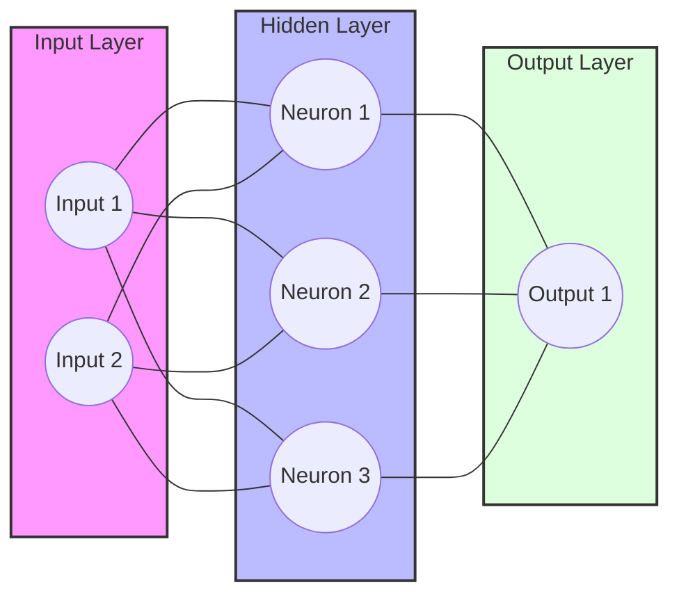
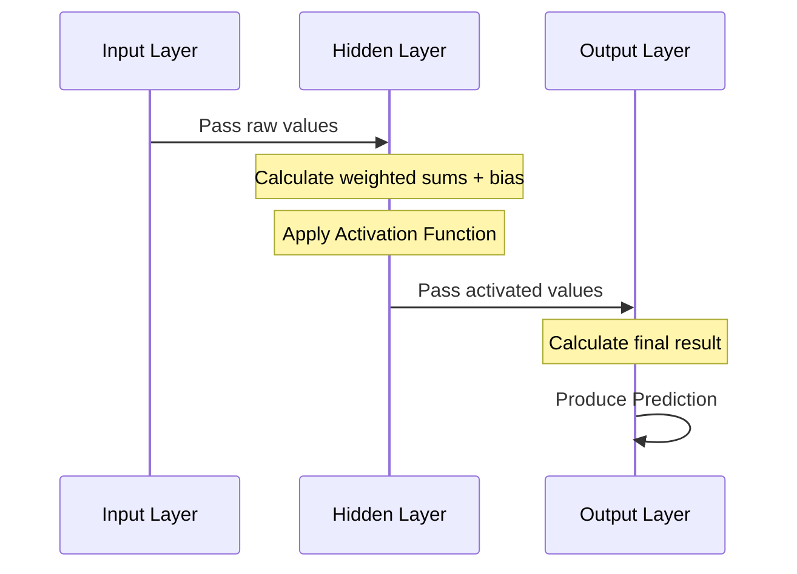
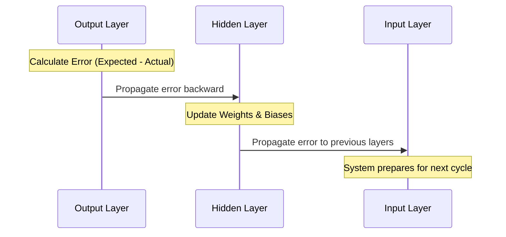
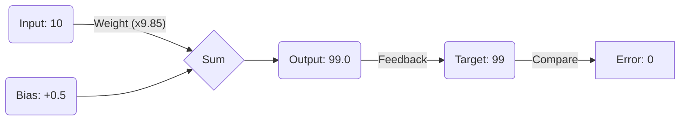
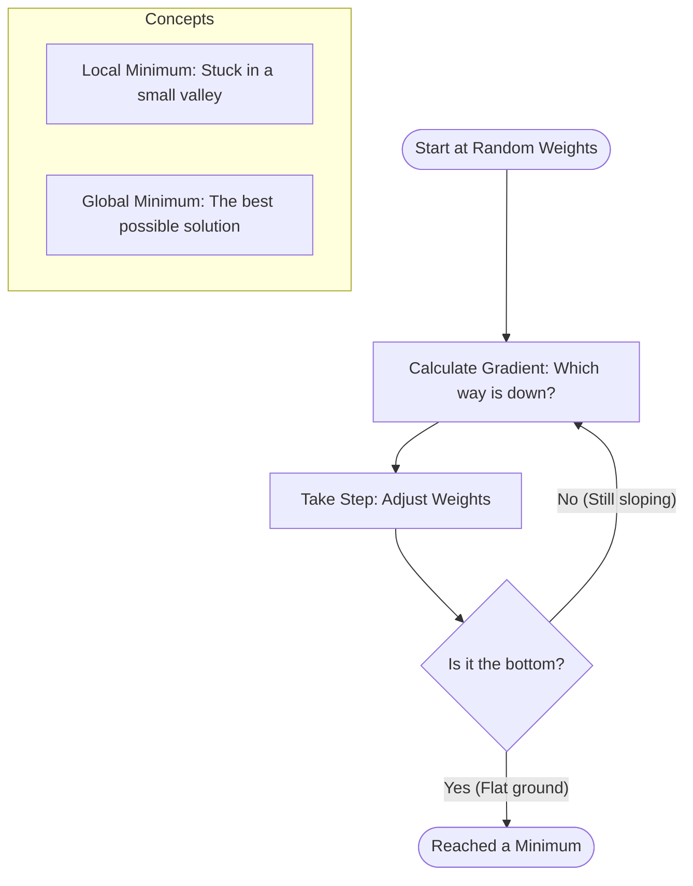

This document explains the logical structure and operational principles of a feedforward neural network with backpropagation.

## Network Topology

A neural network is organized into layers of interconnected processing units called **Neurons**. Data flows from the input layer through hidden layers to the output layer.

---

## Component Logic

### 1. The Neuron
The neuron is the primary unit of computation. It performs three main steps:
1.  **Weighted Sum**: Multiplies each input by a specific "weight" and adds them together.
2.  **Bias**: Adds a constant value (bias) to the sum to shift the activation threshold.
3.  **Activation**: Passes the result through a non-linear function (Sigmoid) to determine the final output value.

**Mathematical Logic:**
$$ \text{Output} = \text{Activation}(\sum (\text{Inputs} \times \text{Weights}) + \text{Bias}) $$

### 2. Layers
*   **Input Layer**: Receives external data. It does not perform computation; it simply passes values forward.
*   **Hidden Layers**: Perform the intermediate processing, capturing complex patterns in the data.
*   **Output Layer**: Produces the final prediction or result.

---

## Operational Flow

The network operates in two distinct phases:

### Phase 1: Feedforward (Prediction)
Data moves forward through the network to produce a result.

### Phase 2: Backpropagation (Learning)
The network compares its prediction to the correct answer and adjusts itself to reduce error.

1.  **Calculate Error**: Determine the difference between the actual output and the expected output.
2.  **Distribute Responsibility**: Working backward from the output, calculate how much each neuron contributed to the error.
3.  **Adjust Weights**: Update the weights and biases slightly in the direction that reduces the error.

---

## Conceptual Example: Learning a Relationship

Imagine you want the network to learn a specific rule: **If I give you 10, you must output 99.**

### 1. The Initial Guess
Initially, the network's weights and biases are random. It might guess:
- **Input:** 10
- **Random Weight:** 0.5
- **Random Bias:** 0.1
- **Calculation:** $(10 \times 0.5) + 0.1 = 5.1$
- **Result:** 5.1 (Very far from 99!)

### 2. The Learning Step (Backpropagation)
The network sees the result is 5.1 but it expected 99. The **Error** is massive.
- It calculates: "I need my weight to be much higher."
- It adjusts the weight from 0.5 to, say, 5.0.

### 3. Iteration & Refinement
The network tries again:
- **Calculation:** $(10 \times 5.0) + 0.1 = 50.1$
- Still too low! It adjusts again. It might try a weight of 9.0 and a bias of 9.0.
- **Calculation:** $(10 \times 9.0) + 9.0 = 99.0$

### 4. Dealing with Uncertainty
In a real system, the network doesn't know the exact rule is "multiply by 9 and add 9." It might settle on:
- **Weight:** 9.85
- **Bias:** 0.5
- **Result:** 99.0
The network doesn't find the "clean" human formula; it finds a mathematical combination of weights and biases that achieves the correct output for the data it has seen.

---

## The Optimization Engine: How Learning Actually Happens

### 1. Why Precise Calculation Matters
Learning isn't just about random guessing. Each step involves calculating the **Gradient**—a mathematical value that indicates exactly how much a small change in a specific weight will affect the total error. Without these precise calculations, the network would wander aimlessly instead of "descending" toward a solution.

### 2. Gradient Descent: Finding the Bottom
Imagine standing on a foggy mountain at night. You want to find the lowest point (where the error is lowest), but you can only see the ground directly beneath your feet.
- **The Gradient**: You feel the slope of the ground to see which way is "down."
- **The Descent**: You take a small step in that downward direction.
- **The Process**: You repeat this until the ground is flat, meaning you can't go any lower.

### 3. The Error Landscape: Minima
The "Error Landscape" is a conceptual map of all possible errors based on different weight combinations. 
- **Global Minimum**: The absolute lowest point in the entire landscape—the perfect solution where the error is as small as it can possibly be.
- **Local Minimum**: A "false bottom." It's a small valley that feels like the lowest point compared to the ground immediately around it, but it isn't the best possible solution. The network can sometimes get "stuck" here.

### 4. Common Challenges
- **Vanishing Gradients**: If the slope is too flat, the steps become so tiny that the network stops learning entirely before reaching the bottom.
- **Overshooting**: If the steps (Learning Rate) are too large, the network might jump right over the bottom and land on the other side, potentially climbing even higher and becoming unstable.

---

## Core Principles

### Activation Function (Sigmoid)
To allow the network to learn complex, non-linear relationships, a "squashing" function is used to keep values between 0 and 1.
$$ f(x) = \frac{1}{1 + e^{-x}} $$

### Weight Initialization
To ensure the network starts learning effectively, weights are initialized using a scaling method that accounts for the number of incoming connections, preventing values from becoming too large or too small during the first few cycles.

### Learning Rate
A small constant that controls how much the weights are adjusted in each step. A high rate learns fast but might overshoot the solution; a low rate is more stable but slower.
