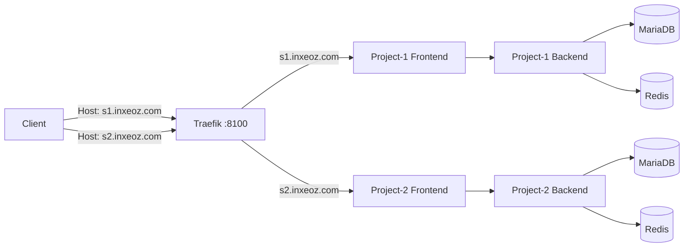

Step-by-step guide to create and run multiple isolated Frappe sites using **Traefik reverse proxy**.

Based on [frappe_docker](https://github.com/frappe/frappe_docker).

---

## Architecture

### What We Built

- **Complete isolation**: Each site has separate MariaDB, Redis, and application containers
- **Auto-discovery**: Traefik routes based on `Host` header — no manual port mapping
- **Scalable**: Add unlimited sites without changing existing configuration
- **Single entrypoint**: All sites share one HTTP port (`:8100`)



### Container Layout

```
traefik                    # Reverse proxy (:8100)
├── project-1-frontend-1        # nginx frontend
├── project-1-backend-1         # Frappe backend
├── project-1-db-1              # MariaDB database
├── project-1-redis-cache-1     # Redis cache
├── project-1-redis-queue-1     # Redis queue
├── project-1-websocket-1       # WebSocket server
├── project-1-scheduler-1       # Background scheduler
├── project-1-queue-short-1     # Short task queue
├── project-1-queue-long-1      # Long task queue
├── project-2-frontend-1    # Same layout, isolated stack
├── project-2-backend-1
├── project-2-db-1
└── ...
```

### Network Flow

1. Request → `Host: s1.inxeoz.com` → `localhost:8100`
2. Traefik reads `Host` header → routes to `project-1-frontend-1`
3. nginx in container → proxies to `project-1-backend-1`
4. Frappe serves the site from its isolated database

---

## Prerequisites

- git
- Docker or Podman
- Docker Compose v2

---

## Quick Start

**Two commands to get a working multi-site setup:**

```bash
# Step 1: Start Traefik infrastructure (run once, ~30s)
docker compose -f compose.yaml -f overrides/compose.traefik-one.yaml --env-file traefik.env -p traefik up -d

# Step 2: Deploy an application site (~1min)
docker compose -f compose.yaml -f overrides/compose.traefik-app.yaml -f overrides/compose.mariadb.yaml -f overrides/compose.redis.yaml --env-file envs/project-1.env -p project-1 up -d

# Verify
curl -H "Host: s1.inxeoz.com" http://localhost:8100
# Expected: <title>Login
```

---

## Setup Guide

### 1. Clone Repository

```bash
git clone https://github.com/frappe/frappe_docker
cd frappe_docker
```

### 2. Verify Configuration

The repository ships with pre-configured Traefik and environment files:

```bash
# Traefik infrastructure config
cat traefik.env | grep -E "(HTTP_PUBLISH_PORT|TRAEFIK_DOMAIN)"

# Application configs
cat envs/project-1.env | grep -E "(SITE_HOST|APP_NAME)"
cat envs/project-2.env | grep -E "(SITE_HOST|APP_NAME)"
```

Expected:
- `HTTP_PUBLISH_PORT=8100`, `TRAEFIK_DOMAIN=dashboard.localhost` (traefik.env)
- `SITE_HOST=s1.inxeoz.com APP_NAME=project-1` (project-1.env)
- `SITE_HOST=s2.inxeoz.com APP_NAME=project-2` (project-2.env)

### 3. Build Custom Image (If Needed)

Skip this if using the default Frappe image. To bake custom apps into the image:

```bash
docker build \
  --build-arg=FRAPPE_PATH=https://github.com/frappe/frappe \
  --build-arg=FRAPPE_BRANCH=version-15 \
  --tag=custom:15 \
  --file=images/layered/Containerfile .
```

### 4. Start Traefik Infrastructure

Traefik is the single entrypoint — start it before any application sites:

```bash
docker compose \
  -f overrides/compose.traefik-one.yaml \
  --env-file traefik.env \
  up -d
```

Verify:

```bash
docker ps | grep traefik
curl -H "Host: dashboard.localhost" http://localhost:8100
# Expected: 401 Unauthorized (dashboard requires auth)
```

### 5. Deploy Application Sites

Each site gets its own complete stack (frontend, backend, database, Redis, workers).

**Project-1 site:**

```bash
docker compose \
  -f compose.yaml \
  -f overrides/compose.traefik-app.yaml \
  -f overrides/compose.mariadb.yaml \
  -f overrides/compose.redis.yaml \
  --env-file envs/project-1.env \
  -p project-1 \
  up -d
```

**Project-2 site (second isolated instance):**

```bash
docker compose \
  -f compose.yaml \
  -f overrides/compose.traefik-app.yaml \
  -f overrides/compose.mariadb.yaml \
  -f overrides/compose.redis.yaml \
  --env-file envs/project-2.env \
  -p project-2 \
  up -d
```

Verify deployment:

```bash
docker ps | grep -E "(traefik|project-1-|project-2-)" | wc -l
# ~25 containers for dual-site
```

### 6. Create Frappe Sites

Run `bench new-site` inside each project's backend container:

```bash
# Project-1
docker compose -p project-1 exec backend bench new-site s1.inxeoz.com \
  --mariadb-user-host-login-scope='%' \
  --db-root-password 123 \
  --admin-password admin123

# Project-2
docker compose -p project-2 exec backend bench new-site s2.inxeoz.com \
  --mariadb-user-host-login-scope='%' \
  --db-root-password 123 \
  --admin-password admin123
```

---

## Access Methods

### Hostname Headers (Always Works)

Test directly with curl — no DNS required:

```bash
# Application sites
curl -H "Host: s1.inxeoz.com" http://localhost:8100
curl -H "Host: s2.inxeoz.com" http://localhost:8100

# Traefik dashboard
curl -H "Host: dashboard.localhost" http://localhost:8100
```

Expected: Full HTML with `<title>Login` for sites, `401 Unauthorized` for dashboard.

### Browser via /etc/hosts

```bash
echo '127.0.0.1 s1.inxeoz.com' | sudo tee -a /etc/hosts
echo '127.0.0.1 s2.inxeoz.com' | sudo tee -a /etc/hosts
echo '127.0.0.1 dashboard.localhost' | sudo tee -a /etc/hosts
```

| Site | URL |
|------|-----|
| Project-1 | http://s1.inxeoz.com:8100 |
| Project-2 | http://s2.inxeoz.com:8100 |
| Traefik Dashboard | http://dashboard.localhost:8100 |

Dashboard login: `admin` / password from `traefik.env`.

### Clean URLs via nginx Proxy (Optional)

For port-based access without `Host` headers:

```bash
sudo cp docs/nginx-frappe-proxy.conf /etc/nginx/sites-available/frappe-proxy
sudo ln -s /etc/nginx/sites-available/frappe-proxy /etc/nginx/sites-enabled/
sudo nginx -t && sudo systemctl reload nginx

# Access via port 89
curl http://s1.inxeoz.com:89
curl http://s2.inxeoz.com:89
```

---

## Scaling: Adding More Sites

Adding a third (or Nth) site requires no new configuration files — just a new environment file:

```bash
cp envs/project-1.env envs/newsite.env
# Edit SITE_HOST=s3.inxeoz.com and APP_NAME=newsite

docker compose \
  -f compose.yaml \
  -f overrides/compose.traefik-app.yaml \
  -f overrides/compose.mariadb.yaml \
  -f overrides/compose.redis.yaml \
  --env-file envs/newsite.env \
  -p newsite \
  up -d

docker compose -p newsite exec backend bench new-site s3.inxeoz.com \
  --mariadb-user-host-login-scope='%' \
  --db-root-password 123 \
  --admin-password admin123

curl -H "Host: s3.inxeoz.com" http://localhost:8100
```

Result: New site accessible immediately via hostname headers.

---

## Management

### Container Lifecycle

```bash
# Stop / restart a site
docker compose -p project-1 down
docker compose -p project-1 restart frontend backend

# Scale backend workers
docker compose -p project-1 up -d --scale backend=2

# Restart all Frappe workers (not databases or Traefik)
docker compose -p project-1 restart backend websocket queue-short queue-long scheduler
```

### Logs and Debugging

```bash
# Stream logs for a service
docker compose -p project-1 logs -f frontend

# Traefik routing logs
docker compose -p project-1 logs -f traefik

# Test routing
curl -H "Host: s1.inxeoz.com" http://localhost:8100
```

### Image Updates

```bash
docker build --tag=custom:15 --file=images/layered/Containerfile . --no-cache
docker compose -p project-1 up -d --force-recreate
```

---

## Production Deployment

### Offline Image Transfer

For servers without internet access, export images locally and transfer them.

**Step 1 — Export images:**

```bash
mkdir -p frappe-images

docker save traefik:v2.11 | gzip > frappe-images/traefik-v2.11.tar.gz
docker save custom:15 | gzip > frappe-images/custom-15.tar.gz
docker save mariadb:11.8 | gzip > frappe-images/mariadb-11.8.tar.gz
docker save redis:6.2-alpine | gzip > frappe-images/redis-6.2-alpine.tar.gz

tar czf frappe-docker-images.tar.gz frappe-images/
```

**Step 2 — Package deployment files:**

```bash
mkdir -p frappe-deployment
cp -r envs/ overrides/ compose/ traefik.env compose.yaml docs/ frappe-deployment/
mv frappe-images/ frappe-deployment/

tar czf frappe-deployment-package.tar.gz frappe-deployment/
```

**Step 3 — Transfer and deploy:**

```bash
# Transfer
scp frappe-deployment-package.tar.gz user@server:/home/user/

# On server
tar xzf frappe-deployment-package.tar.gz
cd frappe-deployment/

docker load < frappe-images/traefik-v2.11.tar.gz
docker load < frappe-images/custom-15.tar.gz
docker load < frappe-images/mariadb-11.8.tar.gz
docker load < frappe-images/redis-6.2-alpine.tar.gz

# Same two-step deployment
docker compose -f compose.yaml -f overrides/compose.traefik-one.yaml --env-file traefik.env -p traefik up -d
docker compose -f compose.yaml -f overrides/compose.traefik-app.yaml -f overrides/compose.mariadb.yaml -f overrides/compose.redis.yaml --env-file envs/project-1.env -p project-1 up -d
```

**Step 4 — Configure local access:**

```bash
echo 'SERVER_IP s1.inxeoz.com' | sudo tee -a /etc/hosts
curl -H "Host: s1.inxeoz.com" http://SERVER_IP:8100
```

### Automation Scripts

Create an export script for repeatable packaging:

```bash
cat > export-for-server.sh << 'SCRIPT'
#!/bin/bash
set -e
mkdir -p frappe-images frappe-deployment

docker save traefik:v2.11 | gzip > frappe-images/traefik-v2.11.tar.gz
docker save custom:15 | gzip > frappe-images/custom-15.tar.gz
docker save mariadb:11.8 | gzip > frappe-images/mariadb-11.8.tar.gz
docker save redis:6.2-alpine | gzip > frappe-images/redis-6.2-alpine.tar.gz

cp -r envs/ overrides/ compose/ traefik.env compose.yaml docs/ frappe-deployment/
mv frappe-images/ frappe-deployment/

tar czf frappe-deployment-package.tar.gz frappe-deployment/
rm -rf frappe-deployment/
ls -lh frappe-deployment-package.tar.gz
SCRIPT
chmod +x export-for-server.sh
```

### SSL/TLS

Add SSL termination via nginx (requires certificates from Let's Encrypt / certbot):

```nginx
server {
    listen 443 ssl http2;
    server_name *.inxeoz.com;

    ssl_certificate /etc/letsencrypt/live/inxeoz.com/fullchain.pem;
    ssl_certificate_key /etc/letsencrypt/live/inxeoz.com/privkey.pem;

    location / {
        proxy_pass http://localhost:8100;
    }
}

server {
    listen 89;
    server_name *.inxeoz.com;
    return 301 https://$host$request_uri;
}
```

### Backup

Each site has isolated data:

```bash
# Database dump
docker compose -p project-1 exec db mysqldump -u root -p123 --all-databases > project-1_backup.sql

# Site files
docker compose -p project-1 exec backend tar -czf - /home/frappe/frappe-bench/sites > project-1_sites.tar.gz
```

### Monitoring

```bash
# Live resource usage
docker stats

# Health check loop
watch 'curl -s -H "Host: s1.inxeoz.com" http://localhost:8100 | grep -q "Login" && echo "Project-1 OK" || echo "Project-1 DOWN"'
```

---

## Reference Files

### `overrides/compose.traefik-one.yaml`

Traefik reverse proxy — single entrypoint, dashboard, basic auth:

```yaml
services:
  traefik:
    image: traefik:v2.11
    container_name: traefik
    restart: unless-stopped

    command:
      - --providers.docker=true
      - --providers.docker.exposedbydefault=false
      - --entrypoints.web.address=:80
      - --api.dashboard=true
      - --api.insecure=false
      - --accesslog=true
      - --log.level=INFO

    ports:
      - "${HTTP_PUBLISH_PORT:-8100}:80"

    volumes:
      - /var/run/docker.sock:/var/run/docker.sock:ro

    networks:
      - traefik-public

    labels:
      - traefik.enable=true
      - traefik.http.routers.traefik.rule=Host(`${TRAEFIK_DOMAIN}`)
      - traefik.http.routers.traefik.entrypoints=web
      - traefik.http.routers.traefik.service=api@internal
      - traefik.http.routers.traefik.middlewares=dashboard-auth
      - traefik.http.middlewares.dashboard-auth.basicauth.users=admin:${HASHED_PASSWORD}

networks:
  traefik-public:
    name: traefik-public
    driver: bridge
```

### `overrides/compose.traefik-app.yaml`

Application routing template — one per site, uses `APP_NAME` / `SITE_HOST` from env:

```yaml
services:
  frontend:
    networks:
      - traefik-public
      - default
    labels:
      - traefik.enable=true
      - traefik.docker.network=traefik-public
      - traefik.http.routers.frontend-${APP_NAME}.rule=Host(`${SITE_HOST}`)
      - traefik.http.routers.frontend-${APP_NAME}.entrypoints=web
      - traefik.http.services.frontend-${APP_NAME}.loadbalancer.server.port=8080

networks:
  traefik-public:
    external: true
```

---

## Troubleshooting

### Sites Return 404 / Not Accessible

```bash
# Check containers
docker ps | grep -E "(traefik|project-1-|project-2-)"

# Traefik routing logs
docker logs traefik 2>&1 | tail -20
docker inspect project-1-frontend-1 | grep traefik.http.routers

# Internal connectivity
docker compose -p project-1 exec backend curl -H "Host: s1.inxeoz.com" http://frontend:8080

# Direct routing test
curl -v -H "Host: s1.inxeoz.com" http://localhost:8100
```

Common causes:
- Containers not running or unhealthy
- Traefik labels missing or incorrect on frontend container
- `traefik-public` network missing or container not attached
- Site not yet created with `bench new-site`
- Site domain in `all_sites.txt` doesn't match `SITE_HOST`

### Database Connection Issues

```bash
docker compose -p project-1 logs db
docker compose -p project-1 exec db mysql -u root -p123 -e "SHOW DATABASES;"
```

### nginx Issues

```bash
# Inside container
docker compose -p project-1 exec frontend nginx -t

# Host nginx (if using proxy)
sudo nginx -t
sudo systemctl status nginx
sudo journalctl -xeu nginx.service | tail -20
```

### Performance

```bash
docker stats
docker compose -p project-1 up -d --scale backend=2
```

---

## Success Verification

```bash
# Sites return login pages
curl -s -H "Host: s1.inxeoz.com" http://localhost:8100 | grep -q "Login"
curl -s -H "Host: s2.inxeoz.com" http://localhost:8100 | grep -q "Login"

# Databases are isolated
docker compose -p project-1 exec db mysql -u root -p123 -e "SHOW DATABASES;" | grep s1_inxeoz
docker compose -p project-2 exec db mysql -u root -p123 -e "SHOW DATABASES;" | grep s2_inxeoz

# All containers healthy
docker ps --filter "health=healthy" | wc -l
docker ps | grep -E "(project-1-|project-2-)" | wc -l
```

You now have a production-ready multi-site Frappe setup with complete isolation and unlimited scalability.
