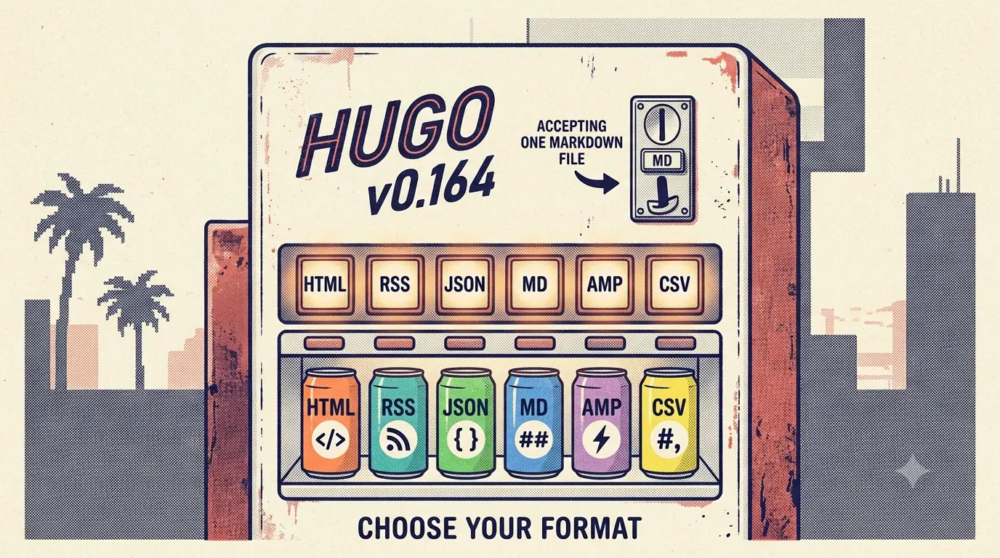

Hugo markets itself as "a Fast and Flexible Static Site Generator", but its documentation barely hints at how deep the tool actually goes. Most people touch four commands (`hugo`, `hugo server`, `hugo new`, `hugo mod`) and call it a day.

This article is a tour of the parts of Hugo that stay hidden — the output format system that gives this very blog a raw-markdown twin for every post, the CLI subcommands most users never discover, the template engine that is secretly a real programming language, and the module system that turns themes into versioned dependencies.

Everything below was verified against Hugo `v0.164.0+extended+withdeploy` on a real build. Nothing is theory.

---

## 1. Every page can be published as a second format (the `.md` trick)

This is the feature this blog shipped recently, and it's the best gateway into Hugo's extensibility because it changes how you think about *output*.

A Hugo page isn't a file — it's a data object that can be rendered through *any* output format. Hugo ships with built-in formats for `html`, `rss`, `json`, `amp`, `sitemap`, `robots`, `webappmanifest`, `csv`, `calendar`, and — here's the hidden one — **`markdown`**.

By default the `markdown` format is ignored. But you can enable it for pages and write a template that dumps the raw source:

```toml
# hugo.toml
[outputFormats.markdown]
  baseName = ""          # publish as <page-url>/.md instead of /index.md

[outputs]
  page = ["HTML", "markdown"]
```

```text
# themes/<theme>/layouts/_default/single.markdown.md
{{ .RawContent }}
```

That's it. Now every page is served in two formats:

```text
https://example.com/posts/my-post/     → rendered HTML
https://example.com/posts/my-post/.md  → raw markdown source
```

`.RawContent` returns the page body with front matter stripped but shortcodes, KaTeX and Mermaid blocks left untouched — exactly what a note app, an editor, or a script wants.


Hugo deliberately **does not let themes define output formats or the `outputs` map** — that config must live in the site's `hugo.toml`. The theme supplies the template; the site supplies the wiring.


**Verifiable proof:** this very article is served at `/posts/tech/hugo-hidden-features/.md` — go fetch it. The file on disk is generated by the build, not committed.

---

## 2. Output formats are a mini content-type system

Once you see output formats as a dimension rather than a setting, a lot of free features unlock. A page is a document that can be rendered as JSON, XML, CSV, or anything else — you define the format, pick a media type, and write a template.

Every format has its own template lookup order, so you can have `single.html`, `single.json`, `single.xml` all rendering the same page differently. The search index on this blog (`index.json`) is just a custom output format over the home kind.

You can even override builtin formats. Want ugly URLs only for one format? Change `ugly` on that format. Want AMP pages without touching HTML? Define `amp`, add it to `outputs`, write `single.amp.html`.


The `.md` trick works because `baseName = ""` publishes to `<page-url>/.md` instead of the default `<page-url>/index.md`. Empty base names are a first-class concept — Hugo's own `404`, `alias`, and `gotmpl` formats use them.


---

## 3. Time travel with `--clock`

Hugo has a global `--clock` flag that sets the system clock the build sees:

```bash
hugo --clock 2021-11-06T22:30:00.00+09:00
```

Combined with `hugo list future` and `hugo list expired`, this is how you preview how the site will look on launch day, or debug why a post with a future date isn't showing up:

```bash
hugo list future     # posts scheduled for later
hugo list expired    # posts that aged out of publishDate+expiryDate
hugo list drafts     # everything still in draft
hugo list published  # what the world currently sees
hugo list all        # the complete inventory, one row per page
```

`hugo list all` is a surprisingly useful site-audit tool — it dumps every page with its date, permalink, kind, and section as CSV.

---

## 4. The CLI has a whole second toolbox under it

`hugo`'s top-level help only hints at what's below. The real inventory:

| Command | What it actually does |
|---|---|
| `hugo config` | Print the **effective** merged config (site + theme) as TOML/YAML/JSON with `--format`, or full defaults with `--printZero` |
| `hugo config mounts` | Show exactly which filesystem folders mount where (content, data, layouts, static, and more) |
| `hugo env` | Dump the Go env, build flags, and extended features of the binary |
| `hugo gen chromastyles` | Export your syntax-highlighting theme as a standalone CSS file (great for non-Hugo projects) |
| `hugo gen doc` | Generate complete Markdown docs for the entire Hugo CLI |
| `hugo gen man` | Generate man pages for the CLI |
| `hugo convert toYAML` / `toTOML` / `toJSON` | Migrate a whole tree of front matter from one format to another |
| `hugo import jekyll` | Import a Jekyll site (posts, layouts, config) into Hugo |
| `hugo completion` | Generate shell autocompletion for bash/zsh/fish/powershell |
| `hugo deploy` | Push the built site to S3, GCS, or Azure — no extra tooling needed |

`hugo config` is the one I reach for most: when a theme behaves unexpectedly, the merged config shows exactly which value won and from where.

```bash
hugo config --format json | grep -i output
```

---

## 5. Diagnostic flags that act like a profiler

Build flags are where Hugo reveals its internals. These belong in every CI script and every "why is the build weird" investigation:

```bash
hugo --gc                          # garbage-collect unused build cache files
hugo --printUnusedTemplates        # list templates that were never invoked
hugo --printPathWarnings           # warn on duplicate output paths / collisions
hugo --printI18nWarnings           # warn about missing translations
hugo --templateMetrics             # how many times each template ran, and how long
hugo --templateMetricsHints        # + suggestions on which templates to simplify
hugo --printMemoryUsage            # memory pressure during long builds
hugo --panicOnWarning              # turn every warning into a hard failure (CI gold)
```

`--templateMetrics` is a revelation the first time you run it — it shows which partials are executed thousands of times, and `--templateMetricsHints` tells you which ones to cache with `partialCached`.

For CI, `--panicOnWarning` turns Hugo's famously chatty warnings into an exit-code 1, so a regression can never quietly slip into a deploy.

---

## 6. The dev server is a power tool

`hugo server` reads like "webserver, limited options" in its own help text, but the flags tell a different story:

```bash
hugo server -N                       # navigate the browser to the file you just edited on reload
hugo server -O                       # open the site in your browser automatically
hugo server --renderToMemory         # build into RAM — faster on huge sites
hugo server --noHTTPCache            # disable browser caching while developing
hugo server --disableFastRender      # force full re-renders instead of incremental
hugo server --disableBrowserError    # don't show build errors in the browser page
hugo server --pprof                  # expose a Go profiling endpoint on :8080
hugo server --port 0                 # pick a free port automatically
hugo server trust                    # install Hugo's local TLS CA → true https://localhost
```

The last one is a genuine hidden gem: `hugo server trust` installs a local certificate authority so your dev server runs on **real HTTPS**, with service workers, secure cookies, and all the rest — no `mkcert`, no nginx reverse proxy.

`--poll 700ms` is the flag you need on filesystems (NFS, Docker bind mounts, WSL2) where inotify watches never fire — it falls back to polling.

---

## 7. Themes can be versioned dependencies (Hugo Modules)

The `hugo mod` family turns themes from git submodules into a real dependency graph:

```bash
hugo mod init github.com/you/site   # declare this site a module
hugo mod get github.com/themeprovider/hugo-theme-x@v1.2.3
hugo mod graph                      # print the whole dependency tree
hugo mod npm                        # sync the theme's npm deps
hugo mod vendor                     # vendor everything into _vendor (offline builds)
hugo mod tidy                       # prune unused entries from go.mod/go.sum
hugo mod verify                     # check checksums
hugo mod clean                      # wipe the module cache
```

`hugo mod npm` is the underrated one: themes that ship `package.json` files can have their JS/CSS assets pulled through the module system and piped into Hugo's asset pipeline — no separate `npm install` step in CI.

---

## 8. Content plumbing you've been doing by hand

Front matter has a cascade mechanism that propagates defaults down a section tree:

```yaml
# content/posts/_index.md
cascade:
  showToc: true
  viewMode: docs
```

Every post under `posts/` inherits those values, and per-post front matter overrides them. That's the same override model this theme uses for typography, layout, and footers.

Archetypes are templates for `hugo new`:

```bash
hugo new content posts/tech/hello.md -k docs   # pick a content type
hugo new content posts/tech/x.md --editor code # jump straight into your editor
```

And `enableGitInfo` is free "last modified" tracking — with `git` available, Hugo reads commit dates so `Lastmod` (and this theme's "Updated" badge) comes straight from your history.

---

## 9. Templates are secretly a programming language

People treat Hugo templates as a formatting layer, but `.Scratch` and `.Store` are real mutable state — the former lets you store and mutate values inside a single template pass (values, dicts, even partials), the latter shares state across the whole render.

Render hooks let you intercept markdown elements that most SSGs hard-code:

```text
layouts/_default/_markup/render-link.html     # rewrite every markdown link
layouts/_default/_markup/render-image.html    # lazy-load, add dimensions
layouts/_default/_markup/render-heading.html  # inject anchor ids, callouts
layouts/_default/_markup/render-codeblock.html # wrap code in a toolbar
```

This theme uses the render-hook and passthrough machinery to turn `$...$` math and ```mermaid blocks into pre-rendered HTML and SVGs at build time — no JavaScript at runtime. Extensibility is how the theme is built, not a feature bolted on.

`resources.ExecuteAsTemplate` goes further: it lets you **render a Go template file stored as an asset**, which is how people build on-the-fly image pipelines, per-page JSON, and even multi-format API dumps.

---

## 10. Data is a first-class citizen

Files in `data/` are automatically exposed to every template as a map. This theme keeps its entire 33-palette color system in `data/color-schemes.yaml` — one file drives light/dark syntax highlighting *and* Mermaid diagram colors, with zero template changes when a palette is added.


One version trap: newer Hugo (0.156+) introduced `hugo.Data`, but Cloudflare Pages ships 0.147 where it doesn't exist. Use **`site.Data`** in templates — it works on every supported version. This is exactly the kind of gotcha that only surfaces in production.


---

## 11. Deployment is built in

`hugo deploy` uploads `public/` to S3, GCS, or Azure with content-hashing, incremental uploads, and CDN cache invalidation — the binary is even compiled `+withdeploy` when you install the standard build (check yours with `hugo env`). If you're already on a cloud bucket, you may not need a CI vendor at all:

```bash
hugo --minify && hugo deploy
```

And `hugo server --renderToMemory` + `--minify` in preview is the fastest iteration loop on very large sites.

---

## How to keep finding these

Hugo hides its power behind consistent conventions rather than a thousand options. The pattern to internalize: **every render target is a format, every format has a template, every template runs in a real language, and the CLI is a collection of small composable tools.**

The fastest way to explore is the tool itself:

```bash
hugo --help            # the surface
hugo gen doc           # complete CLI reference, generated for you
hugo config            # the effective reality of your site
```

Try one new flag this week. `hugo list all` to inventory your site. `hugo --clock` to preview a launch. Add one output format and give every post a raw `.md` twin. Hugo has been able to do all of this for years — it was just waiting for someone to read the help text.

---

*Written because I rediscovered, while shipping the raw-`.md` output format for this blog, that Hugo's extensibility model is far deeper than its marketing. 0.164.0, verified.*
