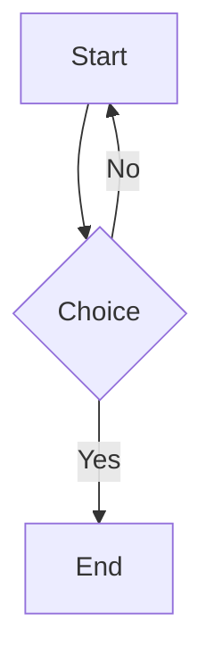

Every parameter can be set in two places. **`hugo.toml [params]`** sets the site-wide default. **Front matter** on a single post overrides it. Front matter always wins.

## Typography

### Font Family

The `font` parameter replaces `--font-body` for the entire page — headings, nav, and body text.

By default (no `font` parameter), `--font-body` uses **Atkinson Hyperlegible** (Google Fonts), a highly-legible sans-serif designed for low-vision readers.

| Value | Renders as | Best for |
|---|---|---|
| *(none)* | Atkinson Hyperlegible *(default)* | General reading, accessibility |
| `mono` | JetBrains Mono | Tech posts, code-heavy writing |
| `serif` | Georgia → Charter → Palatino | Stories, novels, essays, research |
| `sans` | system-ui → Segoe UI → Roboto | Short-form, recipes, reviews |
| any CSS string | Custom font stack | Total control |

```yaml
font: serif
```


`font: serif` also sets `--letter-spacing-normal: 0.01em` and `--line-height-body: 1.9` automatically — both improve serif body readability without any extra config.


### Drop Cap

Enlarges the first letter of the first paragraph using CSS `::first-letter`. No markup changes needed.

```yaml
dropCap: true
```

Best paired with `font: serif` and `contentWidth: normal`.

### Justified Text

Applies `text-align: justify` with automatic hyphenation to paragraphs only. Headings and blockquotes stay left-aligned.

```yaml
justify: true
```

Use for essays, formal writing, or long-form prose where you want the clean block-edge look.

### Opening Epigraph

A centred italic quote rendered before the post body. Set directly in front matter for a simple string:

```yaml
epigraph: "Not one of these dreams has fulfilled me, nor have I expected them to."
```

For author attribution use the `` shortcode instead — see [Shortcodes](#shortcodes).

### ViewMode (presets)

Bundles font, layout, and meta display into a single param. Individual params still override.

| Mode | Font | Best for |
|------|------|----------|
| `docs` | Atkinson (default) | Tutorials, reference, code-heavy posts, papers |
| `poem` | Atkinson (default) | Poetry (centred text) |
| `goofy` | Atkinson (default) | Distraction-free reading, big fonts, no chrome |
| `minimal` | Atkinson (default) | No footer, wide layout — scratch pads, unlisted pages |

Removed modes: `prose` → use `font: serif`; `list` → use `font: sans`; `news` → use `research` + `font: sans`.

```yaml
viewMode: docs
```


`viewMode` sets CSS and template defaults. Explicit `font`, `contentWidth`, `showToc`, etc. always beat the mode.


## Layout

### Content Width

```yaml
contentWidth: normal   # clamp(320px, 95vw, 1200px) — default, good for most posts
contentWidth: wide     # clamp(320px, 95vw, calc((1200px + 100vw)/2)) — between normal and full
contentWidth: full     # 100% — comics, photography, full-bleed layouts
```


`normal` (clamp up to 1200px) is a comfortable reading width. For even more space use `wide`.


### Cover Image

A full-width hero image shown at the top of the post, above the title. Also used as `og:image` for social sharing.

```yaml
coverImage: "https://example.com/my-header-image.jpg"
```

### Lightbox (Image Zoom)

When enabled, every image in the post gets click-to-zoom via Fancybox. No need to manually add `data-fancybox` attributes.

```yaml
lightbox: true
```

### Full-Bleed Images

Stretches every image inside `post-content` to viewport width, breaking out of the content column.

```yaml
imageFullBleed: true
```


Works best with `contentWidth: full` and `showToc: false`. In the three-column TOC layout the grid clips the bleed.


### Code Block Height

The default max-height for code blocks is `32rem` — beyond that the block scrolls. Override or remove the limit:

```yaml
codeMaxHeight: "50rem"   # taller blocks
codeMaxHeight: "none"    # no limit, full code always visible
```

## Post Meta

### Reading Progress Bar

A 3px bar at the top of the viewport that fills as you scroll. No layout impact.

```yaml
progressBar: true
```

### Reading Time

Shows "X min read" in the post meta line. Hugo estimates ~200 words/minute.

```yaml
showReadingTime: true
```

### Last Modified Date

Appears only when `lastmod` differs from `date` — ideal for docs and tutorials that get updated.

```yaml
showLastModified: true
```

```yaml
date: 2026-01-15
lastmod: 2026-05-29
```

### Numbered Headings

Prepends `1.`, `1.1`, `1.1.1` counters to h2, h3, h4 via CSS. No content changes needed.

```yaml
numberedHeadings: true
```

### Hide Meta Block

Removes the entire date/author/reading-time line — useful for poems, untitled pieces, and any post where publication metadata feels intrusive.

```yaml
noMeta: true
```

### Hide Post Title

Suppresses the `<h1>` rendered from the `title:` front matter field. Use when providing a decorative title inside the post body via the `` shortcode.

```yaml
show-title: false
```

### Hide Footer Block

Removes tags, related posts, ads, and comments from the bottom of the page. Useful for poems, visual essays, and pages where post-footprint content feels cluttered.

```yaml
hideFooter: true
```

Set automatically by `viewMode: goofy`, `media`, and `poem`.

### Granular Section Toggles

Fine-grained control over individual meta and footer elements. Each defaults to respecting the parent flag (`noMeta` / `hideFooter`), but can be set independently.

**Meta toggles** (beat `noMeta`):

| Param | Default | What it controls |
|---|---|---|
| `showDate` | `not $noMeta` | Publish date in meta |
| `showAuthor` | `not $noMeta` | Author name in meta |
| `showWordCount` | `not $noMeta` | Word count in meta |

```yaml
showDate: false      # hide date, keep author and word count
showAuthor: true
showWordCount: true
```

**Footer toggles** (beat `hideFooter`):

| Param | Default | What it controls |
|---|---|---|
| `showTags` | `not $hideFooter` | Tags section |
| `showShare` | `not $hideFooter` | Social share buttons |
| `showRelatedPosts` | `not $hideFooter` | Related posts section |
| `showPostNav` | `not $hideFooter` | Prev/next navigation |
| `showComments` | `not $hideFooter` | Comments section |

```yaml
showShare: false      # hide only share buttons, keep everything else
showRelatedPosts: false
showTags: true
showPostNav: true
```

### Color Scheme

Named colour palettes that override light and dark mode colours simultaneously. Does not change layout, fonts, or spacing — only CSS custom properties.

```yaml
viewMode: Neon
```

Available schemes: `90s`, `Modern`, `Neon`, `Anime`, `Maharaja`, `Nature`, `Galaxy`, `Ocean`, `BlackWhite`, `C-Looney-Tunes`, `C-Disney`, `Hacker`, `2d-game`.

The per-page `author.homepage` param wraps the author name in a hyperlink in the post meta line. Falls back to plain text when unset.

```yaml
author:
  homepage: "https://example.com"
```

### Abstract Block

A left-bordered italic block rendered before the body text. For research papers and technical reports.

```yaml
abstract: "One paragraph summary of what this post covers and why it matters."
```

### Thumbnail in List View

Shows a thumbnail in list view (hamburger toggle on homepage), with a dim overlay so text stays readable.

```yaml
showThumbnailInList: true
```

### Thumbnail in Catalog View

Same as above but for the grid (catalog) view — image becomes the card background with a dim overlay.

```yaml
showThumbnailInCatalog: true
```

### Explicit Thumbnail URL

By default the thumbnail is auto-extracted from the first markdown image in the post. Use `thumbnail` to set a specific URL instead:

```yaml
thumbnail: /images/my-custom-thumb.webp
showThumbnailInList: true
```

Overrides the auto-extraction completely. Useful when the first in-post image isn't suitable as a card thumbnail.

## Table of Contents

```yaml
showToc: true
```

Activates the three-column layout: left sidebar (full chapter overview), main content, right sidebar (sub-sections of the current section). On screens below 768px both sidebars hide and a toggle button appears above the content.

The right sidebar shows sub-headings under the active section. When those sub-headings are identical to what the left sidebar already shows (e.g. a post with only h2s and no h3s), the right sidebar displays "No sub headings" instead of repeating the same list.

Clicking a TOC link smooth-scrolls the heading to just below the sticky header — the same `scroll-margin-top: 90px` offset used by native `#hash` jumps, so the heading is never buried at the vertical center of the viewport. The active highlight is applied once the scroll completes, so the sidebar tracks the clicked heading correctly when navigating in either direction (e.g. jumping from the last section back to an earlier one).

Configure the sidebar labels in `hugo.toml`:

```toml
[params]
  tocTitle    = "Contents"        # left sidebar header
  tocSubTitle = "In this section" # right sidebar header
```

## HR Separators

Controls how `---` in Markdown renders.

```yaml
hrStyle: small   # 4em centred line — scene breaks in fiction
hrStyle: full    # 100% width — section dividers in docs
hrStyle: 40%     # any CSS length value
```

## Shortcodes

### Callouts

Five variants: `note`, `tip`, `warning`, `danger`, `info`. All accept an optional `title` param.

```
 Information worth highlighting. 
 A helpful suggestion. 
 Caution before proceeding. 
 Potential data loss or breakage. 
 Neutral supplemental context. 
```


`git reset --hard` discards all uncommitted changes permanently.


### Epigraph

A centred italic opening quote. Accepts `author` and `source` params.

```
 There was a wall. 
```

For multi-line quotes, write the shortcode tags on their own lines. Hugo processes them correctly when the inner content is on a separate line.

### Chapter Title

A decorative chapter heading. Use with `show-title: false` so the front matter title is suppressed.

```
 The Long Way Home 
```

Renders a small caps chapter label above the main title text.

### Spoiler

A collapsible `<details>` block. Default label is "Spoiler — click to reveal".

```
 The lighthouse was a metaphor all along. 
```

### Poem

Centres and italicises the content. Use two trailing spaces at end of each line for line breaks; an empty line between stanzas.

```
 last train — / window cracked — / smell of rain 
```

In actual use, write each line on its own with two trailing spaces:

```markdown

last train of the night —  
someone left a window cracked  
the smell of rain gets in

```


The multi-line form above works fine in post content. The single-line form shown in code is just to avoid documentation rendering issues.


### Details / Accordion

A collapsible block for supplemental content — ingredient lists, optional steps, extended notes.

```
 - 1½ cups rice / - 6 garlic cloves 
```

### Star Rating

Positional argument is the score; `max` is optional (defaults to 5).

```
    →  ★★★★★★★★☆☆  8/10
           →  ★★★★☆        4/5
```

### Keyboard Keys

Inline keyboard key styling.

```
Press Ctrl + S to save.
```

### Center

Wraps content in a centered `<div>`.

```
 This text will be centred. 
```

### KaTeX (Math)

Use `$...$` for inline math and `$$...$$` for display math directly in Markdown — no shortcode needed.

```markdown
The sigmoid $f(x) = \frac{1}{1 + e^{-x}}$ maps any value to (0, 1).

$$
\sum_{k=1}^{n} k = \frac{n(n+1)}{2}
$$
```

Math is **pre-rendered at build time** — no KaTeX JS loads at runtime. After adding new expressions, run `npm run build:diagrams` and commit `data/katex-cache.json`.

---

## Advanced Features

### KaTeX (Math Rendering)

Math expressions (`$...$` inline, `$$...$$` block) are **pre-rendered to HTML at build time** via `scripts/render-katex-cache.mjs`. No KaTeX JS loads at runtime — only KaTeX CSS is needed for styling.

**Build workflow:**
1. Write `$...$` or `$$...$$` in your post
2. Run `npm run build:diagrams` — updates `data/katex-cache.json`
3. Commit the updated cache file

**Detection heuristic:** inline `$...$` is only treated as math if the content contains a LaTeX command (`\frac`, `\sum`, etc.) or `^`/`_`. This avoids false positives from JavaScript `$('selector')` patterns.

Customise the KaTeX CSS CDN in `hugo.toml`:

```toml
[params]
  katexCSSCDN = "https://cdn.jsdelivr.net/npm/katex@0.16.11/dist/katex.min.css"
```

### Fancybox (Image Lightbox)

Every image in every post is automatically wrapped in a Fancybox lightbox link via the render-image hook. Click any image to open the full-resolution viewer with swipe/zoom. No config needed.

Customise CDN URLs in `hugo.toml`:

```toml
[params]
  fancyboxCSSCDN = "https://cdn.jsdelivr.net/npm/@fancyapps/ui@6.1/dist/fancybox/fancybox.css"
  fancyboxJSCDN  = "https://cdn.jsdelivr.net/npm/@fancyapps/ui@6.1/dist/fancybox/fancybox.umd.js"
```

### Mermaid (Diagrams)

Render diagrams from text using fenced code blocks with ` ```mermaid `:

````

````

Diagrams are **pre-rendered to SVGs at build time** via `scripts/render-mermaid-cache.mjs`. No Mermaid JS loads at runtime. SVGs use CSS variables so they adapt to the active color palette automatically.

**Build workflow:**
1. Add a ` ```mermaid ` block to your post
2. Run `npm run build:diagrams` — renders SVGs into `static/mermaid-cache/`
3. Commit the new SVG and the updated `data/mermaid-manifest.json`

### Code Export

Code blocks (both regular and Mermaid) include an **"Open as image"** button alongside the copy button. Clicking it opens the block in a new window with options to download as SVG or PNG.

---

## Per-Post Injections

Inject custom code into individual posts without touching theme files.

### Custom CSS

Inline CSS injected in `<head>`, scoped to this page only.

```yaml
customCSS: |
  .my-special-box {
    background: linear-gradient(135deg, #667eea, #764ba2);
    padding: 2rem;
    border-radius: 12px;
    color: white;
  }
```

### Custom JS

Inline JavaScript injected before `</body>`.

```yaml
customJS: |
  document.querySelectorAll('.my-special-box').forEach(function(el) {
    el.addEventListener('click', function() {
      alert('Clicked!');
    });
  });
```

### Custom Head

Raw HTML injected in `<head>`. Useful for per-page meta tags, schema, fonts, or preloads.

```yaml
customHead: |
  <meta name="theme-color" content="#667eea">
  <link rel="preload" href="/fonts/special.woff2" as="font" crossorigin>
```

## SEO Controls

### noindex

Adds `<meta name="robots" content="noindex">` so search engines skip this page.

```yaml
noindex: true
```

### searchExclude

Excludes the page from `/index.json` — the site's search index. It won't show up in the search modal.

```yaml
searchExclude: true
```

---

## Configurations by Content Type

Complete front matter presets. Copy the block that matches your post type.

### Story / Short Story

```yaml
---
viewMode: goofy
---
```

Optionally add `dropCap: true` for the first-letter style.

### Novel Chapter

```yaml
---
viewMode: goofy
progressBar: true
show-title: false
---
```

Open the post body with the `` and `` shortcodes to replace the suppressed front matter title.

### Essay

```yaml
---
viewMode: goofy
---
```

### Research Paper

```yaml
---
viewMode: docs
showLastModified: true
abstract: "One paragraph summary of the paper."
---
```

Use `docs` for papers, surveys, and research writing — enable `showToc` and `justify` explicitly if desired.

### Technical Documentation

```yaml
---
viewMode: docs
showLastModified: true
---
```

Use `` / `` / `` / `` throughout.  
Use `` for optional or reference content.  
Use `` for keyboard shortcuts.

### Tutorial (step-by-step)

```yaml
---
viewMode: docs
---
```

Structure h2 headings as steps — `## 1. Install`, `## 2. Configure`, `## 3. Run`.

### Recipe

```yaml
---
font: sans
---
```

Wrap the ingredient list in `` so the page doesn't open with a wall of text.

### Review (book / anime / game)

```yaml
---
font: sans
---
```

Use `` for scores and `` for plot details.

### Comic / Visual


### Poem

```yaml
---
viewMode: poem
show-title: false
---
```

Use `` for the title and `` for each stanza group.

### Devlog / Changelog

```yaml
---
viewMode: docs
showLastModified: true
---
```

Structure with `## Week of YYYY-MM-DD` or `## vX.Y.Z` headings.

### Reading List / Link Log

```yaml
---
font: sans
---
```

### Photo Essay

```yaml
---
viewMode: minimal
coverImage: "https://..."
font: serif
---
```

---

## Full Parameter Reference

```yaml
---
title: "Post Title"
date: 2026-01-01
lastmod: 2026-05-29

# ── Typography ──────────────────────────────────
font: mono                # mono | serif | sans | CSS font-family string (default: Atkinson Hyperlegible sans-serif)
dropCap: false            # large first letter on first paragraph
justify: false            # justify paragraph text
epigraph: ""              # opening quote rendered before body

# ── ViewMode & Color ────────────────────────────
viewMode: ""               # docs | poem | goofy | minimal | <PaletteName>

# ── Layout ──────────────────────────────────────
contentWidth: normal      # normal | wide | full
coverImage: ""            # hero image URL (also sets og:image)
imageFullBleed: false     # stretch images to viewport width
lightbox: false           # enable click-to-zoom on all images
codeMaxHeight: "32rem"    # max-height of code blocks; "none" to remove

# ── Meta display ────────────────────────────────
progressBar: false
showReadingTime: false
showLastModified: false
noMeta: false             # hide the entire meta line (individual toggles below beat it)
show-title: true          # hide the h1 rendered from front matter title
showDate: true            # granular: show publish date (respects noMeta)
showAuthor: true          # granular: show author name (respects noMeta)
showWordCount: true       # granular: show word count (respects noMeta)

# ── Footer display ──────────────────────────────
hideFooter: false         # hide tags, share, related, comments, nav (individual toggles below beat it)
showTags: true            # show tags section (respects hideFooter)
showShare: true           # show social share buttons (respects hideFooter)
showRelatedPosts: true    # show related posts section (respects hideFooter)
showPostNav: true         # show prev/next navigation (respects hideFooter)
showComments: true        # show comments section (respects hideFooter)
author:
  homepage: ""            # wraps author name in a link when set

# ── Structure ───────────────────────────────────
showToc: false
numberedHeadings: false

# ── Content ─────────────────────────────────────
abstract: ""
hrStyle: small            # small | full | CSS length

# ── Per-post injections ────────────────────────
customCSS: ""             # inline CSS injected in <head>
customJS: ""              # inline JS injected before </body>
customHead: ""            # raw HTML injected in <head>

# ── SEO ─────────────────────────────────────────
noindex: false            # add <meta name="robots" content="noindex">
searchExclude: false      # exclude from /index.json search index
---

## Site-wide Configuration (`hugo.toml [params]`)

These are set in `hugo.toml` under `[params]` and apply across the entire site.

### Main Sections

```toml
mainSections = ["posts"]   # which content types appear on the homepage
```

### Author

```toml
[params.author]
  name = "Your Name"       # displayed in post meta
```

### Head Title

```toml
headTitle = "My Blog"      # text shown in the site header link (defaults to author name, then site title)
```

### Navigation

```toml
[[params.nav]]
  name = "Home"
  link = "/"
[[params.nav]]
  name = "About"
  link = "/about"
```

### Social Links

```toml
[[params.socials]]
  name = "GitHub"
  link = "https://github.com/username"
[[params.socials]]
  name = "RSS"
  link = "/index.xml"
```

Supported icon names: `GitHub`, `Twitter`, `LinkedIn`, `RSS`, `Email`.

### Footer Links

```toml
[[params.footerLinks]]
  name = "Privacy"
  link = "/privacy"
[[params.footerLinks]]
  name = "Colophon"
  link = "/colophon"
```

### Features

```toml
enableCopyCode = true      # show copy button on code blocks (default: true)
lazyImage = true           # lazy-load images (default: true)
showCategories = true      # show category links on homepage cards
enableCDNFallback = true   # use CDN for Fancybox/KaTeX when available
legacyMode = false         # disable all JS enhancements
showReadingTime = false    # global default for "X min read"
enableTableResize = true   # drag table column dividers + bottom row-height handle
```

Table resizing is **session-only** and rides on the table's own borders — no extra handles. Hover a column separator in the header row and the gridline lights up: drag it to widen/narrow columns (neighbours absorb the delta, so the total width holds). Hover the table's bottom edge and the border lights up: drag down to add vertical space inside every row, or up to remove it. Keyboard: tab to a separator and use `←`/`→` (columns) or `↑`/`↓` (rows), holding `Shift` for larger steps; `Esc` cancels an in-progress drag. Reloading the page restores the natural layout.

### Search

Client-side search powered by [Fuse.js](https://fusejs.io). Press `Ctrl+K` (or the search icon in the header) to open the modal.

```toml
enableSearch = true            # show search button + modal (default: true)
fuseJSLocal = ""               # self-hosted Fuse.js path under static/
fuseJSCDN = "https://cdn.jsdelivr.net/npm/fuse.js@7.0.0/dist/fuse.min.js"
fuseJSCDNIntegrity = ""        # optional SRI hash for the CDN script
```

- Search is **lazy**: Fuse.js and `/index.json` load on the first keystroke, not on page load.
- **Idle state**: with an empty query the modal shows the 5 most recent posts, server-rendered by Hugo (no extra requests, no Fuse needed). They're navigable with `↑↓` / `↵` and clickable. Typing replaces them with live results; clearing the input restores them.
- The search index is the site's `/index.json` (prefixed by `staticPrefix` if set). Exclude a page from it with `searchExclude: true` (see [searchExclude](#searchexclude)).
- `legacyMode: true` disables search entirely.

### Content Injection

Raw HTML injected at specific points:

```toml
postHeaderContent = ""     # before .Content inside the post
postFooterContent = ""     # after .Content, before related posts
postAds = ""               # after related posts, before comments
extraHead = ""             # before </head>
extraBody = ""             # before </body>
```

### Disqus

```toml
disqus = "your-shortname"  # string — NOT a boolean
```

### Static Files

```toml
staticPrefix = ""          # CDN prefix for RSS and local vendor files
extraCSSFiles = ["css/custom.css"]   # additional CSS files to bundle
```

### KaTeX / Fancybox CDN Overrides

```toml
# KaTeX CSS (still loaded for rendered math styling — no KaTeX JS at runtime)
katexCSSCDN = "https://cdn.jsdelivr.net/npm/katex@0.16.11/dist/katex.min.css"

# Fancybox
fancyboxCSSCDN = "https://cdn.jsdelivr.net/npm/@fancyapps/ui@6.1/dist/fancybox/fancybox.css"
fancyboxJSCDN  = "https://cdn.jsdelivr.net/npm/@fancyapps/ui@6.1/dist/fancybox/fancybox.umd.js"
```

For self-hosted assets, append `Local` to the key (e.g. `katexCSSLocal`, `fancyboxJSLocal`) pointing to a path under `static/`.
```
