In this guide, we will create two partitions:

>  ``Root Partition``
>
> ``EFI Partition``


A ***Swap Partition*** is optional and not required for a normal setup, so we will skip it.

```
EFI Partition: 1GB (Type: EFI System)

Root Partition: 15GB (Type: Linux Filesystem)
```

------

Use the `lsblk` command to view details about available disks:

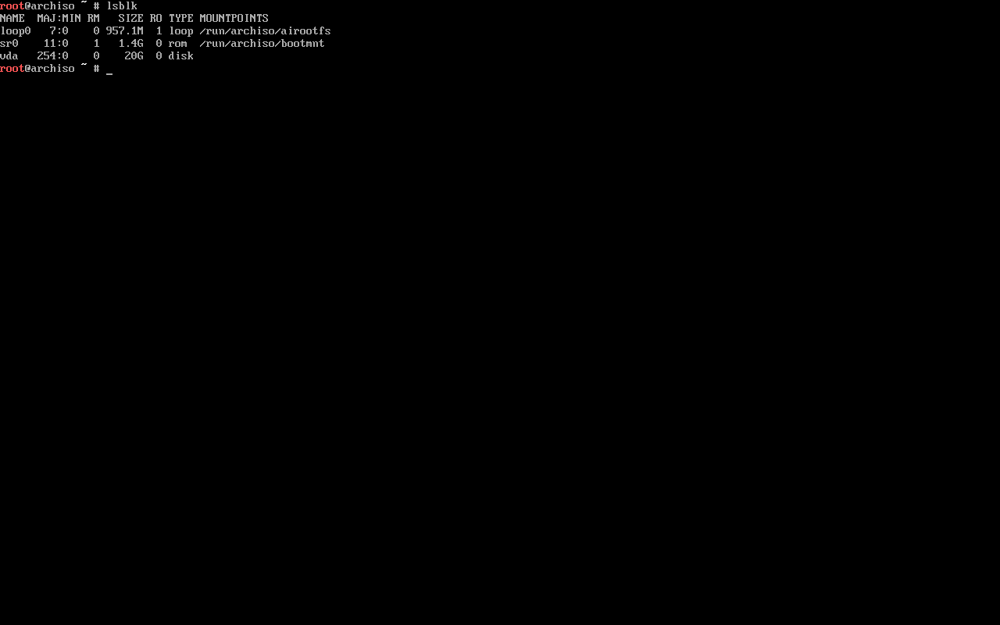

Identify the disk on which you want to create partitions (e.g., `nvme0n1`).

> In this example, the disk is `vda`

------

Use the following command to start partitioning:

```
cfdisk /dev/vda
```

> Example: `cfdisk /dev/YOUR-DISK-NAME`

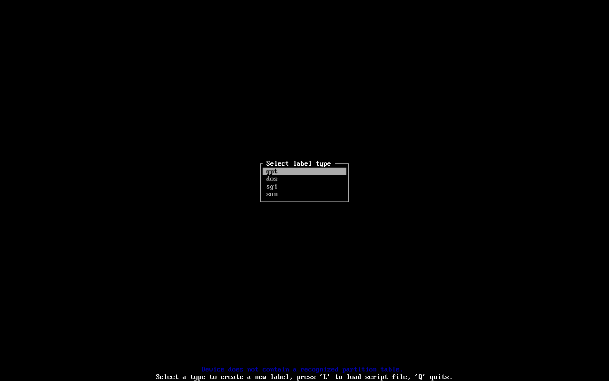

If you don’t see this screen, simply continue from ``Available Options in cfdisk``.

------

### Choosing Partition Table Type

Use **GPT** when:

- Your system uses **UEFI** (most modern PCs & VMs)
- The disk size is **larger than 2TB**
- You want modern features and flexibility

Use **MBR (DOS)** when:

- You are using **old BIOS-only systems**
- You need compatibility with very old OS/tools
- You are setting up legacy configurations like dual-boot

Here, we will select `GPT` and press Enter.

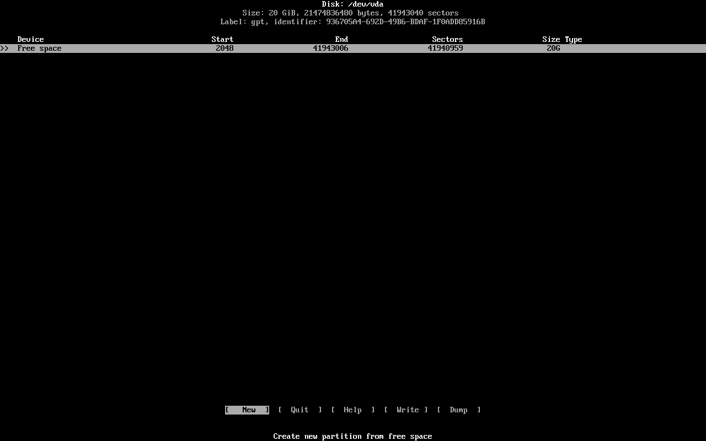

------

### Available Options in cfdisk

At the bottom bar, you will see:

- **[New]**: Create a new partition
- **[Quit]**: Exit without saving changes
- **[Help]**: Show help information
- **[Write]**: Save all changes to disk (required to apply changes)
- **[Dump]**: Output the current partition table (for review/backup)

**Use left/right arrow keys to navigate the bottom menu.**

------

### Creating the Root Partition

Select free space using up/down keys.
Then choose **[New]** using left/right and press Enter.

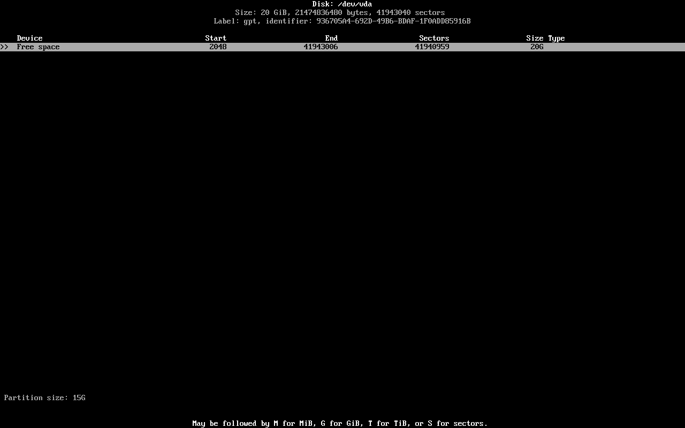

Set the partition size:

> Partition Size: `15G`

Press Enter.

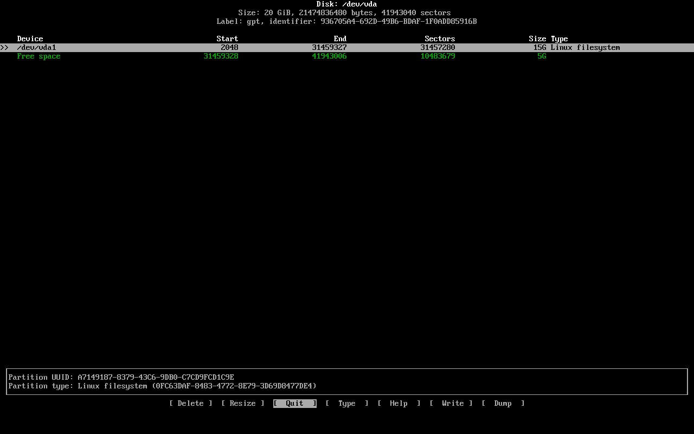

Select the newly created partition `/dev/vda1` using up/down.

> Example: `/dev/YOUR-DISK1`

When the partition is selected, additional options appear:

- **[Delete]**: Delete the selected partition (applied after writing changes)
- **[Resize]**: Modify partition size (if possible)
- **[Type]**: Change partition type (e.g., Linux filesystem, swap)

------

### Setting Partition Type (Root)

Select the partition and choose **[Type]**, then press Enter.

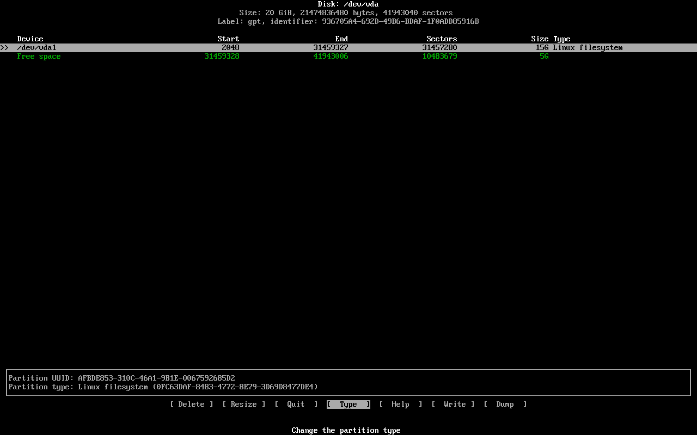

Choose `Linux Filesystem` as the type for the root partition and press Enter.

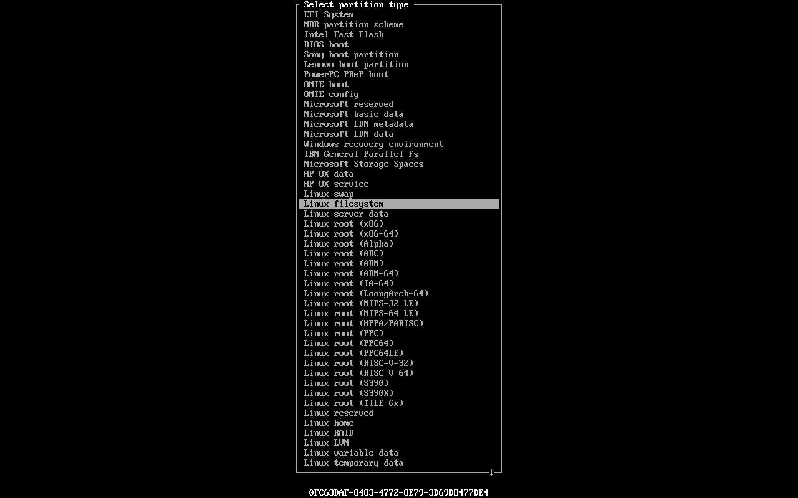

------

### Creating the EFI Partition

Now create another partition for EFI.

Select the remaining free space → choose **[New]** → press Enter.

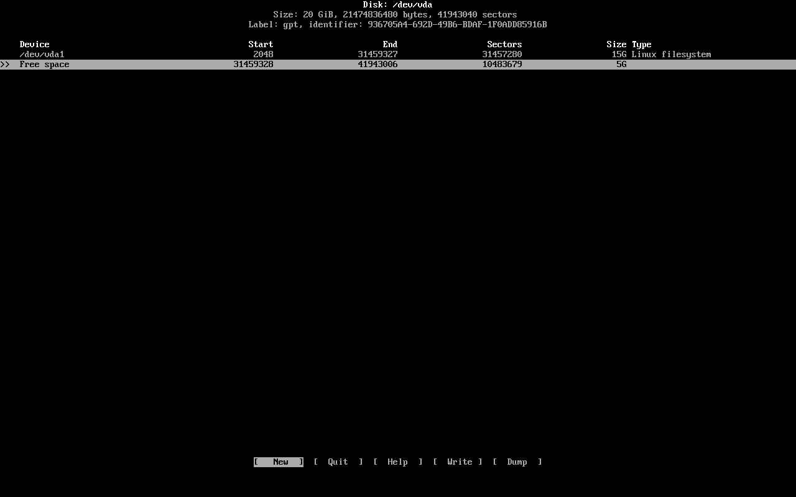

---

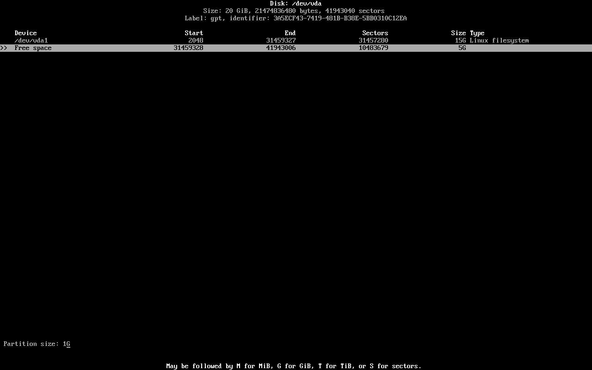

Set the size:

> Partition Size: `1G`

Press Enter.

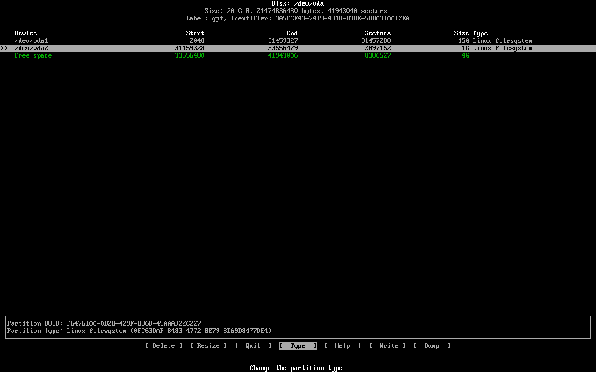

Select the newly created partition `/dev/vda2` using up/down.

> Example: `/dev/YOUR-DISK2`

Then choose **[Type]** and press Enter.

Select `EFI System` as the type for `/dev/vda2` and press Enter.

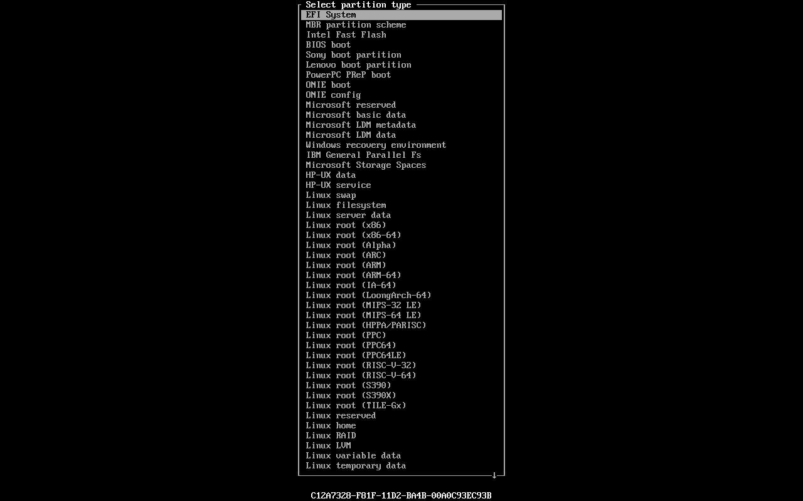

------

### Final Partition Layout

You should now see:

```
/dev/vda1 : Linux Filesystem : 15G
/dev/vda2 : EFI System : 1G
```

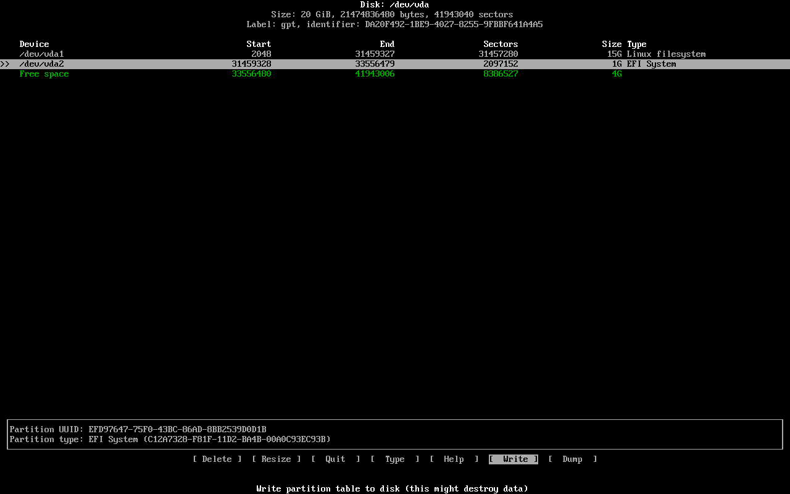

------

### Saving Changes

Select **[Write]** using left/right and press Enter.
Type `yes` to confirm.

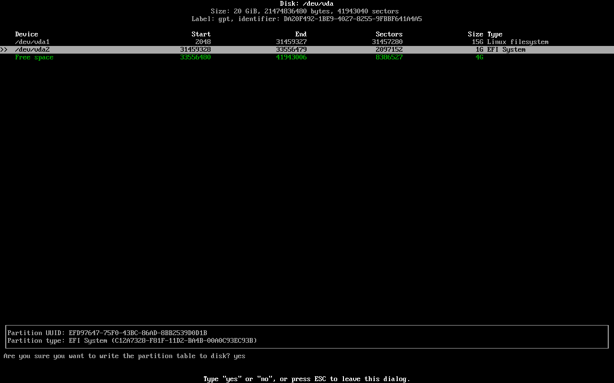

---

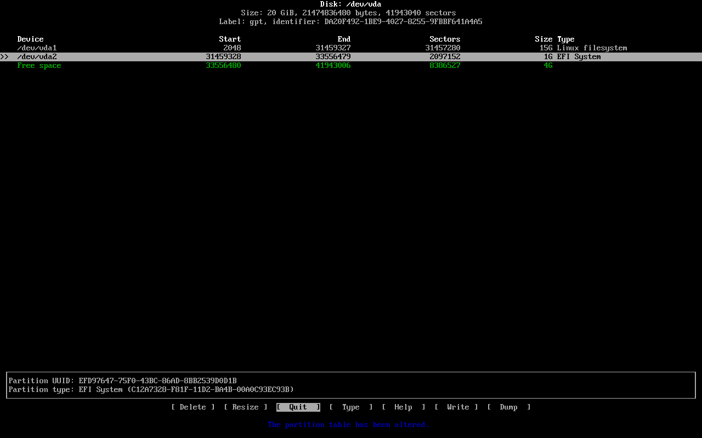

You will see a message:

> The partition table has been altered

Now select **[Quit]** and press Enter.

------

### Verifying Partitions

Run the command again:

```
cfdisk /dev/vda
```

> Example: `cfdisk /dev/YOUR-DISK-NAME`

to verify the created partitions.

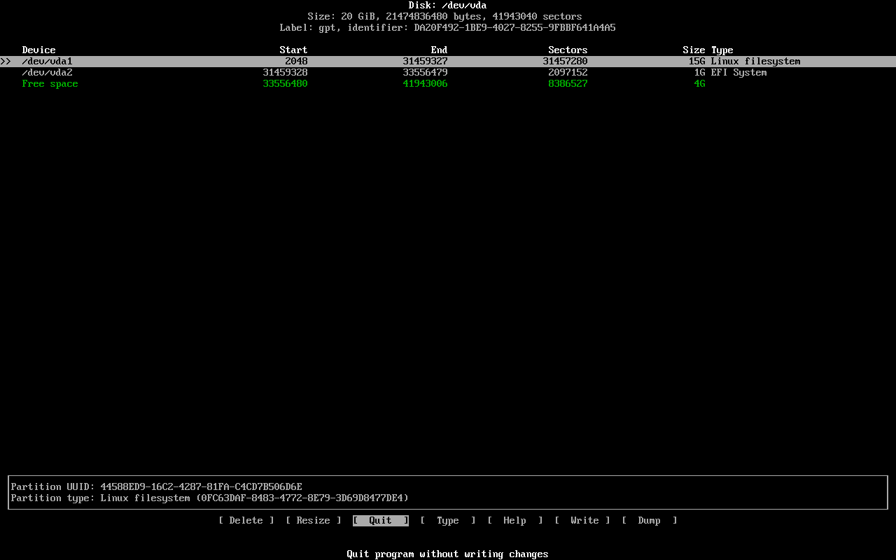


Next : Mount partitions 

>  [/posts/tech/installing-archlinux#step5](/posts/tech/installing-archlinux#step5)