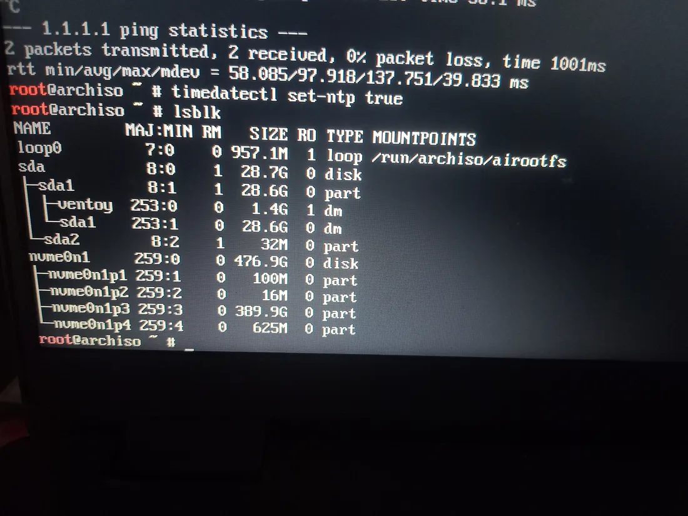

Arch Linux is a lightweight and highly customizable Linux distribution. This guide covers the full installation process and details how to modify an existing Arch installation using the Arch Live ISO.

## Part 1: Installing Arch Linux

### Step 1: Boot into the Arch Linux ISO

1. Download the latest Arch Linux ISO from the official website.

   > https://archlinux.org/download/

2. Create a bootable USB using tools like dd , Rufus, ``ventoy ``(recommended), balenaEtcher:

   > if using dd ``dd if=archlinux.iso of=/dev/sdX bs=4M status=progress && sync``

3. Boot from the USB and select “Arch Linux Installer”. (here is standard method)

   > Turn off your laptop completely.
   >
   > Plug in your Arch USB stick.
   >
   > Hit the power button and start spamming the **end** or **F12** key (or your specific boot menu key) right away to open the boot options.
   >
   > >  If **F12** doesn't work, some laptops use **F2**, **F10**, or **Delete** to enter the BIOS/Boot Menu
   >
   > Choose your USB drive from the menu, and you’re ready to start the install!

---

### Step 2: Connect to the Internet

For wired or ethernet connection:
```bash
ping -c 3 archlinux.org
```

For Wi-Fi: (use iwctl)

```bash
iwctl
device list ## wifi device name i.e wlan0 , and adapter i.e phy0
adapter phy0 set-property Powered on ## if powered off
station wlan0 scan ## scan wifi networks
station wlan0 get-networks ## lisiting of wifi networks
station wlan0 connect <SSID> ## connect to wifi network
station wlan0 show # to get info about wifi check state field
exit

dhcpcd # to get ip assigned
```

Verify with:

```bash
ip a
ping 1.1.1.1
```

---

### Step 3: Update System Clock

```bash
timedatectl set-ntp true
```
---

### Step 4: Partition the Disk

1. Check available disks

```bash
lsblk
```


2. Use **fdisk** or **cfdisk** (recommanded ) to partition:

In this Format
```
EFI Partition: 1GB (Type: EFI System) 
  
Root Partition: 400GB (Type: Linux Filesystem)
  
Swap Partition: 8GB (Type: Linux Swap)
```

> EFI Partition size should be about 1 GB
>
> Root Partition Size Should be at-least 20GB for smooth running
>
> Swap Partition Size should be between 500MB to 8GB and its optional


We will use **cfdisk** here

```bash
cfdisk /dev/nvme0n1
```
use nvme0n1 or something that is system disk , dont use usb disk like sda

refer this guide  for creating partition using ``cfdisk``

> [/posts/tech/how-to-use-cfdisk](/posts/tech/how-to-use-cfdisk)


---

### Step 5: Format and Mount Partitions {#step5}

Always run in this sequence post-partitioning: EFI → Swap → Root, then mount

```bash
mkfs.fat -F32 /dev/nvme0n1p1   # EFI
mkswap /dev/nvme0n1p3          # Swap
mkfs.ext4 /dev/nvme0n1p2       # Root
```

now mount 

```bash
mount /dev/nvme0n1p2 /mnt                  # Root
mount --mkdir /dev/nvme0n1p1 /mnt/boot/efi # EFI
swapon /dev/nvme0n1p3                      # Swap
```
---

### Step 6: Install Base System

Update Key-ring if ISO is Old

```bash
pacman-key --init
pacman-key --populate archlinux
pacman -Sy archlinux-keyring
rm -rf /mnt/var/cache/pacman/pkg/* # Remove corrupted packages If Need
```

Update the mirrorlist
change country if needed

> ``--country India``

```bash
reflector --country India --protocol https --latest 20 --sort rate \
  --save /etc/pacman.d/mirrorlist
```

Install packages (``required``)

```bash
pacstrap /mnt base linux linux-firmware nano sudo iwd reflector grub efibootmgr dhcpcd vim
```

Optional packages

```bash
pacstrap /mnt man-db man-pages less inetutils usbutils pciutils which diffutils file
```


Generate fstab:

```bash
genfstab -U /mnt >> /mnt/etc/fstab
```

---

### Step 7: Chroot into the System

```bash
arch-chroot /mnt
```

---

### Step 8: Configure System 

Set Your time zone 

>  example ``Asia/Kolkata``

```bash
ln -sf /usr/share/zoneinfo/Asia/Kolkata /etc/localtime
hwclock --systohc
```

Edit Locale

> based on Your laptop ``Keyboard`` and ``Language``
>
> common one is ``UTF-8`` and ``United states English``

```bash
nano /etc/locale.gen  # Uncomment en_US.UTF-8 UTF-8
locale-gen
echo "LANG=en_US.UTF-8" > /etc/locale.conf
```

Set Hostname
```bash
echo "archlinux" > /etc/hostname
nano /etc/hosts
```
Add The hosts
```
127.0.0.1   localhost
::1         localhost
```
Set The Root Password

```bash
passwd
```
add user if needed

```bash
useradd -m -G wheel -s /bin/bash username
passwd username
```

> Give Sudo Permission (if needed)
>
> ``nano /etc/sudoers  # Uncomment "%wheel ALL=(ALL:ALL) ALL"``

Install bootloader GRUB for UEFI

```bash
grub-install --target=x86_64-efi --efi-directory=/boot/efi --bootloader-id=GRUB
grub-mkconfig -o /boot/grub/grub.cfg
```


Exit arch-chroot , unmount and Reboot

```bash
exit
umount -R /mnt
reboot
```
Remove installation media and log in.

---

### Part 2: Modifying an Existing Arch Linux Installation

1. **Boot from your installation media** and reach the command prompt.

2. **Identify and mount your existing Arch Linux ``root`` partition** to the `/mnt` directory.

   > **⚠️ Warning:** Do **not** format the partition. Simply mount it to access your files without erasing any data.

3. **Enter the system** by running `arch-chroot /mnt`.

4. **Apply your changes**, such as running `passwd [username]` to reset a password.

5. **Finalize the process:** Type `exit` to leave the chroot, run `umount -R /mnt` to safely unmount your partitions, and then `reboot`.


---

thats it.
