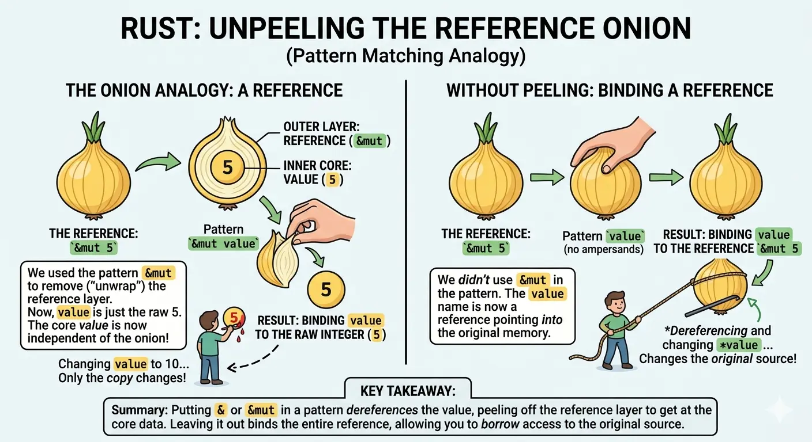

### 



In Rust, working with references is a lot like handling an onion.  Understanding when to "peel" the onion and when to keep it whole is the  secret to mastering pattern matching and mutation.


---

#### The Onion Analogy

Think of a mutable reference (&mut i32) as an onion:

- The Outer Layer: This is the reference (the "address" or "handle").
- The Core: This is the actual data (the number itself).

---

#### Peeling the Onion (&mut v)

When you use a pattern like `for &mut v in slice.iter_mut()`, you are explicitly telling Rust to ``peel off`` the reference layer.

By "unwrapping" the reference, you are left holding just the core value in your hand. Because integers are simple types, Rust just gives you a ``copy`` of that core. If you paint that copy red (change the value), the  original onion still sitting in the slice remains exactly the same.  You've lost your connection to the source!

---

#### Keeping the Skin On (`v`)

If you want to modify the original data, you must keep the skin on. By using for v in slice.iter_mut(), the variable v stays as the whole onion—the reference itself. This "handle" allows you to reach back into the original memory and change the value at its source.

---

#### The Working Example

Here is how you correctly use the "handle" to modify a slice of numbers.

```rust
pub fn transform_even_odd(slice: &mut [i32]) {
    // We keep the "skin" on. 'v' is a &mut i32 (a handle).
    for v in slice.iter_mut() { 
        
        // We use '*' to reach through the handle to the core data.
        if *v % 2 == 0 {
            // This changes the original value in the slice!
            *v *= 2; 
        } else {
            *v -= 1;
        }
    }
}

fn main() {
    let mut numbers = [1, 2, 3, 4];
    transform_even_odd(&mut numbers);
    
    // Output: [0, 4, 2, 8]
    println!("{:?}", numbers); 
}

```

---

#### Why this works:

- **`v` is a Reference:** In the loop, `v` acts as a direct link to each element in the slice.

- **Dereferencing (`\*v`):** The asterisk `*` is like a needle that pierces through the onion skin to touch the core. It allows you to read and write to the memory location that `v` is pointing to.

Summary Rule of Thumb:

- Use `v` in the loop if you need to ``modify`` the original source (keep the handle).

- Use `&v` or `&mut v` in the pattern if you only want a ``copy`` of the data and want to ignore the reference layer entirely.
