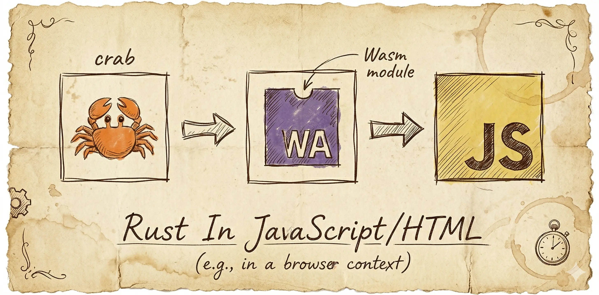

WebAssembly (WASM) allows developers to run high-performance Rust code directly in web applications. This guide covers the steps to compile Rust code to WASM and integrate it with JavaScript/HTML.

### 1. Setting Up the Rust Project

### Install Rust & wasm-pack

Ensure Rust and `wasm-pack` are installed:

```bash
rustup update
cargo install wasm-pack
```

### Create a New Rust Library

```bash
cargo new --lib my_wasm_project
cd my_wasm_project
```

Update `Cargo.toml`:

```toml
[package]
name = "my_wasm_project"
version = "0.1.0"
edition = "2021"

[lib]
name = "phonetic"
path = "src/wsam.rs"
crate-type = ["cdylib", "rlib"]
[dependencies]
wasm-bindgen = "0.2"
serde = { version = "1.0", features = ["derive"] }
serde-wasm-bindgen = "0.6"
```

### 2. Writing Rust Code for WASM

Create `src/wsam.rs`:

```rust
use wasm_bindgen::prelude::*;
use serde::{Deserialize, Serialize};
use serde_wasm_bindgen::to_value;

#[wasm_bindgen]
pub struct PhoneticConverter {
    dictionary: std::collections::HashMap<String, String>,
}
#[wasm_bindgen]
impl PhoneticConverter {
    #[wasm_bindgen(constructor)]
    pub fn new() -> PhoneticConverter {
        let mut dict = std::collections::HashMap::new();
        dict.insert("hello".to_string(), "həˈloʊ".to_string());
        dict.insert("world".to_string(), "wɜːrld".to_string());
        PhoneticConverter { dictionary: dict }
    }
    pub fn convert(&self, word: &str) -> JsValue {
        let result = self.dictionary.get(word).cloned().unwrap_or(word.to_string());
        to_value(&result).unwrap()
    }
}
```

### 3. Building the WASM Module

Run:

```bash
wasm-pack build --target web
```

This creates a `pkg/` folder with JavaScript bindings and `phonetic_bg.wasm`.

### 4. Using WASM in JavaScript/HTML

### Create an HTML File

Create `index.html`:

```html
<!DOCTYPE html>
<html lang="en">
<head>
    <meta charset="UTF-8">
    <meta name="viewport" content="width=device-width, initial-scale=1.0">
    <title>WASM Phonetic Converter</title>
</head>
<body>
    <h1>Phonetic Converter</h1>
    <input type="text" id="input" placeholder="Enter word">
    <button onclick="convertWord()">Convert</button>
    <pre id="output"></pre>
    
    <script type="module">
        import init, { PhoneticConverter } from "./pkg/phonetic.js";
        
        async function run() {
            await init();
            window.converter = new PhoneticConverter();
        }
        
        window.convertWord = function () {
            const word = document.getElementById("input").value;
            if (!window.converter) {
                document.getElementById("output").textContent = "WASM not loaded yet!";
                return;
            }
            document.getElementById("output").textContent = window.converter.convert(word);
        };
        
        run();
    </script>
</body>
</html>
```

### 5. Running the Project

WASM requires an HTTP server. Start one using:

```bash
python3 -m http.server 8080
```

Or with Node.js:

```bash
npx serve .
```

Then, open `http://localhost:8080/index.html` in a browser and test the phonetic converter! 🎉
